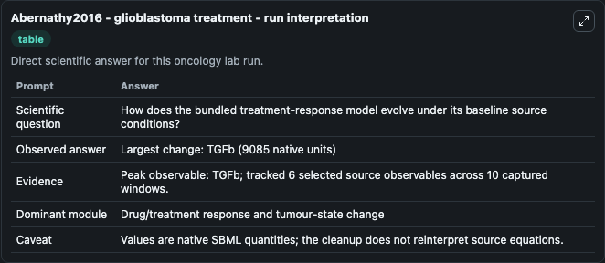
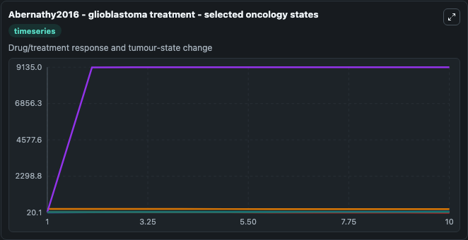
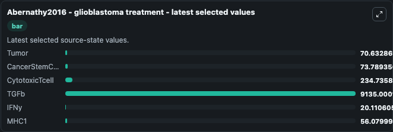

# Abernathy2016 - glioblastoma treatment

This Biosimulant lab wraps `Abernathy2016 - glioblastoma treatment` as a runnable oncology model with a companion visualization module.
The paper describes a model of glioblastoma. It can be used to explore treatment-response dynamics and compare scenario outcomes across configurations.

## What You'll See

The lab asks: How does the bundled treatment-response model evolve under its baseline source conditions? It runs for 10.0 time units with a communication step of 1.0. The run uses the model defaults declared by the curated SBML wrapper. The generated visualizations focus on Tumor, CancerStemCell, CytotoxicTcell, TGFb, IFNy, and MHC1, combining trajectory, endpoint-comparison, and summary-table views from one completed dark-mode run.

In this captured run, **TGFb** peaked at **9135.0** and **TGFb** moved by **9085.0** native units across 10.0 simulation windows.

<!-- BIOSIMULANT_VISUALS_START -->
### Output Visualizations



*Summary table for Abernathy2016 - glioblastoma treatment, reporting the scientific question, observed answer (largest change: **TGFb** at **9085.0** native units), evidence (peak observable: **TGFb**), dominant module, and caveat.*



*Trajectories of Tumor, CancerStemCell, CytotoxicTcell, TGFb, IFNy, and MHC1 across the 10.0 simulation. In this run **TGFb** climbed from 50.000 to 9135.0 and **IFNy** fell from 50.000 to 20.111 — the largest movements among the focused observables.*



*Endpoint ranking of the focused observables. Top 3 by final value: **TGFb** = 9135.0, **CytotoxicTcell** = 234.7, **CancerStemCell** = 73.789, with 3 more observables below.*

<!-- BIOSIMULANT_VISUALS_END -->

## Model Context

- Core model: `models/core`
- Visualization model: `models/visualisation`
- Standard: `other`
- Upstream source: `biomodels_ebi:BIOMD0000000757`
- License: `CC0`
- Visual scope: Drug/treatment response and tumour-state change
- Caveat: Values are native SBML quantities; the cleanup does not reinterpret source equations.

## Inputs

| Input | Maps To | Default | Notes |
|---|---|---|---|
| Tumor | `oncology_sbml_abernathy2016_glioblastoma_treatment_biomd0000000757_model.initial_tumor` | `70.0` | Initial Tumor. Sets the initial value of bundled SBML symbol `Tumor`. |
| CancerStemCell | `oncology_sbml_abernathy2016_glioblastoma_treatment_biomd0000000757_model.initial_cancerstemcell` | `30.0` | Initial CancerStemCell. Sets the initial value of bundled SBML symbol `CancerStemCell`. |
| CytotoxicTcell | `oncology_sbml_abernathy2016_glioblastoma_treatment_biomd0000000757_model.initial_cytotoxictcell` | `250.0` | Initial CytotoxicTcell. Sets the initial value of bundled SBML symbol `CytotoxicTcell`. |
| TGFb | `oncology_sbml_abernathy2016_glioblastoma_treatment_biomd0000000757_model.initial_tgfb` | `50.0` | Initial TGFb. Sets the initial value of bundled SBML symbol `TGFb`. |
| IFNy | `oncology_sbml_abernathy2016_glioblastoma_treatment_biomd0000000757_model.initial_ifny` | `50.0` | Initial IFNy. Sets the initial value of bundled SBML symbol `IFNy`. |
| MHC1 | `oncology_sbml_abernathy2016_glioblastoma_treatment_biomd0000000757_model.initial_mhc1` | `50.0` | Initial MHC1. Sets the initial value of bundled SBML symbol `MHC1`. |

## Outputs

| Output | Maps To | Role |
|---|---|---|
| `tumor` | `oncology_sbml_abernathy2016_glioblastoma_treatment_biomd0000000757_model.tumor` | Tumor observable. |
| `cancerstemcell` | `oncology_sbml_abernathy2016_glioblastoma_treatment_biomd0000000757_model.cancerstemcell` | CancerStemCell observable. |
| `cytotoxictcell` | `oncology_sbml_abernathy2016_glioblastoma_treatment_biomd0000000757_model.cytotoxictcell` | CytotoxicTcell observable. |
| `tgfb` | `oncology_sbml_abernathy2016_glioblastoma_treatment_biomd0000000757_model.tgfb` | TGFb observable. |
| `ifny` | `oncology_sbml_abernathy2016_glioblastoma_treatment_biomd0000000757_model.ifny` | IFNy observable. |
| `mhc1` | `oncology_sbml_abernathy2016_glioblastoma_treatment_biomd0000000757_model.mhc1` | MHC1 observable. |
| `state` | `oncology_sbml_abernathy2016_glioblastoma_treatment_biomd0000000757_model.state` | Full raw SBML observable record for reproducibility and downstream visualisation. |
| `summary` | `oncology_sbml_abernathy2016_glioblastoma_treatment_biomd0000000757_model.summary` | Change and peak summary across the simulated SBML observables. |
| `species_labels` | `oncology_sbml_abernathy2016_glioblastoma_treatment_biomd0000000757_model.species_labels` | Mapping from selected raw SBML observable symbols to display labels. |

## Runtime

- Duration: `10.0`
- Communication step: `1.0`

## Running Locally

```bash
biosimulant labs serve .
```
