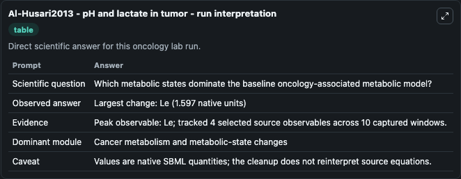
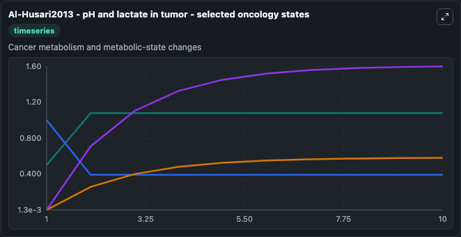
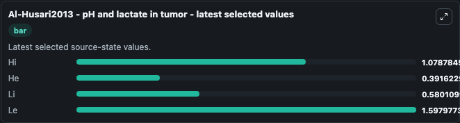

# Al-Husari2013 - pH and lactate in tumor

This Biosimulant lab wraps `Al-Husari2013 - pH and lactate in tumor` as a runnable oncology model with a companion visualization module.
The paper describes a model of pH control in tumor. It can be used to explore treatment-response dynamics and compare scenario outcomes across configurations.

## What You'll See

The lab asks: Which metabolic states dominate the baseline oncology-associated metabolic model? It runs for 10.0 time units with a communication step of 1.0. The run uses the model defaults declared by the curated SBML wrapper. The generated visualizations focus on Hi, He, Li, and Le, combining trajectory, endpoint-comparison, and summary-table views from one completed dark-mode run.

In this captured run, **Le** peaked at **1.598** and **Le** moved by **1.597** native units across 10.0 simulation windows.

<!-- BIOSIMULANT_VISUALS_START -->
### Output Visualizations



*Summary table for Al-Husari2013 - pH and lactate in tumor, reporting the scientific question, observed answer (largest change: **Le** at **1.597** native units), evidence (peak observable: **Le**), dominant module, and caveat.*



*Trajectories of Hi, He, Li, and Le across the 10.0 simulation. In this run **Le** climbed from 0.00125 to 1.598 and **He** fell from 1.000 to 0.3916 — the largest movements among the focused observables.*



*Endpoint ranking of the focused observables. Top 3 by final value: **Le** = 1.598, **Hi** = 1.079, **Li** = 0.5801, with 1 more observable below.*

<!-- BIOSIMULANT_VISUALS_END -->

## Model Context

- Core model: `models/core`
- Visualization model: `models/visualisation`
- Standard: `other`
- Upstream source: `biomodels_ebi:BIOMD0000000805`
- License: `CC0`
- Visual scope: Cancer metabolism and metabolic-state changes
- Caveat: Values are native SBML quantities; the cleanup does not reinterpret source equations.

## Inputs

| Input | Maps To | Default | Notes |
|---|---|---|---|

## Outputs

| Output | Maps To | Role |
|---|---|---|
| `model_state_1` | `oncology_sbml_al_husari2013_ph_and_lactate_in_tumor_biomd0000000805_model.model_state_1` | Hi observable. |
| `model_state_2` | `oncology_sbml_al_husari2013_ph_and_lactate_in_tumor_biomd0000000805_model.model_state_2` | He observable. |
| `model_state_3` | `oncology_sbml_al_husari2013_ph_and_lactate_in_tumor_biomd0000000805_model.model_state_3` | Li observable. |
| `model_state_4` | `oncology_sbml_al_husari2013_ph_and_lactate_in_tumor_biomd0000000805_model.model_state_4` | Le observable. |
| `state` | `oncology_sbml_al_husari2013_ph_and_lactate_in_tumor_biomd0000000805_model.state` | Full raw SBML observable record for reproducibility and downstream visualisation. |
| `summary` | `oncology_sbml_al_husari2013_ph_and_lactate_in_tumor_biomd0000000805_model.summary` | Change and peak summary across the simulated SBML observables. |
| `species_labels` | `oncology_sbml_al_husari2013_ph_and_lactate_in_tumor_biomd0000000805_model.species_labels` | Mapping from selected raw SBML observable symbols to display labels. |

## Runtime

- Duration: `10.0`
- Communication step: `1.0`

## Running Locally

```bash
biosimulant labs serve .
```
