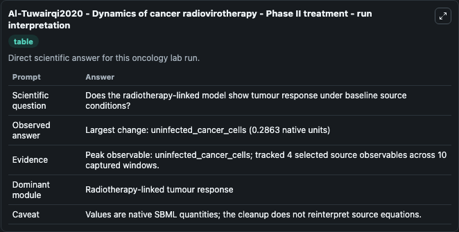
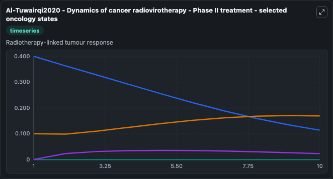
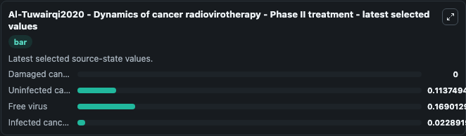

# Al-Tuwairqi2020 - Dynamics of cancer radiovirotherapy - Phase II treatment

This Biosimulant lab wraps `Al-Tuwairqi2020 - Dynamics of cancer radiovirotherapy - Phase II treatment` as a runnable oncology model with a companion visualization module.
This ordinary differential equation model of cancer radiovirotherapy dynamics is described in the publication:Salma M. It can be used to explore treatment-response dynamics and compare scenario outcomes across configurations.

## What You'll See

The lab asks: Does the radiotherapy-linked model show tumour response under baseline source conditions? It runs for 10.0 time units with a communication step of 1.0. The run uses the model defaults declared by the curated SBML wrapper. The generated visualizations focus on Damaged cancer cells, Uninfected cancer cells, Free virus, and Infected cancer cells, combining trajectory, endpoint-comparison, and summary-table views from one completed dark-mode run.

In this captured run, **uninfected_cancer_cells** carried the largest peak and **uninfected_cancer_cells** moved by **0.2863** native units across 10.0 simulation windows.

<!-- BIOSIMULANT_VISUALS_START -->
### Output Visualizations



*Summary table for Al-Tuwairqi2020 - Dynamics of cancer radiovirotherapy - Phase II treatment, reporting the scientific question, observed answer (largest change: **uninfected_cancer_cells** at **0.2863** native units), evidence (peak observable: **uninfected_cancer_cells**), dominant module, and caveat.*



*Trajectories of Damaged cancer cells, Uninfected cancer cells, Free virus, and Infected cancer cells across the 10.0 simulation. In this run **Free virus** climbed from 0.1000 to 0.1690 and **Uninfected cancer cells** fell from 0.4000 to 0.1137 — the largest movements among the focused observables.*



*Endpoint ranking of the focused observables. Top 3 by final value: **Free virus** = 0.1690, **Uninfected cancer cells** = 0.1137, **Infected cancer cells** = 0.0229, with 1 more observable below.*

<!-- BIOSIMULANT_VISUALS_END -->

## Model Context

- Core model: `models/core`
- Visualization model: `models/visualisation`
- Standard: `other`
- Upstream source: `biomodels_ebi:BIOMD0000001032`
- License: `CC0`
- Visual scope: Radiotherapy-linked tumour response
- Caveat: Values are native SBML quantities; the cleanup does not reinterpret source equations.

## Inputs

| Input | Maps To | Default | Notes |
|---|---|---|---|
| Damaged cancer cells | `oncology_sbml_al_tuwairqi2020_dynamics_of_cancer_radiovirother_biomd0000001032_model.initial_damaged_cancer_cells` | `0.0` | Initial Damaged cancer cells. Sets the initial value of bundled SBML symbol `damaged_cancer_cells`. |
| Uninfected cancer cells | `oncology_sbml_al_tuwairqi2020_dynamics_of_cancer_radiovirother_biomd0000001032_model.initial_uninfected_cancer_cells` | `0.4` | Initial Uninfected cancer cells. Sets the initial value of bundled SBML symbol `uninfected_cancer_cells`. |
| Free virus | `oncology_sbml_al_tuwairqi2020_dynamics_of_cancer_radiovirother_biomd0000001032_model.initial_free_virus` | `0.1` | Initial Free virus. Sets the initial value of bundled SBML symbol `free_virus`. |
| Infected cancer cells | `oncology_sbml_al_tuwairqi2020_dynamics_of_cancer_radiovirother_biomd0000001032_model.initial_infected_cancer_cells` | `0.0` | Initial Infected cancer cells. Sets the initial value of bundled SBML symbol `infected_cancer_cells`. |

## Outputs

| Output | Maps To | Role |
|---|---|---|
| `damaged_cancer_cells` | `oncology_sbml_al_tuwairqi2020_dynamics_of_cancer_radiovirother_biomd0000001032_model.damaged_cancer_cells` | Damaged cancer cells observable. |
| `uninfected_cancer_cells` | `oncology_sbml_al_tuwairqi2020_dynamics_of_cancer_radiovirother_biomd0000001032_model.uninfected_cancer_cells` | Uninfected cancer cells observable. |
| `free_virus` | `oncology_sbml_al_tuwairqi2020_dynamics_of_cancer_radiovirother_biomd0000001032_model.free_virus` | Free virus observable. |
| `infected_cancer_cells` | `oncology_sbml_al_tuwairqi2020_dynamics_of_cancer_radiovirother_biomd0000001032_model.infected_cancer_cells` | Infected cancer cells observable. |
| `state` | `oncology_sbml_al_tuwairqi2020_dynamics_of_cancer_radiovirother_biomd0000001032_model.state` | Full raw SBML observable record for reproducibility and downstream visualisation. |
| `summary` | `oncology_sbml_al_tuwairqi2020_dynamics_of_cancer_radiovirother_biomd0000001032_model.summary` | Change and peak summary across the simulated SBML observables. |
| `species_labels` | `oncology_sbml_al_tuwairqi2020_dynamics_of_cancer_radiovirother_biomd0000001032_model.species_labels` | Mapping from selected raw SBML observable symbols to display labels. |

## Runtime

- Duration: `10.0`
- Communication step: `1.0`

## Running Locally

```bash
biosimulant labs serve .
```
