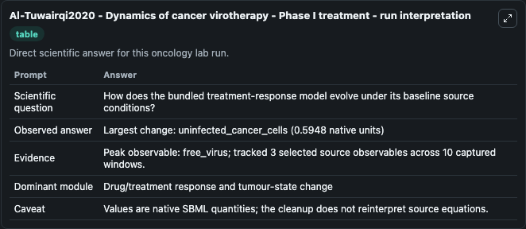
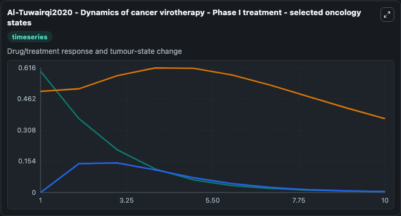
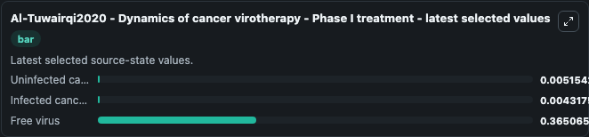

# Al-Tuwairqi2020 - Dynamics of cancer virotherapy - Phase I treatment

This Biosimulant lab wraps `Al-Tuwairqi2020 - Dynamics of cancer virotherapy - Phase I treatment` as a runnable oncology model with a companion visualization module.
This ordinary differential equation model of cancer virotherapy dynamics is described in the publication:Salma M. It can be used to explore treatment-response dynamics and compare scenario outcomes across configurations.

## What You'll See

The lab asks: How does the bundled treatment-response model evolve under its baseline source conditions? It runs for 10.0 time units with a communication step of 1.0. The run uses the model defaults declared by the curated SBML wrapper. The generated visualizations focus on Uninfected cancer cells, Infected cancer cells, and Free virus, combining trajectory, endpoint-comparison, and summary-table views from one completed dark-mode run.

In this captured run, **free_virus** carried the largest peak and **uninfected_cancer_cells** moved by **0.5948** native units across 10.0 simulation windows.

<!-- BIOSIMULANT_VISUALS_START -->
### Output Visualizations



*Summary table for Al-Tuwairqi2020 - Dynamics of cancer virotherapy - Phase I treatment, reporting the scientific question, observed answer (largest change: **uninfected_cancer_cells** at **0.5948** native units), evidence (peak observable: **free_virus**), dominant module, and caveat.*



*Trajectories of Uninfected cancer cells, Infected cancer cells, and Free virus across the 10.0 simulation. In this run **Infected cancer cells** climbed from 0 to 0.00432 and **Uninfected cancer cells** fell from 0.6000 to 0.00515 — the largest movements among the focused observables.*



*Endpoint ranking of the focused observables. Top 3 by final value: **Free virus** = 0.3651, **Uninfected cancer cells** = 0.00515, **Infected cancer cells** = 0.00432.*

<!-- BIOSIMULANT_VISUALS_END -->

## Model Context

- Core model: `models/core`
- Visualization model: `models/visualisation`
- Standard: `other`
- Upstream source: `biomodels_ebi:BIOMD0000001031`
- License: `CC0`
- Visual scope: Drug/treatment response and tumour-state change
- Caveat: Values are native SBML quantities; the cleanup does not reinterpret source equations.

## Inputs

| Input | Maps To | Default | Notes |
|---|---|---|---|
| Uninfected cancer cells | `oncology_sbml_al_tuwairqi2020_dynamics_of_cancer_virotherapy_p_biomd0000001031_model.initial_uninfected_cancer_cells` | `0.6` | Initial Uninfected cancer cells. Sets the initial value of bundled SBML symbol `uninfected_cancer_cells`. |
| Infected cancer cells | `oncology_sbml_al_tuwairqi2020_dynamics_of_cancer_virotherapy_p_biomd0000001031_model.initial_infected_cancer_cells` | `0.0` | Initial Infected cancer cells. Sets the initial value of bundled SBML symbol `infected_cancer_cells`. |
| Free virus | `oncology_sbml_al_tuwairqi2020_dynamics_of_cancer_virotherapy_p_biomd0000001031_model.initial_free_virus` | `0.5` | Initial Free virus. Sets the initial value of bundled SBML symbol `free_virus`. |

## Outputs

| Output | Maps To | Role |
|---|---|---|
| `uninfected_cancer_cells` | `oncology_sbml_al_tuwairqi2020_dynamics_of_cancer_virotherapy_p_biomd0000001031_model.uninfected_cancer_cells` | Uninfected cancer cells observable. |
| `infected_cancer_cells` | `oncology_sbml_al_tuwairqi2020_dynamics_of_cancer_virotherapy_p_biomd0000001031_model.infected_cancer_cells` | Infected cancer cells observable. |
| `free_virus` | `oncology_sbml_al_tuwairqi2020_dynamics_of_cancer_virotherapy_p_biomd0000001031_model.free_virus` | Free virus observable. |
| `state` | `oncology_sbml_al_tuwairqi2020_dynamics_of_cancer_virotherapy_p_biomd0000001031_model.state` | Full raw SBML observable record for reproducibility and downstream visualisation. |
| `summary` | `oncology_sbml_al_tuwairqi2020_dynamics_of_cancer_virotherapy_p_biomd0000001031_model.summary` | Change and peak summary across the simulated SBML observables. |
| `species_labels` | `oncology_sbml_al_tuwairqi2020_dynamics_of_cancer_virotherapy_p_biomd0000001031_model.species_labels` | Mapping from selected raw SBML observable symbols to display labels. |

## Runtime

- Duration: `10.0`
- Communication step: `1.0`

## Running Locally

```bash
biosimulant labs serve .
```
