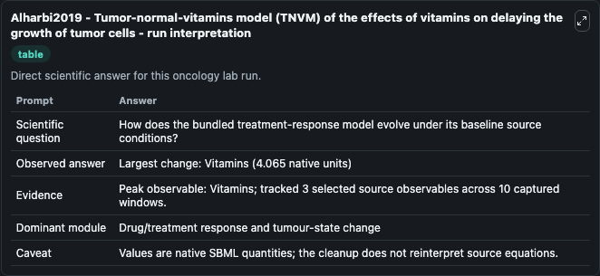
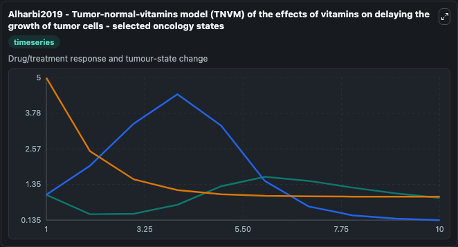
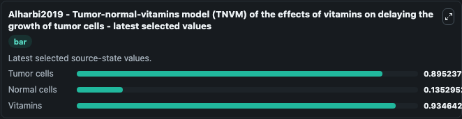

# Alharbi2019 - Tumor-normal-vitamins model (TNVM) of the effects of vitamins on delaying the growth of tumor cells

This Biosimulant lab wraps `Alharbi2019 - Tumor-normal-vitamins model (TNVM) of the effects of vitamins on delaying the growth of tumor cells` as a runnable oncology model with a companion visualization module.
This ordinary differential equation model of the interactions between tumor and normal cells, in the presence of a regular rate of vitamins, is based on the publication:S. It can be used to explore treatment-response dynamics and compare scenario outcomes across configurations.

## What You'll See

The lab asks: How does the bundled treatment-response model evolve under its baseline source conditions? It runs for 10.0 time units with a communication step of 1.0. The run uses the model defaults declared by the curated SBML wrapper. The generated visualizations focus on Tumor cells, Normal cells, and Vitamins, combining trajectory, endpoint-comparison, and summary-table views from one completed dark-mode run.

In this captured run, **Vitamins** peaked at **5.000** and **Vitamins** moved by **4.065** native units across 10.0 simulation windows.

<!-- BIOSIMULANT_VISUALS_START -->
### Output Visualizations



*Summary table for Alharbi2019 - Tumor-normal-vitamins model (TNVM) of the effects of vitamins on delaying the growth of tumor cells, reporting the scientific question, observed answer (largest change: **Vitamins** at **4.065** native units), evidence (peak observable: **Vitamins**), dominant module, and caveat.*



*Trajectories of Tumor cells, Normal cells, and Vitamins across the 10.0 simulation. In this run **Vitamins** fell from 5.000 to 0.9346 — the largest movements among the focused observables.*



*Endpoint ranking of the focused observables. Top 3 by final value: **Vitamins** = 0.9346, **Tumor cells** = 0.8952, **Normal cells** = 0.1353.*

<!-- BIOSIMULANT_VISUALS_END -->

## Model Context

- Core model: `models/core`
- Visualization model: `models/visualisation`
- Standard: `other`
- Upstream source: `biomodels_ebi:BIOMD0000001038`
- License: `CC0`
- Visual scope: Drug/treatment response and tumour-state change
- Caveat: Values are native SBML quantities; the cleanup does not reinterpret source equations.

## Inputs

| Input | Maps To | Default | Notes |
|---|---|---|---|
| Tumor cells | `oncology_sbml_alharbi2019_tumor_normal_vitamins_model_tnvm_of_biomd0000001038_model.initial_tumor_cells` | `1.0` | Initial Tumor cells. Sets the initial value of bundled SBML symbol `Tumor_cells`. |
| Normal cells | `oncology_sbml_alharbi2019_tumor_normal_vitamins_model_tnvm_of_biomd0000001038_model.initial_normal_cells` | `1.0` | Initial Normal cells. Sets the initial value of bundled SBML symbol `Normal_cells`. |
| Vitamins | `oncology_sbml_alharbi2019_tumor_normal_vitamins_model_tnvm_of_biomd0000001038_model.initial_vitamins` | `5.0` | Initial Vitamins. Sets the initial value of bundled SBML symbol `Vitamins`. |

## Outputs

| Output | Maps To | Role |
|---|---|---|
| `tumor_cells` | `oncology_sbml_alharbi2019_tumor_normal_vitamins_model_tnvm_of_biomd0000001038_model.tumor_cells` | Tumor cells observable. |
| `normal_cells` | `oncology_sbml_alharbi2019_tumor_normal_vitamins_model_tnvm_of_biomd0000001038_model.normal_cells` | Normal cells observable. |
| `vitamins` | `oncology_sbml_alharbi2019_tumor_normal_vitamins_model_tnvm_of_biomd0000001038_model.vitamins` | Vitamins observable. |
| `state` | `oncology_sbml_alharbi2019_tumor_normal_vitamins_model_tnvm_of_biomd0000001038_model.state` | Full raw SBML observable record for reproducibility and downstream visualisation. |
| `summary` | `oncology_sbml_alharbi2019_tumor_normal_vitamins_model_tnvm_of_biomd0000001038_model.summary` | Change and peak summary across the simulated SBML observables. |
| `species_labels` | `oncology_sbml_alharbi2019_tumor_normal_vitamins_model_tnvm_of_biomd0000001038_model.species_labels` | Mapping from selected raw SBML observable symbols to display labels. |

## Runtime

- Duration: `10.0`
- Communication step: `1.0`

## Running Locally

```bash
biosimulant labs serve .
```
