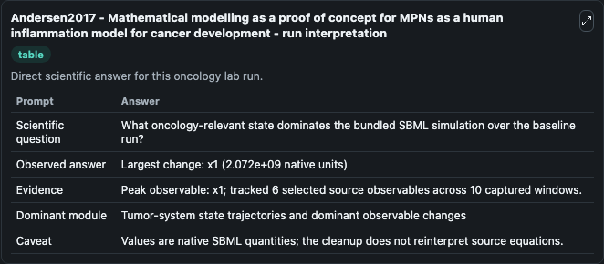
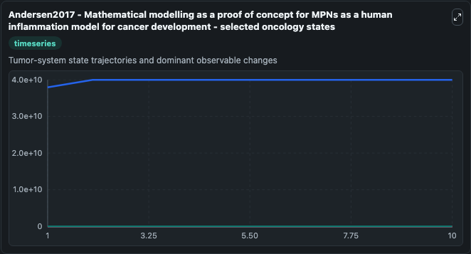
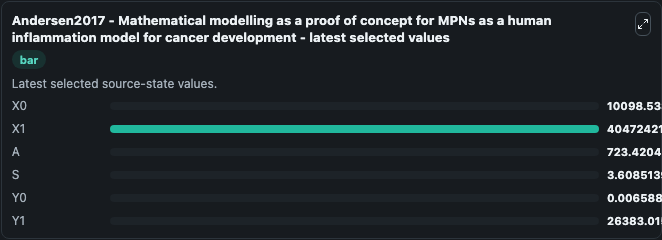

# Andersen2017 - Mathematical modelling as a proof of concept for MPNs as a human inflammation model for cancer development

This Biosimulant lab wraps `Andersen2017 - Mathematical modelling as a proof of concept for MPNs as a human inflammation model for cancer development` as a runnable oncology model with a companion visualization module.
This is a mathematical model investigating the role of chronic inflammation in the development and progression of myeloproliferative neoplasms (MPNs). It can be used to explore treatment-response dynamics and compare scenario outcomes across configurations.

## What You'll See

The lab asks: What oncology-relevant state dominates the bundled SBML simulation over the baseline run? It runs for 10.0 time units with a communication step of 1.0. The run uses the model defaults declared by the curated SBML wrapper. The generated visualizations focus on X0, X1, A, S, Y0, and Y1, combining trajectory, endpoint-comparison, and summary-table views from one completed dark-mode run.

In this captured run, **x1** carried the largest peak and **x1** moved by **2.07e+09** native units across 10.0 simulation windows.

<!-- BIOSIMULANT_VISUALS_START -->
### Output Visualizations



*Summary table for Andersen2017 - Mathematical modelling as a proof of concept for MPNs as a human inflammation model for cancer development, reporting the scientific question, observed answer (largest change: **x1** at **2.07e+09** native units), evidence (peak observable: **x1**), dominant module, and caveat.*



*Trajectories of X0, X1, A, S, Y0, and Y1 across the 10.0 simulation. In this run **X1** climbed from 3.84e+10 to 4.05e+10 and **X0** fell from 1.01e+04 to 1.01e+04 — the largest movements among the focused observables.*



*Endpoint ranking of the focused observables. Top 3 by final value: **X1** = 4.05e+10, **Y1** = 2.64e+04, **X0** = 1.01e+04, with 3 more observables below.*

<!-- BIOSIMULANT_VISUALS_END -->

## Model Context

- Core model: `models/core`
- Visualization model: `models/visualisation`
- Standard: `other`
- Upstream source: `biomodels_ebi:BIOMD0000000852`
- License: `CC0`
- Visual scope: Tumor-system state trajectories and dominant observable changes
- Caveat: Values are native SBML quantities; the cleanup does not reinterpret source equations.

## Inputs

| Input | Maps To | Default | Notes |
|---|---|---|---|

## Outputs

| Output | Maps To | Role |
|---|---|---|
| `model_state_1` | `oncology_sbml_andersen2017_mathematical_modelling_as_a_proof_o_biomd0000000852_model.model_state_1` | X0 observable. |
| `model_state_2` | `oncology_sbml_andersen2017_mathematical_modelling_as_a_proof_o_biomd0000000852_model.model_state_2` | X1 observable. |
| `model_state_3` | `oncology_sbml_andersen2017_mathematical_modelling_as_a_proof_o_biomd0000000852_model.model_state_3` | A observable. |
| `model_state_4` | `oncology_sbml_andersen2017_mathematical_modelling_as_a_proof_o_biomd0000000852_model.model_state_4` | S observable. |
| `model_state_5` | `oncology_sbml_andersen2017_mathematical_modelling_as_a_proof_o_biomd0000000852_model.model_state_5` | Y0 observable. |
| `model_state_6` | `oncology_sbml_andersen2017_mathematical_modelling_as_a_proof_o_biomd0000000852_model.model_state_6` | Y1 observable. |
| `state` | `oncology_sbml_andersen2017_mathematical_modelling_as_a_proof_o_biomd0000000852_model.state` | Full raw SBML observable record for reproducibility and downstream visualisation. |
| `summary` | `oncology_sbml_andersen2017_mathematical_modelling_as_a_proof_o_biomd0000000852_model.summary` | Change and peak summary across the simulated SBML observables. |
| `species_labels` | `oncology_sbml_andersen2017_mathematical_modelling_as_a_proof_o_biomd0000000852_model.species_labels` | Mapping from selected raw SBML observable symbols to display labels. |

## Runtime

- Duration: `10.0`
- Communication step: `1.0`

## Running Locally

```bash
biosimulant labs serve .
```
