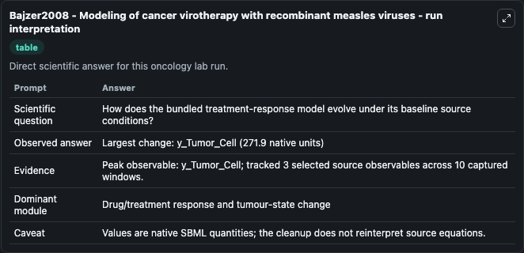
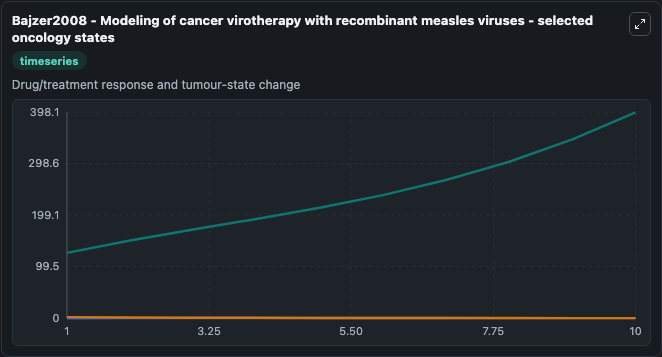
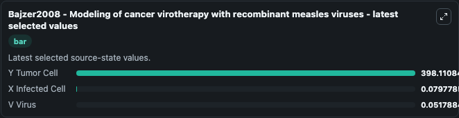

# Bajzer2008 - Modeling of cancer virotherapy with recombinant measles viruses

This Biosimulant lab wraps `Bajzer2008 - Modeling of cancer virotherapy with recombinant measles viruses` as a runnable oncology model with a companion visualization module.
This model describes the interactions between tumor cells and virus particles, with particular reference to virus-induced syncytium formation and ultimately death of tumor cells. It can be used to explore treatment-response dynamics and compare scenario outcomes across configurations.

## What You'll See

The lab asks: How does the bundled treatment-response model evolve under its baseline source conditions? It runs for 10.0 time units with a communication step of 1.0. The run uses the model defaults declared by the curated SBML wrapper. The generated visualizations focus on Y Tumor Cell, X Infected Cell, and V Virus, combining trajectory, endpoint-comparison, and summary-table views from one completed dark-mode run.

In this captured run, **y_Tumor_Cell** carried the largest peak and **y_Tumor_Cell** moved by **271.9** native units across 10.0 simulation windows.

<!-- BIOSIMULANT_VISUALS_START -->
### Output Visualizations



*Summary table for Bajzer2008 - Modeling of cancer virotherapy with recombinant measles viruses, reporting the scientific question, observed answer (largest change: **y_Tumor_Cell** at **271.9** native units), evidence (peak observable: **y_Tumor_Cell**), dominant module, and caveat.*



*Trajectories of Y Tumor Cell, X Infected Cell, and V Virus across the 10.0 simulation. In this run **Y Tumor Cell** climbed from 126.2 to 398.1 and **V Virus** fell from 2.000 to 0.0518 — the largest movements among the focused observables.*



*Endpoint ranking of the focused observables. Top 3 by final value: **Y Tumor Cell** = 398.1, **X Infected Cell** = 0.0798, **V Virus** = 0.0518.*

<!-- BIOSIMULANT_VISUALS_END -->

## Model Context

- Core model: `models/core`
- Visualization model: `models/visualisation`
- Standard: `other`
- Upstream source: `biomodels_ebi:BIOMD0000000771`
- License: `CC0`
- Visual scope: Drug/treatment response and tumour-state change
- Caveat: Values are native SBML quantities; the cleanup does not reinterpret source equations.

## Inputs

| Input | Maps To | Default | Notes |
|---|---|---|---|
| Epsilon source parameter | `oncology_sbml_bajzer2008_modeling_of_cancer_virotherapy_with_r_biomd0000000771_model.epsilon_level` | `1.648773` | Epsilon source parameter. Maps to bundled SBML parameter `epsilon`. |
| Y Tumor Cell | `oncology_sbml_bajzer2008_modeling_of_cancer_virotherapy_with_r_biomd0000000771_model.initial_y_tumor_cell` | `126.237` | Initial Y Tumor Cell. Sets the initial value of bundled SBML symbol `y_Tumor_Cell`. |
| X Infected Cell | `oncology_sbml_bajzer2008_modeling_of_cancer_virotherapy_with_r_biomd0000000771_model.initial_x_infected_cell` | `0.0` | Initial X Infected Cell. Sets the initial value of bundled SBML symbol `x_Infected_Cell`. |
| V Virus | `oncology_sbml_bajzer2008_modeling_of_cancer_virotherapy_with_r_biomd0000000771_model.initial_v_virus` | `2.0` | Initial V Virus. Sets the initial value of bundled SBML symbol `v_Virus`. |

## Outputs

| Output | Maps To | Role |
|---|---|---|
| `y_tumor_cell` | `oncology_sbml_bajzer2008_modeling_of_cancer_virotherapy_with_r_biomd0000000771_model.y_tumor_cell` | Y Tumor Cell observable. |
| `x_infected_cell` | `oncology_sbml_bajzer2008_modeling_of_cancer_virotherapy_with_r_biomd0000000771_model.x_infected_cell` | X Infected Cell observable. |
| `v_virus` | `oncology_sbml_bajzer2008_modeling_of_cancer_virotherapy_with_r_biomd0000000771_model.v_virus` | V Virus observable. |
| `state` | `oncology_sbml_bajzer2008_modeling_of_cancer_virotherapy_with_r_biomd0000000771_model.state` | Full raw SBML observable record for reproducibility and downstream visualisation. |
| `summary` | `oncology_sbml_bajzer2008_modeling_of_cancer_virotherapy_with_r_biomd0000000771_model.summary` | Change and peak summary across the simulated SBML observables. |
| `species_labels` | `oncology_sbml_bajzer2008_modeling_of_cancer_virotherapy_with_r_biomd0000000771_model.species_labels` | Mapping from selected raw SBML observable symbols to display labels. |

## Runtime

- Duration: `10.0`
- Communication step: `1.0`

## Running Locally

```bash
biosimulant labs serve .
```
