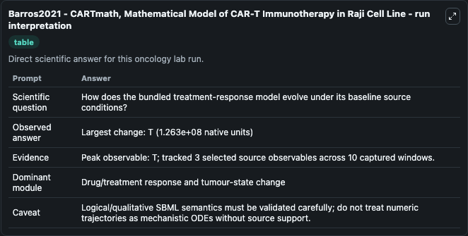
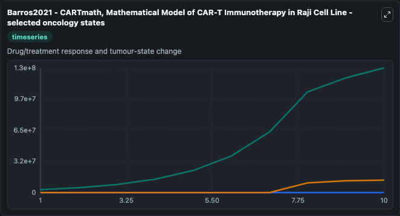
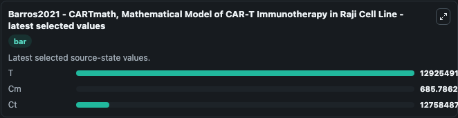

# Barros2021 - CARTmath, Mathematical Model of CAR-T Immunotherapy in Raji Cell Line

This Biosimulant lab wraps `Barros2021 - CARTmath, Mathematical Model of CAR-T Immunotherapy in Raji Cell Line` as a runnable oncology model with a companion visualization module.
A mathematical model (CART-math) studying the impact of CAR-T cells therapy on haematological cancer cell lines which in this case is RAJI. It can be used to explore treatment-response dynamics and compare scenario outcomes across configurations.

## What You'll See

The lab asks: How does the bundled treatment-response model evolve under its baseline source conditions? It runs for 10.0 time units with a communication step of 1.0. The run uses the model defaults declared by the curated SBML wrapper. The generated visualizations focus on T, Cm, and Ct, combining trajectory, endpoint-comparison, and summary-table views from one completed dark-mode run.

In this captured run, **T** peaked at **1.29e+08** and **T** moved by **1.26e+08** native units across 10.0 simulation windows.

<!-- BIOSIMULANT_VISUALS_START -->
### Output Visualizations



*Summary table for Barros2021 - CARTmath, Mathematical Model of CAR-T Immunotherapy in Raji Cell Line, reporting the scientific question, observed answer (largest change: **T** at **1.26e+08** native units), evidence (peak observable: **T**), dominant module, and caveat.*



*Trajectories of T, Cm, and Ct across the 10.0 simulation. In this run **T** climbed from 3e+06 to 1.29e+08 — the largest movements among the focused observables.*



*Endpoint ranking of the focused observables. Top 3 by final value: **T** = 1.29e+08, **Ct** = 1.28e+07, **Cm** = 685.8.*

<!-- BIOSIMULANT_VISUALS_END -->

## Model Context

- Core model: `models/core`
- Visualization model: `models/visualisation`
- Standard: `other`
- Upstream source: `biomodels_ebi:BIOMD0000001020`
- License: `CC0`
- Visual scope: Drug/treatment response and tumour-state change
- Caveat: Logical/qualitative SBML semantics must be validated carefully; do not treat numeric trajectories as mechanistic ODEs without source support.

## Inputs

| Input | Maps To | Default | Notes |
|---|---|---|---|
| Epsilon source parameter | `oncology_sbml_barros2021_cartmath_mathematical_model_of_car_t_biomd0000001020_model.epsilon_level` | `1.59795` | Epsilon source parameter. Maps to bundled SBML parameter `epsilon`. |
| Raji IDO+CART 19+1MT source parameter | `oncology_sbml_barros2021_cartmath_mathematical_model_of_car_t_biomd0000001020_model.raji_ido_positive_cart_19_positive_1mt_level` | `0.0` | Raji IDO+CART 19+1MT source parameter. Maps to bundled SBML parameter `Raji_IDO_CART_19_1MT`. |
| for Raji IDO+CART 19+1MT source parameter | `oncology_sbml_barros2021_cartmath_mathematical_model_of_car_t_biomd0000001020_model.initial_for_raji_ido_positive_cart_19_positive_1mt` | `0.0` | Initial for Raji IDO+CART 19+1MT source parameter. Maps to bundled SBML parameter `ModelValue_10`. |

## Outputs

| Output | Maps To | Role |
|---|---|---|
| `model_state_1` | `oncology_sbml_barros2021_cartmath_mathematical_model_of_car_t_biomd0000001020_model.model_state_1` | T observable. |
| `model_state_2` | `oncology_sbml_barros2021_cartmath_mathematical_model_of_car_t_biomd0000001020_model.model_state_2` | Cm observable. |
| `model_state_3` | `oncology_sbml_barros2021_cartmath_mathematical_model_of_car_t_biomd0000001020_model.model_state_3` | Ct observable. |
| `state` | `oncology_sbml_barros2021_cartmath_mathematical_model_of_car_t_biomd0000001020_model.state` | Full raw SBML observable record for reproducibility and downstream visualisation. |
| `summary` | `oncology_sbml_barros2021_cartmath_mathematical_model_of_car_t_biomd0000001020_model.summary` | Change and peak summary across the simulated SBML observables. |
| `species_labels` | `oncology_sbml_barros2021_cartmath_mathematical_model_of_car_t_biomd0000001020_model.species_labels` | Mapping from selected raw SBML observable symbols to display labels. |

## Runtime

- Duration: `10.0`
- Communication step: `1.0`

## Running Locally

```bash
biosimulant labs serve .
```
