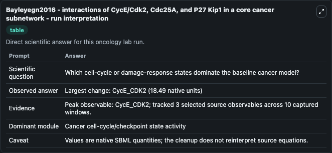
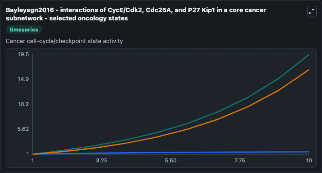
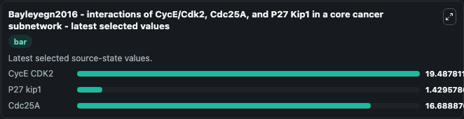

# Bayleyegn2016 - interactions of CycE/Cdk2, Cdc25A, and P27 Kip1 in a core cancer subnetwork

This Biosimulant lab wraps `Bayleyegn2016 - interactions of CycE/Cdk2, Cdc25A, and P27 Kip1 in a core cancer subnetwork` as a runnable oncology model with a companion visualization module.
Mathematical description of the interactions of CycE/Cdk2, Cdc25A, and P27Kip1 in a core cancer subnetwork. It can be used to explore treatment-response dynamics and compare scenario outcomes across configurations.

## What You'll See

The lab asks: Which cell-cycle or damage-response states dominate the baseline cancer model? It runs for 10.0 time units with a communication step of 1.0. The run uses the model defaults declared by the curated SBML wrapper. The generated visualizations focus on CycE CDK2, P27 kip1, and Cdc25A, combining trajectory, endpoint-comparison, and summary-table views from one completed dark-mode run.

In this captured run, **CycE_CDK2** carried the largest peak and **CycE_CDK2** moved by **18.490** native units across 10.0 simulation windows.

<!-- BIOSIMULANT_VISUALS_START -->
### Output Visualizations



*Summary table for Bayleyegn2016 - interactions of CycE/Cdk2, Cdc25A, and P27 Kip1 in a core cancer subnetwork, reporting the scientific question, observed answer (largest change: **CycE_CDK2** at **18.490** native units), evidence (peak observable: **CycE_CDK2**), dominant module, and caveat.*



*Trajectories of CycE CDK2, P27 kip1, and Cdc25A across the 10.0 simulation. In this run **CycE CDK2** climbed from 1.000 to 19.488 — the largest movements among the focused observables.*



*Endpoint ranking of the focused observables. Top 3 by final value: **CycE CDK2** = 19.488, **Cdc25A** = 16.689, **P27 kip1** = 1.430.*

<!-- BIOSIMULANT_VISUALS_END -->

## Model Context

- Core model: `models/core`
- Visualization model: `models/visualisation`
- Standard: `other`
- Upstream source: `biomodels_ebi:MODEL2003180002`
- License: `CC0`
- Visual scope: Cancer cell-cycle/checkpoint state activity
- Caveat: Values are native SBML quantities; the cleanup does not reinterpret source equations.

## Inputs

| Input | Maps To | Default | Notes |
|---|---|---|---|

## Outputs

| Output | Maps To | Role |
|---|---|---|
| `cyce_cdk2` | `oncology_sbml_bayleyegn2016_interactions_of_cyce_cdk2_cdc25a_a_model2003180002_model.cyce_cdk2` | CycE CDK2 observable. |
| `p27_kip1` | `oncology_sbml_bayleyegn2016_interactions_of_cyce_cdk2_cdc25a_a_model2003180002_model.p27_kip1` | P27 kip1 observable. |
| `cdc25a` | `oncology_sbml_bayleyegn2016_interactions_of_cyce_cdk2_cdc25a_a_model2003180002_model.cdc25a` | Cdc25A observable. |
| `state` | `oncology_sbml_bayleyegn2016_interactions_of_cyce_cdk2_cdc25a_a_model2003180002_model.state` | Full raw SBML observable record for reproducibility and downstream visualisation. |
| `summary` | `oncology_sbml_bayleyegn2016_interactions_of_cyce_cdk2_cdc25a_a_model2003180002_model.summary` | Change and peak summary across the simulated SBML observables. |
| `species_labels` | `oncology_sbml_bayleyegn2016_interactions_of_cyce_cdk2_cdc25a_a_model2003180002_model.species_labels` | Mapping from selected raw SBML observable symbols to display labels. |

## Runtime

- Duration: `10.0`
- Communication step: `1.0`

## Running Locally

```bash
biosimulant labs serve .
```
