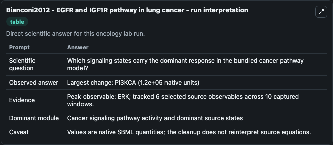
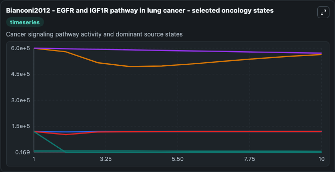
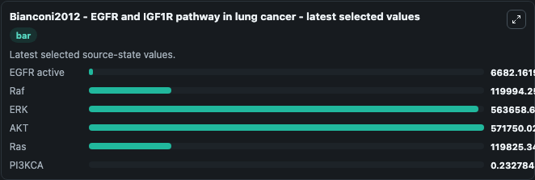

# Bianconi2012 - EGFR and IGF1R pathway in lung cancer

This Biosimulant lab wraps `Bianconi2012 - EGFR and IGF1R pathway in lung cancer` as a runnable oncology model with a companion visualization module.
Bianconi2012 - EGFR and IGF1R pathway in lung cancer EGFR and IGF1R pathways play a key role in various human cancers and are crucial for tumour transformation and survival of malignant cells. It can be used to explore treatment-response dynamics and compare scenario outcomes across configurations.

## What You'll See

The lab asks: Which signaling states carry the dominant response in the bundled cancer pathway model? It runs for 10.0 time units with a communication step of 1.0. The run uses the model defaults declared by the curated SBML wrapper. The generated visualizations focus on EGFR active, Raf, ERK, AKT, Ras, and PI3KCA, combining trajectory, endpoint-comparison, and summary-table views from one completed dark-mode run.

In this captured run, **ERK** peaked at **6e+05** and **PI3KCA** moved by **1.2e+05** native units across 10.0 simulation windows.

<!-- BIOSIMULANT_VISUALS_START -->
### Output Visualizations



*Summary table for Bianconi2012 - EGFR and IGF1R pathway in lung cancer, reporting the scientific question, observed answer (largest change: **PI3KCA** at **1.2e+05** native units), evidence (peak observable: **ERK**), dominant module, and caveat.*



*Trajectories of EGFR active, Raf, ERK, AKT, Ras, and PI3KCA across the 10.0 simulation. In this run **PI3KCA** fell from 1.2e+05 to 0.2328 — the largest movements among the focused observables.*



*Endpoint ranking of the focused observables. Top 3 by final value: **AKT** = 5.72e+05, **ERK** = 5.64e+05, **Raf** = 1.2e+05, with 3 more observables below.*

<!-- BIOSIMULANT_VISUALS_END -->

## Model Context

- Core model: `models/core`
- Visualization model: `models/visualisation`
- Standard: `other`
- Upstream source: `biomodels_ebi:BIOMD0000000427`
- License: `CC0`
- Visual scope: Cancer signaling pathway activity and dominant source states
- Caveat: Values are native SBML quantities; the cleanup does not reinterpret source equations.

## Inputs

| Input | Maps To | Default | Notes |
|---|---|---|---|
| Gamma EGFR source parameter | `oncology_sbml_bianconi2012_egfr_and_igf1r_pathway_in_lung_canc_biomd0000000427_model.gamma_egfr_level` | `0.02` | Gamma EGFR source parameter. Maps to bundled SBML parameter `gamma_EGFR`. |
| EGFR active | `oncology_sbml_bianconi2012_egfr_and_igf1r_pathway_in_lung_canc_biomd0000000427_model.initial_egfr_active` | `8000.0` | Initial EGFR active. Sets the initial value of bundled SBML symbol `EGFR_active`. |
| Raf | `oncology_sbml_bianconi2012_egfr_and_igf1r_pathway_in_lung_canc_biomd0000000427_model.initial_raf` | `120000.0` | Initial Raf. Sets the initial value of bundled SBML symbol `Raf`. |
| ERK | `oncology_sbml_bianconi2012_egfr_and_igf1r_pathway_in_lung_canc_biomd0000000427_model.initial_erk` | `600000.0` | Initial ERK. Sets the initial value of bundled SBML symbol `ERK`. |
| AKT | `oncology_sbml_bianconi2012_egfr_and_igf1r_pathway_in_lung_canc_biomd0000000427_model.initial_akt` | `600000.0` | Initial AKT. Sets the initial value of bundled SBML symbol `AKT`. |
| Ras | `oncology_sbml_bianconi2012_egfr_and_igf1r_pathway_in_lung_canc_biomd0000000427_model.initial_ras` | `120000.0` | Initial Ras. Sets the initial value of bundled SBML symbol `Ras`. |

## Outputs

| Output | Maps To | Role |
|---|---|---|
| `egfr_active` | `oncology_sbml_bianconi2012_egfr_and_igf1r_pathway_in_lung_canc_biomd0000000427_model.egfr_active` | EGFR active observable. |
| `raf` | `oncology_sbml_bianconi2012_egfr_and_igf1r_pathway_in_lung_canc_biomd0000000427_model.raf` | Raf observable. |
| `erk` | `oncology_sbml_bianconi2012_egfr_and_igf1r_pathway_in_lung_canc_biomd0000000427_model.erk` | ERK observable. |
| `akt` | `oncology_sbml_bianconi2012_egfr_and_igf1r_pathway_in_lung_canc_biomd0000000427_model.akt` | AKT observable. |
| `ras` | `oncology_sbml_bianconi2012_egfr_and_igf1r_pathway_in_lung_canc_biomd0000000427_model.ras` | Ras observable. |
| `pi3kca` | `oncology_sbml_bianconi2012_egfr_and_igf1r_pathway_in_lung_canc_biomd0000000427_model.pi3kca` | PI3KCA observable. |
| `state` | `oncology_sbml_bianconi2012_egfr_and_igf1r_pathway_in_lung_canc_biomd0000000427_model.state` | Full raw SBML observable record for reproducibility and downstream visualisation. |
| `summary` | `oncology_sbml_bianconi2012_egfr_and_igf1r_pathway_in_lung_canc_biomd0000000427_model.summary` | Change and peak summary across the simulated SBML observables. |
| `species_labels` | `oncology_sbml_bianconi2012_egfr_and_igf1r_pathway_in_lung_canc_biomd0000000427_model.species_labels` | Mapping from selected raw SBML observable symbols to display labels. |

## Runtime

- Duration: `10.0`
- Communication step: `1.0`

## Running Locally

```bash
biosimulant labs serve .
```
