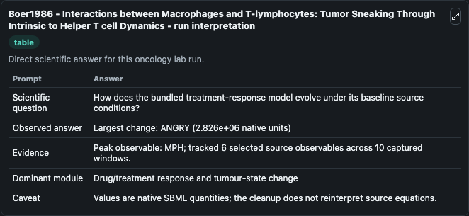
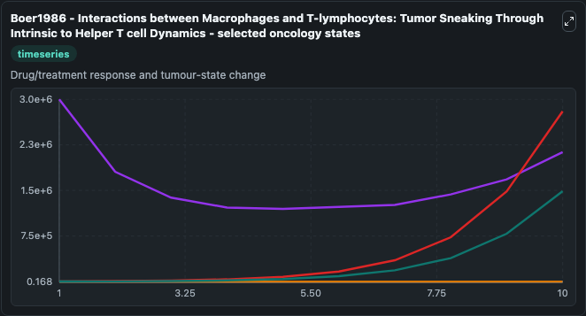
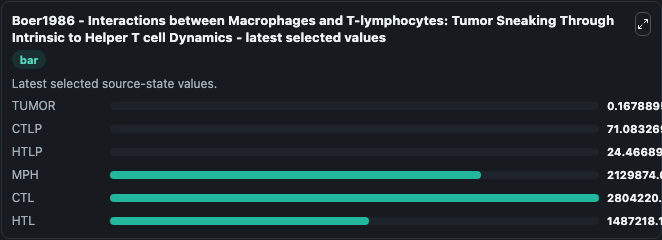

# Boer1986 - Interactions between Macrophages and T-lymphocytes: Tumor Sneaking Through Intrinsic to Helper T cell Dynamics

This Biosimulant lab wraps `Boer1986 - Interactions between Macrophages and T-lymphocytes: Tumor Sneaking Through Intrinsic to Helper T cell Dynamics` as a runnable oncology model with a companion visualization module.
Interactions between Macrophages and T-lymphocytes: TumorSneaking Through Intrinsic to Helper T cell DynamicsROB J. It can be used to explore treatment-response dynamics and compare scenario outcomes across configurations.

## What You'll See

The lab asks: How does the bundled treatment-response model evolve under its baseline source conditions? It runs for 10.0 time units with a communication step of 1.0. The run uses the model defaults declared by the curated SBML wrapper. The generated visualizations focus on TUMOR, CTLP, HTLP, MPH, CTL, and HTL, combining trajectory, endpoint-comparison, and summary-table views from one completed dark-mode run.

In this captured run, **MPH** peaked at **3e+06** and **ANGRY** moved by **2.83e+06** native units across 10.0 simulation windows.

<!-- BIOSIMULANT_VISUALS_START -->
### Output Visualizations



*Summary table for Boer1986 - Interactions between Macrophages and T-lymphocytes: Tumor Sneaking Through Intrinsic to Helper T cell Dynamics, reporting the scientific question, observed answer (largest change: **ANGRY** at **2.83e+06** native units), evidence (peak observable: **MPH**), dominant module, and caveat.*



*Trajectories of TUMOR, CTLP, HTLP, MPH, CTL, and HTL across the 10.0 simulation. In this run **CTL** climbed from 3909.0 to 2.8e+06 and **MPH** fell from 3e+06 to 2.13e+06 — the largest movements among the focused observables.*



*Endpoint ranking of the focused observables. Top 3 by final value: **CTL** = 2.8e+06, **MPH** = 2.13e+06, **HTL** = 1.49e+06, with 3 more observables below.*

<!-- BIOSIMULANT_VISUALS_END -->

## Model Context

- Core model: `models/core`
- Visualization model: `models/visualisation`
- Standard: `other`
- Upstream source: `biomodels_ebi:MODEL1912110001`
- License: `CC0`
- Visual scope: Drug/treatment response and tumour-state change
- Caveat: Values are native SBML quantities; the cleanup does not reinterpret source equations.

## Inputs

| Input | Maps To | Default | Notes |
|---|---|---|---|
| KILL source parameter | `oncology_sbml_boer1986_interactions_between_macrophages_and_t_model1912110001_model.kill_level` | `10.0` | KILL source parameter. Maps to bundled SBML parameter `KILL`. |
| TUMOR | `oncology_sbml_boer1986_interactions_between_macrophages_and_t_model1912110001_model.initial_tumor` | `1000.0` | Initial TUMOR. Sets the initial value of bundled SBML symbol `TUMOR`. |
| CTLP | `oncology_sbml_boer1986_interactions_between_macrophages_and_t_model1912110001_model.initial_ctlp` | `1.0` | Initial CTLP. Sets the initial value of bundled SBML symbol `CTLP`. |
| HTLP | `oncology_sbml_boer1986_interactions_between_macrophages_and_t_model1912110001_model.initial_htlp` | `15.0` | Initial HTLP. Sets the initial value of bundled SBML symbol `HTLP`. |
| MPH | `oncology_sbml_boer1986_interactions_between_macrophages_and_t_model1912110001_model.initial_mph` | `3000000.0` | Initial MPH. Sets the initial value of bundled SBML symbol `MPH`. |
| CTL | `oncology_sbml_boer1986_interactions_between_macrophages_and_t_model1912110001_model.initial_ctl` | `3909.0` | Initial CTL. Sets the initial value of bundled SBML symbol `CTL`. |

## Outputs

| Output | Maps To | Role |
|---|---|---|
| `tumor` | `oncology_sbml_boer1986_interactions_between_macrophages_and_t_model1912110001_model.tumor` | TUMOR observable. |
| `ctlp` | `oncology_sbml_boer1986_interactions_between_macrophages_and_t_model1912110001_model.ctlp` | CTLP observable. |
| `htlp` | `oncology_sbml_boer1986_interactions_between_macrophages_and_t_model1912110001_model.htlp` | HTLP observable. |
| `mph` | `oncology_sbml_boer1986_interactions_between_macrophages_and_t_model1912110001_model.mph` | MPH observable. |
| `ctl` | `oncology_sbml_boer1986_interactions_between_macrophages_and_t_model1912110001_model.ctl` | CTL observable. |
| `htl` | `oncology_sbml_boer1986_interactions_between_macrophages_and_t_model1912110001_model.htl` | HTL observable. |
| `state` | `oncology_sbml_boer1986_interactions_between_macrophages_and_t_model1912110001_model.state` | Full raw SBML observable record for reproducibility and downstream visualisation. |
| `summary` | `oncology_sbml_boer1986_interactions_between_macrophages_and_t_model1912110001_model.summary` | Change and peak summary across the simulated SBML observables. |
| `species_labels` | `oncology_sbml_boer1986_interactions_between_macrophages_and_t_model1912110001_model.species_labels` | Mapping from selected raw SBML observable symbols to display labels. |

## Runtime

- Duration: `10.0`
- Communication step: `1.0`

## Running Locally

```bash
biosimulant labs serve .
```
