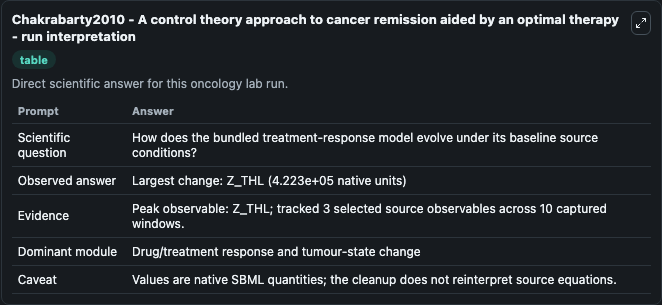
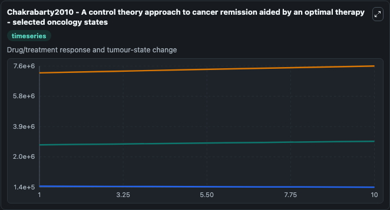
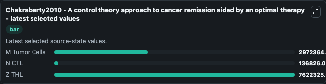

# Chakrabarty2010 - A control theory approach to cancer remission aided by an optimal therapy

This Biosimulant lab wraps `Chakrabarty2010 - A control theory approach to cancer remission aided by an optimal therapy` as a runnable oncology model with a companion visualization module.
This is a reinvestigation of a previous model depicting cancer remission. It can be used to explore treatment-response dynamics and compare scenario outcomes across configurations.

## What You'll See

The lab asks: How does the bundled treatment-response model evolve under its baseline source conditions? It runs for 10.0 time units with a communication step of 1.0. The run uses the model defaults declared by the curated SBML wrapper. The generated visualizations focus on M Tumor Cells, N CTL, and Z THL, combining trajectory, endpoint-comparison, and summary-table views from one completed dark-mode run.

In this captured run, **Z_THL** carried the largest peak and **Z_THL** moved by **4.22e+05** native units across 10.0 simulation windows.

<!-- BIOSIMULANT_VISUALS_START -->
### Output Visualizations



*Summary table for Chakrabarty2010 - A control theory approach to cancer remission aided by an optimal therapy, reporting the scientific question, observed answer (largest change: **Z_THL** at **4.22e+05** native units), evidence (peak observable: **Z_THL**), dominant module, and caveat.*



*Trajectories of M Tumor Cells, N CTL, and Z THL across the 10.0 simulation. In this run **Z THL** climbed from 7.2e+06 to 7.62e+06 and **N CTL** fell from 2e+05 to 1.37e+05 — the largest movements among the focused observables.*



*Endpoint ranking of the focused observables. Top 3 by final value: **Z THL** = 7.62e+06, **M Tumor Cells** = 2.97e+06, **N CTL** = 1.37e+05.*

<!-- BIOSIMULANT_VISUALS_END -->

## Model Context

- Core model: `models/core`
- Visualization model: `models/visualisation`
- Standard: `other`
- Upstream source: `biomodels_ebi:BIOMD0000000777`
- License: `CC0`
- Visual scope: Drug/treatment response and tumour-state change
- Caveat: Values are native SBML quantities; the cleanup does not reinterpret source equations.

## Inputs

| Input | Maps To | Default | Notes |
|---|---|---|---|
| M Tumor Cells | `oncology_sbml_chakrabarty2010_a_control_theory_approach_to_can_biomd0000000777_model.initial_m_tumor_cells` | `2750000.0` | Initial M Tumor Cells. Sets the initial value of bundled SBML symbol `M_Tumor_Cells`. |
| N CTL | `oncology_sbml_chakrabarty2010_a_control_theory_approach_to_can_biomd0000000777_model.initial_n_ctl` | `200000.0` | Initial N CTL. Sets the initial value of bundled SBML symbol `N_CTL`. |
| Z THL | `oncology_sbml_chakrabarty2010_a_control_theory_approach_to_can_biomd0000000777_model.initial_z_thl` | `7200000.0` | Initial Z THL. Sets the initial value of bundled SBML symbol `Z_THL`. |

## Outputs

| Output | Maps To | Role |
|---|---|---|
| `m_tumor_cells` | `oncology_sbml_chakrabarty2010_a_control_theory_approach_to_can_biomd0000000777_model.m_tumor_cells` | M Tumor Cells observable. |
| `n_ctl` | `oncology_sbml_chakrabarty2010_a_control_theory_approach_to_can_biomd0000000777_model.n_ctl` | N CTL observable. |
| `z_thl` | `oncology_sbml_chakrabarty2010_a_control_theory_approach_to_can_biomd0000000777_model.z_thl` | Z THL observable. |
| `state` | `oncology_sbml_chakrabarty2010_a_control_theory_approach_to_can_biomd0000000777_model.state` | Full raw SBML observable record for reproducibility and downstream visualisation. |
| `summary` | `oncology_sbml_chakrabarty2010_a_control_theory_approach_to_can_biomd0000000777_model.summary` | Change and peak summary across the simulated SBML observables. |
| `species_labels` | `oncology_sbml_chakrabarty2010_a_control_theory_approach_to_can_biomd0000000777_model.species_labels` | Mapping from selected raw SBML observable symbols to display labels. |

## Runtime

- Duration: `10.0`
- Communication step: `1.0`

## Running Locally

```bash
biosimulant labs serve .
```
