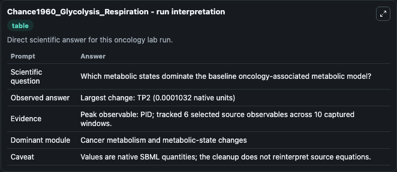
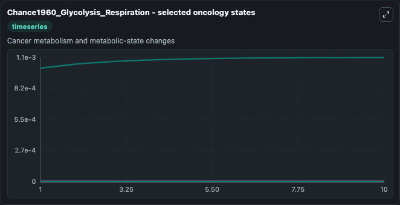
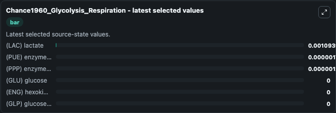

# Chance1960_Glycolysis_Respiration

This Biosimulant lab wraps `Chance1960_Glycolysis_Respiration` as a runnable oncology model with a companion visualization module.
This model is described inthe article: Metabolic control mechanisms. It can be used to explore treatment-response dynamics and compare scenario outcomes across configurations.

## What You'll See

The lab asks: Which metabolic states dominate the baseline oncology-associated metabolic model? It runs for 10.0 time units with a communication step of 1.0. The run uses the model defaults declared by the curated SBML wrapper. The generated visualizations focus on (LAC) lactate, (PUE) enzyme concerned in ATP utilization, (PPP) enzyme intermediate concerned in ATP utilization, (GLU) glucose, (ENG) hexokinase glucose intermediate, and (GLP) glucose 6 phosphate, combining trajectory, endpoint-comparison, and summary-table views from one completed dark-mode run.

In this captured run, **PID** carried the largest peak and **TP2** moved by **0.000103** native units across 10.0 simulation windows.

<!-- BIOSIMULANT_VISUALS_START -->
### Output Visualizations



*Summary table for Chance1960_Glycolysis_Respiration, reporting the scientific question, observed answer (largest change: **TP2** at **0.000103** native units), evidence (peak observable: **PID**), dominant module, and caveat.*



*Trajectories of (LAC) lactate, (PUE) enzyme concerned in ATP utilization, (PPP) enzyme intermediate concerned in ATP utilization, (GLU) glucose, (ENG) hexokinase glucose intermediate, and (GLP) glucose 6 phosphate across the 10.0 simulation. In this run **(LAC) lactate** climbed from 0.001 to 0.00109 and **(PUE) enzyme concerned in ATP utilization** fell from 2e-06 to 1.75e-06 — the largest movements among the focused observables.*



*Endpoint ranking of the focused observables. Top 3 by final value: **(LAC) lactate** = 0.00109, **(PUE) enzyme concerned in ATP utilization** = 1.75e-06, **(PPP) enzyme intermediate concerned in ATP utilization** = 1.25e-06, with 3 more observables below.*

<!-- BIOSIMULANT_VISUALS_END -->

## Model Context

- Core model: `models/core`
- Visualization model: `models/visualisation`
- Standard: `other`
- Upstream source: `biomodels_ebi:BIOMD0000000281`
- License: `CC0`
- Visual scope: Cancer metabolism and metabolic-state changes
- Caveat: Values are native SBML quantities; the cleanup does not reinterpret source equations.

## Inputs

| Input | Maps To | Default | Notes |
|---|---|---|---|
| (LAC) lactate | `oncology_sbml_chance1960_glycolysis_respiration_biomd0000000281_model.initial_lac_lactate` | `0.001` | Initial (LAC) lactate. Sets the initial value of bundled SBML symbol `LAC`. |
| (PUE) enzyme concerned in ATP utilization | `oncology_sbml_chance1960_glycolysis_respiration_biomd0000000281_model.initial_pue_enzyme_concerned_in_atp_utilization` | `2e-06` | Initial (PUE) enzyme concerned in ATP utilization. Sets the initial value of bundled SBML symbol `PUE`. |
| (PPP) enzyme intermediate concerned in ATP utilization | `oncology_sbml_chance1960_glycolysis_respiration_biomd0000000281_model.initial_ppp_enzyme_intermediate_concerned_in_atp_utilization` | `1e-06` | Initial (PPP) enzyme intermediate concerned in ATP utilization. Sets the initial value of bundled SBML symbol `PPP`. |
| (GLU) glucose | `oncology_sbml_chance1960_glycolysis_respiration_biomd0000000281_model.initial_glu_glucose` | `0.0` | Initial (GLU) glucose. Sets the initial value of bundled SBML symbol `GLU`. |
| (ENG) hexokinase glucose intermediate | `oncology_sbml_chance1960_glycolysis_respiration_biomd0000000281_model.initial_eng_hexokinase_glucose_intermediate` | `0.0` | Initial (ENG) hexokinase glucose intermediate. Sets the initial value of bundled SBML symbol `ENG`. |
| (GLP) glucose 6 phosphate | `oncology_sbml_chance1960_glycolysis_respiration_biomd0000000281_model.initial_glp_glucose_6_phosphate` | `0.0` | Initial (GLP) glucose 6 phosphate. Sets the initial value of bundled SBML symbol `GLP`. |

## Outputs

| Output | Maps To | Role |
|---|---|---|
| `lac_lactate` | `oncology_sbml_chance1960_glycolysis_respiration_biomd0000000281_model.lac_lactate` | (LAC) lactate observable. |
| `pue_enzyme_concerned_in_atp_utilization` | `oncology_sbml_chance1960_glycolysis_respiration_biomd0000000281_model.pue_enzyme_concerned_in_atp_utilization` | (PUE) enzyme concerned in ATP utilization observable. |
| `ppp_enzyme_intermediate_concerned_in_atp_utilization` | `oncology_sbml_chance1960_glycolysis_respiration_biomd0000000281_model.ppp_enzyme_intermediate_concerned_in_atp_utilization` | (PPP) enzyme intermediate concerned in ATP utilization observable. |
| `glu_glucose` | `oncology_sbml_chance1960_glycolysis_respiration_biomd0000000281_model.glu_glucose` | (GLU) glucose observable. |
| `eng_hexokinase_glucose_intermediate` | `oncology_sbml_chance1960_glycolysis_respiration_biomd0000000281_model.eng_hexokinase_glucose_intermediate` | (ENG) hexokinase glucose intermediate observable. |
| `glp_glucose_6_phosphate` | `oncology_sbml_chance1960_glycolysis_respiration_biomd0000000281_model.glp_glucose_6_phosphate` | (GLP) glucose 6 phosphate observable. |
| `state` | `oncology_sbml_chance1960_glycolysis_respiration_biomd0000000281_model.state` | Full raw SBML observable record for reproducibility and downstream visualisation. |
| `summary` | `oncology_sbml_chance1960_glycolysis_respiration_biomd0000000281_model.summary` | Change and peak summary across the simulated SBML observables. |
| `species_labels` | `oncology_sbml_chance1960_glycolysis_respiration_biomd0000000281_model.species_labels` | Mapping from selected raw SBML observable symbols to display labels. |

## Runtime

- Duration: `10.0`
- Communication step: `1.0`

## Running Locally

```bash
biosimulant labs serve .
```
