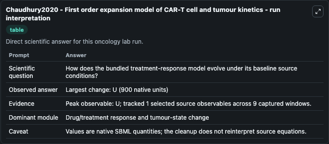
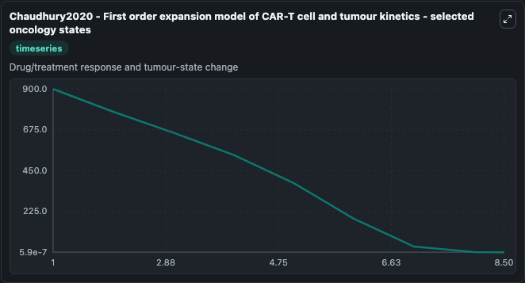
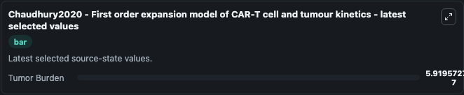

# Chaudhury2020 - First order expansion model of CAR-T cell and tumour kinetics

This Biosimulant lab wraps `Chaudhury2020 - First order expansion model of CAR-T cell and tumour kinetics` as a runnable oncology model with a companion visualization module.
This ordinary differential equation model of the cellular kinetics and pharmacodynamics of CAR-T cell therapy is described in the publication:Chaudhury, A., Zhu, X., Chu, L., Goliaei, A., June, C., Ke. It can be used to explore treatment-response dynamics and compare scenario outcomes across configurations.

## What You'll See

The lab asks: How does the bundled treatment-response model evolve under its baseline source conditions? It runs for 8.5 time units with a communication step of 1.0. The run uses the model defaults declared by the curated SBML wrapper. The generated visualizations focus on Tumor Burden, combining trajectory, endpoint-comparison, and summary-table views from one completed dark-mode run.

In this captured run, **U** carried the largest peak and **U** moved by **900.0** native units across 8.5 simulation windows.

<!-- BIOSIMULANT_VISUALS_START -->
### Output Visualizations



*Summary table for Chaudhury2020 - First order expansion model of CAR-T cell and tumour kinetics, reporting the scientific question, observed answer (largest change: **U** at **900.0** native units), evidence (peak observable: **U**), dominant module, and caveat.*



*Trajectories of Tumor Burden across the 8.5 simulation. In this run **Tumor Burden** fell from 900.0 to 5.92e-07 — the largest movements among the focused observables.*



*Largest-excursion ranking of the focused observables — the absolute movement magnitude during the run. Top 1: **Tumor Burden** = 5.92e-07.*

<!-- BIOSIMULANT_VISUALS_END -->

## Model Context

- Core model: `models/core`
- Visualization model: `models/visualisation`
- Standard: `other`
- Upstream source: `biomodels_ebi:MODEL2109110005`
- License: `CC0`
- Visual scope: Drug/treatment response and tumour-state change
- Caveat: Values are native SBML quantities; the cleanup does not reinterpret source equations.

## Inputs

| Input | Maps To | Default | Notes |
|---|---|---|---|
| CAR-T Cells | `oncology_sbml_chaudhury2020_first_order_expansion_model_of_car_model2109110005_model.initial_car_t_cells` | `10.0` | Initial CAR-T Cells. Sets the initial value of bundled SBML symbol `CAR_T_cells`. |
| Tumor Burden | `oncology_sbml_chaudhury2020_first_order_expansion_model_of_car_model2109110005_model.initial_tumor_burden` | `900.000000000001` | Initial Tumor Burden. Sets the initial value of bundled SBML symbol `U`. |

## Outputs

| Output | Maps To | Role |
|---|---|---|
| `car_t_cells` | `oncology_sbml_chaudhury2020_first_order_expansion_model_of_car_model2109110005_model.car_t_cells` | CAR-T Cells observable. |
| `tumor_burden` | `oncology_sbml_chaudhury2020_first_order_expansion_model_of_car_model2109110005_model.tumor_burden` | Tumor Burden observable. |
| `state` | `oncology_sbml_chaudhury2020_first_order_expansion_model_of_car_model2109110005_model.state` | Full raw SBML observable record for reproducibility and downstream visualisation. |
| `summary` | `oncology_sbml_chaudhury2020_first_order_expansion_model_of_car_model2109110005_model.summary` | Change and peak summary across the simulated SBML observables. |
| `species_labels` | `oncology_sbml_chaudhury2020_first_order_expansion_model_of_car_model2109110005_model.species_labels` | Mapping from selected raw SBML observable symbols to display labels. |

## Runtime

- Duration: `8.5`
- Communication step: `1.0`

## Running Locally

```bash
biosimulant labs serve .
```
