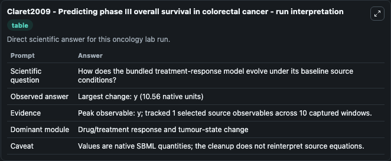
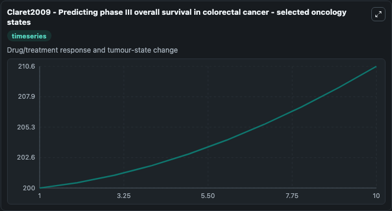
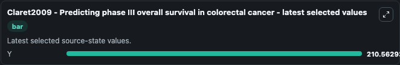

# Claret2009 - Predicting phase III overall survival in colorectal cancer

This Biosimulant lab wraps `Claret2009 - Predicting phase III overall survival in colorectal cancer` as a runnable oncology model with a companion visualization module.
Claret2009 - Predicting phase III overall survival in colorectal cancer This model is described in the article: Model-based prediction of phase III overall survival in colorectal cancer on the basis o. It can be used to explore treatment-response dynamics and compare scenario outcomes across configurations.

## What You'll See

The lab asks: How does the bundled treatment-response model evolve under its baseline source conditions? It runs for 10.0 time units with a communication step of 1.0. The run uses the model defaults declared by the curated SBML wrapper. The generated visualizations focus on Y, combining trajectory, endpoint-comparison, and summary-table views from one completed dark-mode run.

In this captured run, **y** carried the largest peak and **y** moved by **10.560** native units across 10.0 simulation windows.

<!-- BIOSIMULANT_VISUALS_START -->
### Output Visualizations



*Summary table for Claret2009 - Predicting phase III overall survival in colorectal cancer, reporting the scientific question, observed answer (largest change: **y** at **10.560** native units), evidence (peak observable: **y**), dominant module, and caveat.*



*Trajectories of Y across the 10.0 simulation. In this run **Y** climbed from 200.0 to 210.6 — the largest movements among the focused observables.*



*Endpoint ranking of the focused observables. Top 1 by final value: **Y** = 210.6.*

<!-- BIOSIMULANT_VISUALS_END -->

## Model Context

- Core model: `models/core`
- Visualization model: `models/visualisation`
- Standard: `other`
- Upstream source: `biomodels_ebi:MODEL1708310001`
- License: `CC0`
- Visual scope: Drug/treatment response and tumour-state change
- Caveat: Values are native SBML quantities; the cleanup does not reinterpret source equations.

## Inputs

| Input | Maps To | Default | Notes |
|---|---|---|---|
| Treatment int source parameter | `oncology_sbml_claret2009_predicting_phase_iii_overall_survival_model1708310001_model.treatment_int_level` | `14.0` | Treatment int source parameter. Maps to bundled SBML parameter `treatment_int`. |
| Treatment day source parameter | `oncology_sbml_claret2009_predicting_phase_iii_overall_survival_model1708310001_model.treatment_day_level` | `1.0` | Treatment day source parameter. Maps to bundled SBML parameter `treatment_day`. |
| Dose length source parameter | `oncology_sbml_claret2009_predicting_phase_iii_overall_survival_model1708310001_model.dose_length` | `0.0625` | Dose length source parameter. Maps to bundled SBML parameter `dose_length`. |
| Dose int2 source parameter | `oncology_sbml_claret2009_predicting_phase_iii_overall_survival_model1708310001_model.dose_int2` | `0.5` | Dose int2 source parameter. Maps to bundled SBML parameter `Dose_int2`. |

## Outputs

| Output | Maps To | Role |
|---|---|---|
| `model_state_1` | `oncology_sbml_claret2009_predicting_phase_iii_overall_survival_model1708310001_model.model_state_1` | Y observable. |
| `state` | `oncology_sbml_claret2009_predicting_phase_iii_overall_survival_model1708310001_model.state` | Full raw SBML observable record for reproducibility and downstream visualisation. |
| `summary` | `oncology_sbml_claret2009_predicting_phase_iii_overall_survival_model1708310001_model.summary` | Change and peak summary across the simulated SBML observables. |
| `species_labels` | `oncology_sbml_claret2009_predicting_phase_iii_overall_survival_model1708310001_model.species_labels` | Mapping from selected raw SBML observable symbols to display labels. |

## Runtime

- Duration: `10.0`
- Communication step: `1.0`

## Running Locally

```bash
biosimulant labs serve .
```
