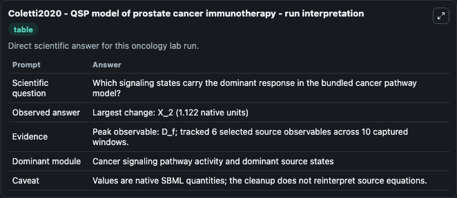
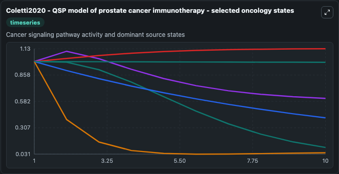
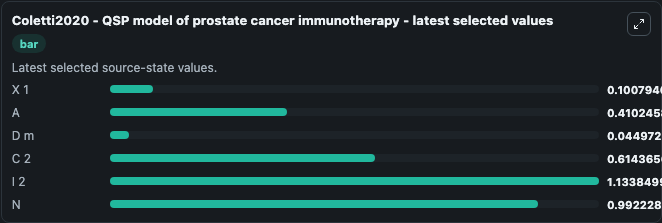

# Coletti2020 - QSP model of prostate cancer immunotherapy

This Biosimulant lab wraps `Coletti2020 - QSP model of prostate cancer immunotherapy` as a runnable oncology model with a companion visualization module.
This model is based on the publication:Coletti R, Leonardelli L, Parolo S, Marchetti L. It can be used to explore treatment-response dynamics and compare scenario outcomes across configurations.

## What You'll See

The lab asks: Which signaling states carry the dominant response in the bundled cancer pathway model? It runs for 10.0 time units with a communication step of 1.0. The run uses the model defaults declared by the curated SBML wrapper. The generated visualizations focus on X 1, A, D m, C 2, I 2, and N, combining trajectory, endpoint-comparison, and summary-table views from one completed dark-mode run.

In this captured run, **D_f** carried the largest peak and **X_2** moved by **1.122** native units across 10.0 simulation windows.

<!-- BIOSIMULANT_VISUALS_START -->
### Output Visualizations



*Summary table for Coletti2020 - QSP model of prostate cancer immunotherapy, reporting the scientific question, observed answer (largest change: **X_2** at **1.122** native units), evidence (peak observable: **D_f**), dominant module, and caveat.*



*Trajectories of X 1, A, D m, C 2, I 2, and N across the 10.0 simulation. In this run **I 2** climbed from 1.000 to 1.134 and **D m** fell from 1.000 to 0.0450 — the largest movements among the focused observables.*



*Endpoint ranking of the focused observables. Top 3 by final value: **I 2** = 1.134, **N** = 0.9922, **C 2** = 0.6144, with 3 more observables below.*

<!-- BIOSIMULANT_VISUALS_END -->

## Model Context

- Core model: `models/core`
- Visualization model: `models/visualisation`
- Standard: `other`
- Upstream source: `biomodels_ebi:MODEL2109110002`
- License: `CC0`
- Visual scope: Cancer signaling pathway activity and dominant source states
- Caveat: Values are native SBML quantities; the cleanup does not reinterpret source equations.

## Inputs

| Input | Maps To | Default | Notes |
|---|---|---|---|
| K antiIl source parameter | `oncology_sbml_coletti2020_qsp_model_of_prostate_cancer_immunot_model2109110002_model.k_antiil_level` | `0.714` | K antiIl source parameter. Maps to bundled SBML parameter `k_antiIl`. |

## Outputs

| Output | Maps To | Role |
|---|---|---|
| `model_state_1` | `oncology_sbml_coletti2020_qsp_model_of_prostate_cancer_immunot_model2109110002_model.model_state_1` | X 1 observable. |
| `model_state_2` | `oncology_sbml_coletti2020_qsp_model_of_prostate_cancer_immunot_model2109110002_model.model_state_2` | A observable. |
| `model_state_3` | `oncology_sbml_coletti2020_qsp_model_of_prostate_cancer_immunot_model2109110002_model.model_state_3` | D m observable. |
| `model_state_4` | `oncology_sbml_coletti2020_qsp_model_of_prostate_cancer_immunot_model2109110002_model.model_state_4` | C 2 observable. |
| `model_state_5` | `oncology_sbml_coletti2020_qsp_model_of_prostate_cancer_immunot_model2109110002_model.model_state_5` | I 2 observable. |
| `model_state_6` | `oncology_sbml_coletti2020_qsp_model_of_prostate_cancer_immunot_model2109110002_model.model_state_6` | N observable. |
| `state` | `oncology_sbml_coletti2020_qsp_model_of_prostate_cancer_immunot_model2109110002_model.state` | Full raw SBML observable record for reproducibility and downstream visualisation. |
| `summary` | `oncology_sbml_coletti2020_qsp_model_of_prostate_cancer_immunot_model2109110002_model.summary` | Change and peak summary across the simulated SBML observables. |
| `species_labels` | `oncology_sbml_coletti2020_qsp_model_of_prostate_cancer_immunot_model2109110002_model.species_labels` | Mapping from selected raw SBML observable symbols to display labels. |

## Runtime

- Duration: `10.0`
- Communication step: `1.0`

## Running Locally

```bash
biosimulant labs serve .
```
