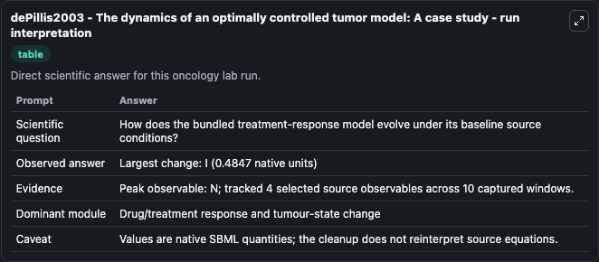
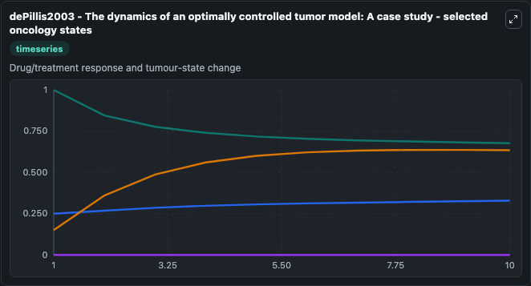
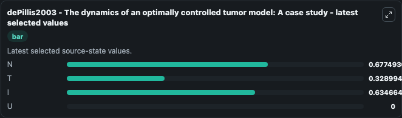

# dePillis2003 - The dynamics of an optimally controlled tumor model: A case study

This Biosimulant lab wraps `dePillis2003 - The dynamics of an optimally controlled tumor model: A case study` as a runnable oncology model with a companion visualization module.
&lt;notes xmlns=&quot;http://www.sbml.org/sbml/level2/version4&quot;&gt; &lt;body xmlns=&quot;http://www.w3.org/1999/xhtml&quot;&gt; &lt;pre&gt;The dynamics of an optimally controlled tumor model: A c. It can be used to explore treatment-response dynamics and compare scenario outcomes across configurations.

## What You'll See

The lab asks: How does the bundled treatment-response model evolve under its baseline source conditions? It runs for 10.0 time units with a communication step of 1.0. The run uses the model defaults declared by the curated SBML wrapper. The generated visualizations focus on N, T, I, and U, combining trajectory, endpoint-comparison, and summary-table views from one completed dark-mode run.

In this captured run, **N** peaked at **1.000** and **I** moved by **0.4847** native units across 10.0 simulation windows.

<!-- BIOSIMULANT_VISUALS_START -->
### Output Visualizations



*Summary table for dePillis2003 - The dynamics of an optimally controlled tumor model: A case study, reporting the scientific question, observed answer (largest change: **I** at **0.4847** native units), evidence (peak observable: **N**), dominant module, and caveat.*



*Trajectories of N, T, I, and U across the 10.0 simulation. In this run **I** climbed from 0.1500 to 0.6347 and **N** fell from 1.000 to 0.6775 — the largest movements among the focused observables.*



*Endpoint ranking of the focused observables. Top 3 by final value: **N** = 0.6775, **I** = 0.6347, **T** = 0.3290, with 1 more observable below.*

<!-- BIOSIMULANT_VISUALS_END -->

## Model Context

- Core model: `models/core`
- Visualization model: `models/visualisation`
- Standard: `other`
- Upstream source: `biomodels_ebi:BIOMD0000000909`
- License: `CC0`
- Visual scope: Drug/treatment response and tumour-state change
- Caveat: Values are native SBML quantities; the cleanup does not reinterpret source equations.

## Inputs

| Input | Maps To | Default | Notes |
|---|---|---|---|

## Outputs

| Output | Maps To | Role |
|---|---|---|
| `model_state_1` | `oncology_sbml_depillis2003_the_dynamics_of_an_optimally_contro_biomd0000000909_model.model_state_1` | N observable. |
| `model_state_2` | `oncology_sbml_depillis2003_the_dynamics_of_an_optimally_contro_biomd0000000909_model.model_state_2` | T observable. |
| `model_state_3` | `oncology_sbml_depillis2003_the_dynamics_of_an_optimally_contro_biomd0000000909_model.model_state_3` | I observable. |
| `model_state_4` | `oncology_sbml_depillis2003_the_dynamics_of_an_optimally_contro_biomd0000000909_model.model_state_4` | U observable. |
| `state` | `oncology_sbml_depillis2003_the_dynamics_of_an_optimally_contro_biomd0000000909_model.state` | Full raw SBML observable record for reproducibility and downstream visualisation. |
| `summary` | `oncology_sbml_depillis2003_the_dynamics_of_an_optimally_contro_biomd0000000909_model.summary` | Change and peak summary across the simulated SBML observables. |
| `species_labels` | `oncology_sbml_depillis2003_the_dynamics_of_an_optimally_contro_biomd0000000909_model.species_labels` | Mapping from selected raw SBML observable symbols to display labels. |

## Runtime

- Duration: `10.0`
- Communication step: `1.0`

## Running Locally

```bash
biosimulant labs serve .
```
