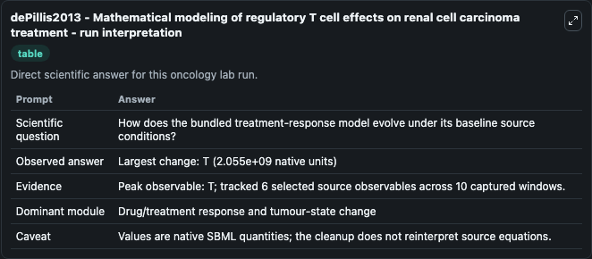
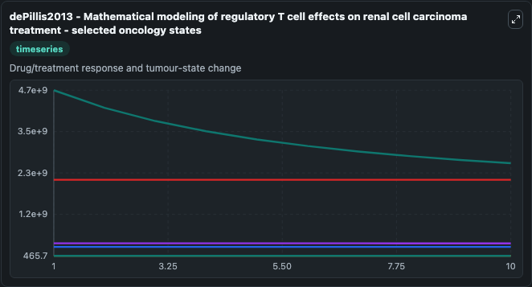
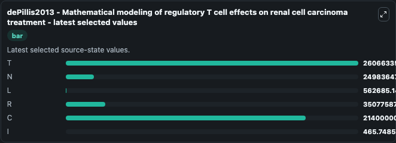

# dePillis2013 - Mathematical modeling of regulatory T cell effects on renal cell carcinoma treatment

This Biosimulant lab wraps `dePillis2013 - Mathematical modeling of regulatory T cell effects on renal cell carcinoma treatment` as a runnable oncology model with a companion visualization module.
Mathematical modeling of regulatory T cell effects on renal cell carcinoma treatmentLisette dePillis 1, , Trevor Caldwell 2, , Elizabeth Sarapata 2, and Heather Williams 2,1. It can be used to explore treatment-response dynamics and compare scenario outcomes across configurations.

## What You'll See

The lab asks: How does the bundled treatment-response model evolve under its baseline source conditions? It runs for 10.0 time units with a communication step of 1.0. The run uses the model defaults declared by the curated SBML wrapper. The generated visualizations focus on T, N, L, R, C, and I, combining trajectory, endpoint-comparison, and summary-table views from one completed dark-mode run.

In this captured run, **T** peaked at **4.66e+09** and **T** moved by **2.06e+09** native units across 10.0 simulation windows.

<!-- BIOSIMULANT_VISUALS_START -->
### Output Visualizations



*Summary table for dePillis2013 - Mathematical modeling of regulatory T cell effects on renal cell carcinoma treatment, reporting the scientific question, observed answer (largest change: **T** at **2.06e+09** native units), evidence (peak observable: **T**), dominant module, and caveat.*



*Trajectories of T, N, L, R, C, and I across the 10.0 simulation. In this run **L** climbed from 5.27e+05 to 5.63e+05 and **T** fell from 4.66e+09 to 2.61e+09 — the largest movements among the focused observables.*



*Endpoint ranking of the focused observables. Top 3 by final value: **T** = 2.61e+09, **C** = 2.14e+09, **R** = 3.51e+08, with 3 more observables below.*

<!-- BIOSIMULANT_VISUALS_END -->

## Model Context

- Core model: `models/core`
- Visualization model: `models/visualisation`
- Standard: `other`
- Upstream source: `biomodels_ebi:BIOMD0000000908`
- License: `CC0`
- Visual scope: Drug/treatment response and tumour-state change
- Caveat: Values are native SBML quantities; the cleanup does not reinterpret source equations.

## Inputs

| Input | Maps To | Default | Notes |
|---|---|---|---|

## Outputs

| Output | Maps To | Role |
|---|---|---|
| `model_state_1` | `oncology_sbml_depillis2013_mathematical_modeling_of_regulatory_biomd0000000908_model.model_state_1` | T observable. |
| `model_state_2` | `oncology_sbml_depillis2013_mathematical_modeling_of_regulatory_biomd0000000908_model.model_state_2` | N observable. |
| `model_state_3` | `oncology_sbml_depillis2013_mathematical_modeling_of_regulatory_biomd0000000908_model.model_state_3` | L observable. |
| `model_state_4` | `oncology_sbml_depillis2013_mathematical_modeling_of_regulatory_biomd0000000908_model.model_state_4` | R observable. |
| `model_state_5` | `oncology_sbml_depillis2013_mathematical_modeling_of_regulatory_biomd0000000908_model.model_state_5` | C observable. |
| `model_state_6` | `oncology_sbml_depillis2013_mathematical_modeling_of_regulatory_biomd0000000908_model.model_state_6` | I observable. |
| `state` | `oncology_sbml_depillis2013_mathematical_modeling_of_regulatory_biomd0000000908_model.state` | Full raw SBML observable record for reproducibility and downstream visualisation. |
| `summary` | `oncology_sbml_depillis2013_mathematical_modeling_of_regulatory_biomd0000000908_model.summary` | Change and peak summary across the simulated SBML observables. |
| `species_labels` | `oncology_sbml_depillis2013_mathematical_modeling_of_regulatory_biomd0000000908_model.species_labels` | Mapping from selected raw SBML observable symbols to display labels. |

## Runtime

- Duration: `10.0`
- Communication step: `1.0`

## Running Locally

```bash
biosimulant labs serve .
```
