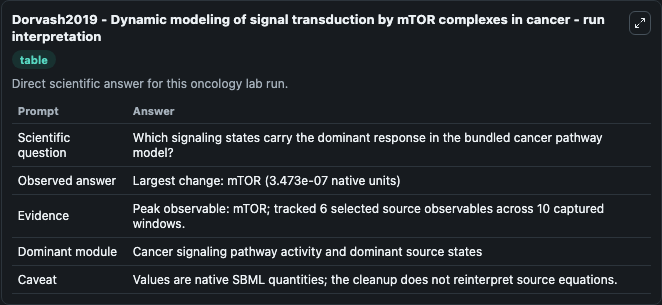
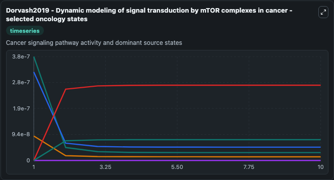
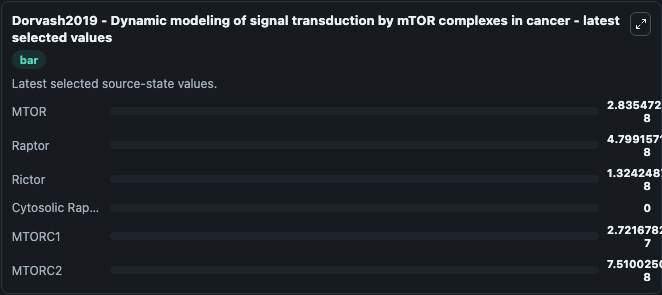

# Dorvash2019 - Dynamic modeling of signal transduction by mTOR complexes in cancer

This Biosimulant lab wraps `Dorvash2019 - Dynamic modeling of signal transduction by mTOR complexes in cancer` as a runnable oncology model with a companion visualization module.
This model is based on:Dynamic modeling of signal transduction by mTOR complexes in cancerAuthor:Mohammadreza Dorvash, Mohammad Farahmandnia, Pouria Mosaddeghi, Mitra Farahmandnejad, Hosein Saber, Moh. It can be used to explore treatment-response dynamics and compare scenario outcomes across configurations.

## What You'll See

The lab asks: Which signaling states carry the dominant response in the bundled cancer pathway model? It runs for 10.0 time units with a communication step of 1.0. The run uses the model defaults declared by the curated SBML wrapper. The generated visualizations focus on MTOR, Raptor, Rictor, Cytosolic Rapamycin, MTORC1, and MTORC2, combining trajectory, endpoint-comparison, and summary-table views from one completed dark-mode run.

In this captured run, **mTOR** carried the largest peak and **mTOR** moved by **3.47e-07** native units across 10.0 simulation windows.

<!-- BIOSIMULANT_VISUALS_START -->
### Output Visualizations



*Summary table for Dorvash2019 - Dynamic modeling of signal transduction by mTOR complexes in cancer, reporting the scientific question, observed answer (largest change: **mTOR** at **3.47e-07** native units), evidence (peak observable: **mTOR**), dominant module, and caveat.*



*Trajectories of MTOR, Raptor, Rictor, Cytosolic Rapamycin, MTORC1, and MTORC2 across the 10.0 simulation. In this run **MTORC1** climbed from 0 to 2.72e-07 and **MTOR** fell from 3.76e-07 to 2.84e-08 — the largest movements among the focused observables.*



*Endpoint ranking of the focused observables. Top 3 by final value: **MTORC1** = 2.72e-07, **MTORC2** = 7.51e-08, **Raptor** = 4.8e-08, with 3 more observables below.*

<!-- BIOSIMULANT_VISUALS_END -->

## Model Context

- Core model: `models/core`
- Visualization model: `models/visualisation`
- Standard: `other`
- Upstream source: `biomodels_ebi:BIOMD0000000822`
- License: `CC0`
- Visual scope: Cancer signaling pathway activity and dominant source states
- Caveat: Values are native SBML quantities; the cleanup does not reinterpret source equations.

## Inputs

| Input | Maps To | Default | Notes |
|---|---|---|---|
| Rapamycin Dose source parameter | `oncology_sbml_dorvash2019_dynamic_modeling_of_signal_transduct_biomd0000000822_model.rapamycin_dose` | `0.0` | Rapamycin Dose source parameter. Maps to bundled SBML parameter `Rapamycin_Dose`. |
| MTOR | `oncology_sbml_dorvash2019_dynamic_modeling_of_signal_transduct_biomd0000000822_model.initial_mtor` | `3.756228e-07` | Initial MTOR. Sets the initial value of bundled SBML symbol `mTOR`. |
| Raptor | `oncology_sbml_dorvash2019_dynamic_modeling_of_signal_transduct_biomd0000000822_model.initial_raptor` | `3.201594e-07` | Initial Raptor. Sets the initial value of bundled SBML symbol `Raptor`. |
| Rictor | `oncology_sbml_dorvash2019_dynamic_modeling_of_signal_transduct_biomd0000000822_model.initial_rictor` | `8.834274e-08` | Initial Rictor. Sets the initial value of bundled SBML symbol `Rictor`. |
| Cytosolic Rapamycin | `oncology_sbml_dorvash2019_dynamic_modeling_of_signal_transduct_biomd0000000822_model.initial_cytosolic_rapamycin` | `0.0` | Initial Cytosolic Rapamycin. Sets the initial value of bundled SBML symbol `Cytosolic_Rapamycin`. |
| MTORC1 | `oncology_sbml_dorvash2019_dynamic_modeling_of_signal_transduct_biomd0000000822_model.initial_mtorc1` | `0.0` | Initial MTORC1. Sets the initial value of bundled SBML symbol `mTORC1`. |

## Outputs

| Output | Maps To | Role |
|---|---|---|
| `mtor` | `oncology_sbml_dorvash2019_dynamic_modeling_of_signal_transduct_biomd0000000822_model.mtor` | MTOR observable. |
| `raptor` | `oncology_sbml_dorvash2019_dynamic_modeling_of_signal_transduct_biomd0000000822_model.raptor` | Raptor observable. |
| `rictor` | `oncology_sbml_dorvash2019_dynamic_modeling_of_signal_transduct_biomd0000000822_model.rictor` | Rictor observable. |
| `cytosolic_rapamycin` | `oncology_sbml_dorvash2019_dynamic_modeling_of_signal_transduct_biomd0000000822_model.cytosolic_rapamycin` | Cytosolic Rapamycin observable. |
| `mtorc1` | `oncology_sbml_dorvash2019_dynamic_modeling_of_signal_transduct_biomd0000000822_model.mtorc1` | MTORC1 observable. |
| `mtorc2` | `oncology_sbml_dorvash2019_dynamic_modeling_of_signal_transduct_biomd0000000822_model.mtorc2` | MTORC2 observable. |
| `state` | `oncology_sbml_dorvash2019_dynamic_modeling_of_signal_transduct_biomd0000000822_model.state` | Full raw SBML observable record for reproducibility and downstream visualisation. |
| `summary` | `oncology_sbml_dorvash2019_dynamic_modeling_of_signal_transduct_biomd0000000822_model.summary` | Change and peak summary across the simulated SBML observables. |
| `species_labels` | `oncology_sbml_dorvash2019_dynamic_modeling_of_signal_transduct_biomd0000000822_model.species_labels` | Mapping from selected raw SBML observable symbols to display labels. |

## Runtime

- Duration: `10.0`
- Communication step: `1.0`

## Running Locally

```bash
biosimulant labs serve .
```
