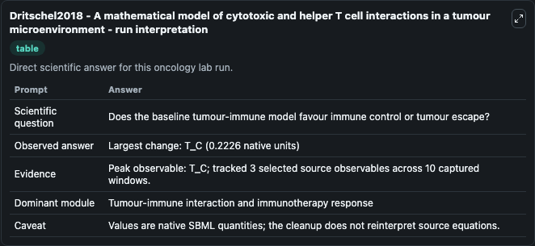
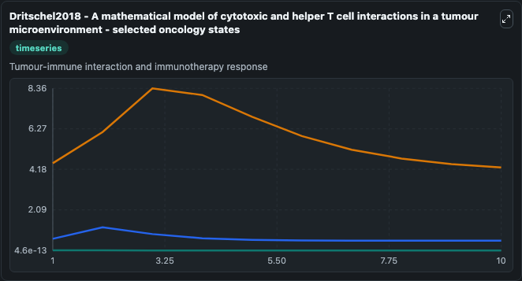
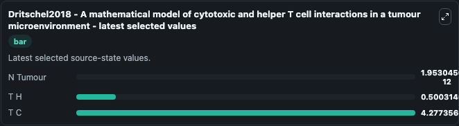

# Dritschel2018 - A mathematical model of cytotoxic and helper T cell interactions in a tumour microenvironment

This Biosimulant lab wraps `Dritschel2018 - A mathematical model of cytotoxic and helper T cell interactions in a tumour microenvironment` as a runnable oncology model with a companion visualization module.
This model examines the role of helper and cytotoxic T cells in an anti-tumour response, with implicit inclusions of immunosuppressive effects. It can be used to explore treatment-response dynamics and compare scenario outcomes across configurations.

## What You'll See

The lab asks: Does the baseline tumour-immune model favour immune control or tumour escape? It runs for 10.0 time units with a communication step of 1.0. The run uses the model defaults declared by the curated SBML wrapper. The generated visualizations focus on N Tumour, T H, and T C, combining trajectory, endpoint-comparison, and summary-table views from one completed dark-mode run.

In this captured run, **T_C** carried the largest peak and **T_C** moved by **0.2226** native units across 10.0 simulation windows.

<!-- BIOSIMULANT_VISUALS_START -->
### Output Visualizations



*Summary table for Dritschel2018 - A mathematical model of cytotoxic and helper T cell interactions in a tumour microenvironment, reporting the scientific question, observed answer (largest change: **T_C** at **0.2226** native units), evidence (peak observable: **T_C**), dominant module, and caveat.*



*Trajectories of N Tumour, T H, and T C across the 10.0 simulation. In this run **T C** fell from 4.500 to 4.277 — the largest movements among the focused observables.*



*Endpoint ranking of the focused observables. Top 3 by final value: **T C** = 4.277, **T H** = 0.5003, **N Tumour** = 1.95e-12.*

<!-- BIOSIMULANT_VISUALS_END -->

## Model Context

- Core model: `models/core`
- Visualization model: `models/visualisation`
- Standard: `other`
- Upstream source: `biomodels_ebi:BIOMD0000000763`
- License: `CC0`
- Visual scope: Tumour-immune interaction and immunotherapy response
- Caveat: Values are native SBML quantities; the cleanup does not reinterpret source equations.

## Inputs

| Input | Maps To | Default | Notes |
|---|---|---|---|
| Ntilde source parameter | `oncology_sbml_dritschel2018_a_mathematical_model_of_cytotoxic_biomd0000000763_model.ntilde_level` | `0.04` | Ntilde source parameter. Maps to bundled SBML parameter `Ntilde`. |
| N Tumour | `oncology_sbml_dritschel2018_a_mathematical_model_of_cytotoxic_biomd0000000763_model.initial_n_tumour` | `0.01` | Initial N Tumour. Sets the initial value of bundled SBML symbol `N_Tumour`. |

## Outputs

| Output | Maps To | Role |
|---|---|---|
| `n_tumour` | `oncology_sbml_dritschel2018_a_mathematical_model_of_cytotoxic_biomd0000000763_model.n_tumour` | N Tumour observable. |
| `model_state_2` | `oncology_sbml_dritschel2018_a_mathematical_model_of_cytotoxic_biomd0000000763_model.model_state_2` | T H observable. |
| `model_state_3` | `oncology_sbml_dritschel2018_a_mathematical_model_of_cytotoxic_biomd0000000763_model.model_state_3` | T C observable. |
| `state` | `oncology_sbml_dritschel2018_a_mathematical_model_of_cytotoxic_biomd0000000763_model.state` | Full raw SBML observable record for reproducibility and downstream visualisation. |
| `summary` | `oncology_sbml_dritschel2018_a_mathematical_model_of_cytotoxic_biomd0000000763_model.summary` | Change and peak summary across the simulated SBML observables. |
| `species_labels` | `oncology_sbml_dritschel2018_a_mathematical_model_of_cytotoxic_biomd0000000763_model.species_labels` | Mapping from selected raw SBML observable symbols to display labels. |

## Runtime

- Duration: `10.0`
- Communication step: `1.0`

## Running Locally

```bash
biosimulant labs serve .
```
