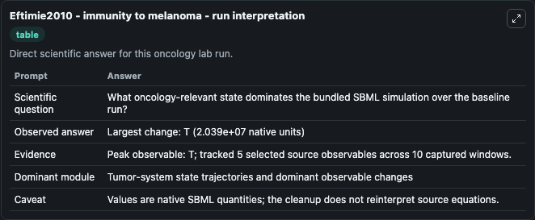
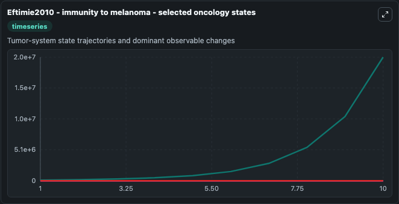
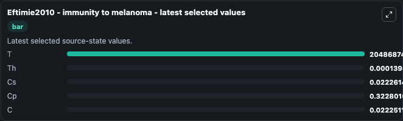

# Eftimie2010 - immunity to melanoma

This Biosimulant lab wraps `Eftimie2010 - immunity to melanoma` as a runnable oncology model with a companion visualization module.
The paper describes a model of immunity to melanoma. It can be used to explore treatment-response dynamics and compare scenario outcomes across configurations.

## What You'll See

The lab asks: What oncology-relevant state dominates the bundled SBML simulation over the baseline run? It runs for 10.0 time units with a communication step of 1.0. The run uses the model defaults declared by the curated SBML wrapper. The generated visualizations focus on T, Th, Cs, Cp, and C, combining trajectory, endpoint-comparison, and summary-table views from one completed dark-mode run.

In this captured run, **T** peaked at **2.05e+07** and **T** moved by **2.04e+07** native units across 10.0 simulation windows.

<!-- BIOSIMULANT_VISUALS_START -->
### Output Visualizations



*Summary table for Eftimie2010 - immunity to melanoma, reporting the scientific question, observed answer (largest change: **T** at **2.04e+07** native units), evidence (peak observable: **T**), dominant module, and caveat.*



*Trajectories of T, Th, Cs, Cp, and C across the 10.0 simulation. In this run **T** climbed from 1e+05 to 2.05e+07 — the largest movements among the focused observables.*



*Endpoint ranking of the focused observables. Top 3 by final value: **T** = 2.05e+07, **Cp** = 0.3228, **Cs** = 0.0223, with 2 more observables below.*

<!-- BIOSIMULANT_VISUALS_END -->

## Model Context

- Core model: `models/core`
- Visualization model: `models/visualisation`
- Standard: `other`
- Upstream source: `biomodels_ebi:BIOMD0000000768`
- License: `CC0`
- Visual scope: Tumor-system state trajectories and dominant observable changes
- Caveat: Values are native SBML quantities; the cleanup does not reinterpret source equations.

## Inputs

| Input | Maps To | Default | Notes |
|---|---|---|---|

## Outputs

| Output | Maps To | Role |
|---|---|---|
| `model_state_1` | `oncology_sbml_eftimie2010_immunity_to_melanoma_biomd0000000768_model.model_state_1` | T observable. |
| `model_state_2` | `oncology_sbml_eftimie2010_immunity_to_melanoma_biomd0000000768_model.model_state_2` | Th observable. |
| `model_state_3` | `oncology_sbml_eftimie2010_immunity_to_melanoma_biomd0000000768_model.model_state_3` | Cs observable. |
| `model_state_4` | `oncology_sbml_eftimie2010_immunity_to_melanoma_biomd0000000768_model.model_state_4` | Cp observable. |
| `model_state_5` | `oncology_sbml_eftimie2010_immunity_to_melanoma_biomd0000000768_model.model_state_5` | C observable. |
| `state` | `oncology_sbml_eftimie2010_immunity_to_melanoma_biomd0000000768_model.state` | Full raw SBML observable record for reproducibility and downstream visualisation. |
| `summary` | `oncology_sbml_eftimie2010_immunity_to_melanoma_biomd0000000768_model.summary` | Change and peak summary across the simulated SBML observables. |
| `species_labels` | `oncology_sbml_eftimie2010_immunity_to_melanoma_biomd0000000768_model.species_labels` | Mapping from selected raw SBML observable symbols to display labels. |

## Runtime

- Duration: `10.0`
- Communication step: `1.0`

## Running Locally

```bash
biosimulant labs serve .
```
