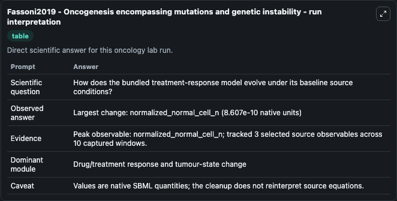
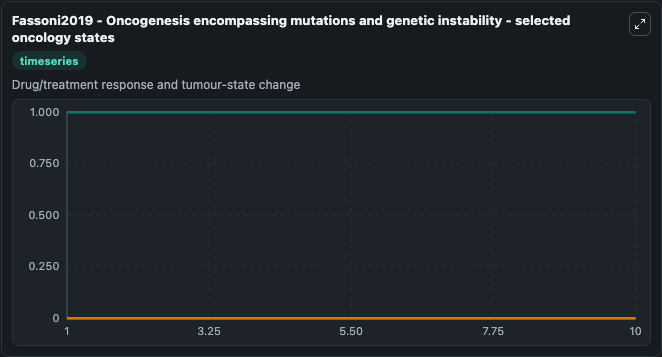
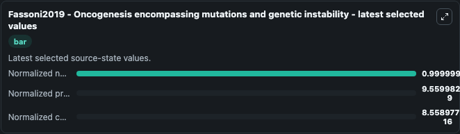

# Fassoni2019 - Oncogenesis encompassing mutations and genetic instability

This Biosimulant lab wraps `Fassoni2019 - Oncogenesis encompassing mutations and genetic instability` as a runnable oncology model with a companion visualization module.
This model describes the multistep process that transform a normal cell and its descendants into a malignant tumour by considering three populations: normal, premalignant and cancer cells. It can be used to explore treatment-response dynamics and compare scenario outcomes across configurations.

## What You'll See

The lab asks: How does the bundled treatment-response model evolve under its baseline source conditions? It runs for 10.0 time units with a communication step of 1.0. The run uses the model defaults declared by the curated SBML wrapper. The generated visualizations focus on Normalized normal cell n, Normalized pre cancer cell g, and Normalized cancer cell a, combining trajectory, endpoint-comparison, and summary-table views from one completed dark-mode run.

In this captured run, **normalized_normal_cell_n** carried the largest peak and **normalized_normal_cell_n** moved by **8.61e-10** native units across 10.0 simulation windows.

<!-- BIOSIMULANT_VISUALS_START -->
### Output Visualizations



*Summary table for Fassoni2019 - Oncogenesis encompassing mutations and genetic instability, reporting the scientific question, observed answer (largest change: **normalized_normal_cell_n** at **8.61e-10** native units), evidence (peak observable: **normalized_normal_cell_n**), dominant module, and caveat.*



*Trajectories of Normalized normal cell n, Normalized pre cancer cell g, and Normalized cancer cell a across the 10.0 simulation. In this run **Normalized normal cell n** climbed from 1.0000 to 1.0000 and **Normalized pre cancer cell g** fell from 1e-08 to 9.56e-09 — the largest movements among the focused observables.*



*Endpoint ranking of the focused observables. Top 3 by final value: **Normalized normal cell n** = 1.0000, **Normalized pre cancer cell g** = 9.56e-09, **Normalized cancer cell a** = 8.56e-16.*

<!-- BIOSIMULANT_VISUALS_END -->

## Model Context

- Core model: `models/core`
- Visualization model: `models/visualisation`
- Standard: `other`
- Upstream source: `biomodels_ebi:BIOMD0000000807`
- License: `CC0`
- Visual scope: Drug/treatment response and tumour-state change
- Caveat: Values are native SBML quantities; the cleanup does not reinterpret source equations.

## Inputs

| Input | Maps To | Default | Notes |
|---|---|---|---|
| Normalized normal cell n | `oncology_sbml_fassoni2019_oncogenesis_encompassing_mutations_a_biomd0000000807_model.initial_normalized_normal_cell_n` | `0.99999999` | Initial Normalized normal cell n. Sets the initial value of bundled SBML symbol `normalized_normal_cell_n`. |
| Normalized pre cancer cell g | `oncology_sbml_fassoni2019_oncogenesis_encompassing_mutations_a_biomd0000000807_model.initial_normalized_pre_cancer_cell_g` | `1e-08` | Initial Normalized pre cancer cell g. Sets the initial value of bundled SBML symbol `normalized_pre_cancer_cell_g`. |
| Normalized cancer cell a | `oncology_sbml_fassoni2019_oncogenesis_encompassing_mutations_a_biomd0000000807_model.initial_normalized_cancer_cell_a` | `0.0` | Initial Normalized cancer cell a. Sets the initial value of bundled SBML symbol `normalized_cancer_cell_a`. |

## Outputs

| Output | Maps To | Role |
|---|---|---|
| `normalized_normal_cell_n` | `oncology_sbml_fassoni2019_oncogenesis_encompassing_mutations_a_biomd0000000807_model.normalized_normal_cell_n` | Normalized normal cell n observable. |
| `normalized_pre_cancer_cell_g` | `oncology_sbml_fassoni2019_oncogenesis_encompassing_mutations_a_biomd0000000807_model.normalized_pre_cancer_cell_g` | Normalized pre cancer cell g observable. |
| `normalized_cancer_cell_a` | `oncology_sbml_fassoni2019_oncogenesis_encompassing_mutations_a_biomd0000000807_model.normalized_cancer_cell_a` | Normalized cancer cell a observable. |
| `state` | `oncology_sbml_fassoni2019_oncogenesis_encompassing_mutations_a_biomd0000000807_model.state` | Full raw SBML observable record for reproducibility and downstream visualisation. |
| `summary` | `oncology_sbml_fassoni2019_oncogenesis_encompassing_mutations_a_biomd0000000807_model.summary` | Change and peak summary across the simulated SBML observables. |
| `species_labels` | `oncology_sbml_fassoni2019_oncogenesis_encompassing_mutations_a_biomd0000000807_model.species_labels` | Mapping from selected raw SBML observable symbols to display labels. |

## Runtime

- Duration: `10.0`
- Communication step: `1.0`

## Running Locally

```bash
biosimulant labs serve .
```
