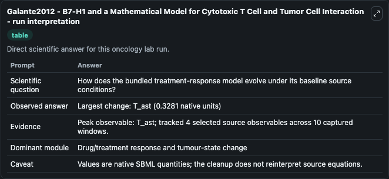
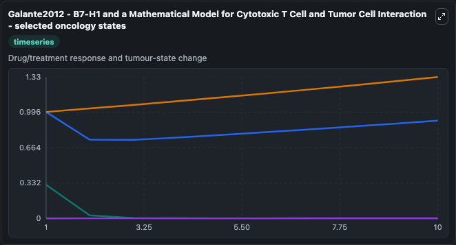
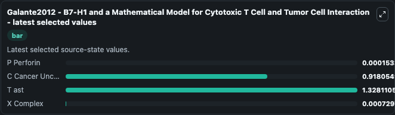

# Galante2012 - B7-H1 and a Mathematical Model for Cytotoxic T Cell and Tumor Cell Interaction

This Biosimulant lab wraps `Galante2012 - B7-H1 and a Mathematical Model for Cytotoxic T Cell and Tumor Cell Interaction` as a runnable oncology model with a companion visualization module.
This is a mathematical model that describes the interactions between cytotoxic T cells and tumor cells as influenced by B7-H1 (PD-L1) activity, with a focus on how B7-H1 affects cancer cells apoptosis. It can be used to explore treatment-response dynamics and compare scenario outcomes across configurations.

## What You'll See

The lab asks: How does the bundled treatment-response model evolve under its baseline source conditions? It runs for 10.0 time units with a communication step of 1.0. The run uses the model defaults declared by the curated SBML wrapper. The generated visualizations focus on P Perforin, C Cancer Uncomplexed, T ast, and X Complex, combining trajectory, endpoint-comparison, and summary-table views from one completed dark-mode run.

In this captured run, **T_ast** carried the largest peak and **T_ast** moved by **0.3281** native units across 10.0 simulation windows.

<!-- BIOSIMULANT_VISUALS_START -->
### Output Visualizations



*Summary table for Galante2012 - B7-H1 and a Mathematical Model for Cytotoxic T Cell and Tumor Cell Interaction, reporting the scientific question, observed answer (largest change: **T_ast** at **0.3281** native units), evidence (peak observable: **T_ast**), dominant module, and caveat.*



*Trajectories of P Perforin, C Cancer Uncomplexed, T ast, and X Complex across the 10.0 simulation. In this run **T ast** climbed from 1.000 to 1.328 and **P Perforin** fell from 0.3150 to 0.000153 — the largest movements among the focused observables.*



*Endpoint ranking of the focused observables. Top 3 by final value: **T ast** = 1.328, **C Cancer Uncomplexed** = 0.9181, **X Complex** = 0.00073, with 1 more observable below.*

<!-- BIOSIMULANT_VISUALS_END -->

## Model Context

- Core model: `models/core`
- Visualization model: `models/visualisation`
- Standard: `other`
- Upstream source: `biomodels_ebi:BIOMD0000000812`
- License: `CC0`
- Visual scope: Drug/treatment response and tumour-state change
- Caveat: Values are native SBML quantities; the cleanup does not reinterpret source equations.

## Inputs

| Input | Maps To | Default | Notes |
|---|---|---|---|
| P Perforin | `oncology_sbml_galante2012_b7_h1_and_a_mathematical_model_for_c_biomd0000000812_model.initial_p_perforin` | `0.315` | Initial P Perforin. Sets the initial value of bundled SBML symbol `P_Perforin`. |
| C Cancer Uncomplexed | `oncology_sbml_galante2012_b7_h1_and_a_mathematical_model_for_c_biomd0000000812_model.initial_c_cancer_uncomplexed` | `1.0` | Initial C Cancer Uncomplexed. Sets the initial value of bundled SBML symbol `C_Cancer_Uncomplexed`. |
| T ast | `oncology_sbml_galante2012_b7_h1_and_a_mathematical_model_for_c_biomd0000000812_model.initial_t_ast` | `1.0` | Initial T ast. Sets the initial value of bundled SBML symbol `T_ast`. |
| X Complex | `oncology_sbml_galante2012_b7_h1_and_a_mathematical_model_for_c_biomd0000000812_model.initial_x_complex` | `0.0` | Initial X Complex. Sets the initial value of bundled SBML symbol `X_Complex`. |

## Outputs

| Output | Maps To | Role |
|---|---|---|
| `p_perforin` | `oncology_sbml_galante2012_b7_h1_and_a_mathematical_model_for_c_biomd0000000812_model.p_perforin` | P Perforin observable. |
| `c_cancer_uncomplexed` | `oncology_sbml_galante2012_b7_h1_and_a_mathematical_model_for_c_biomd0000000812_model.c_cancer_uncomplexed` | C Cancer Uncomplexed observable. |
| `t_ast` | `oncology_sbml_galante2012_b7_h1_and_a_mathematical_model_for_c_biomd0000000812_model.t_ast` | T ast observable. |
| `x_complex` | `oncology_sbml_galante2012_b7_h1_and_a_mathematical_model_for_c_biomd0000000812_model.x_complex` | X Complex observable. |
| `state` | `oncology_sbml_galante2012_b7_h1_and_a_mathematical_model_for_c_biomd0000000812_model.state` | Full raw SBML observable record for reproducibility and downstream visualisation. |
| `summary` | `oncology_sbml_galante2012_b7_h1_and_a_mathematical_model_for_c_biomd0000000812_model.summary` | Change and peak summary across the simulated SBML observables. |
| `species_labels` | `oncology_sbml_galante2012_b7_h1_and_a_mathematical_model_for_c_biomd0000000812_model.species_labels` | Mapping from selected raw SBML observable symbols to display labels. |

## Runtime

- Duration: `10.0`
- Communication step: `1.0`

## Running Locally

```bash
biosimulant labs serve .
```
