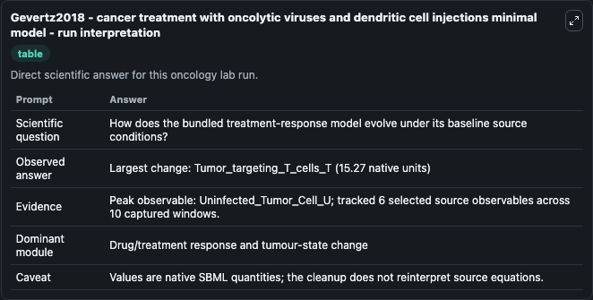
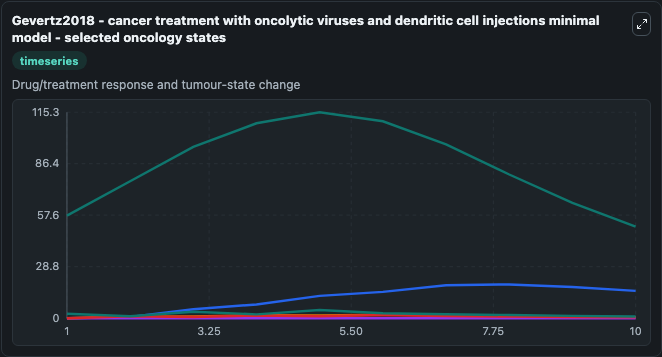
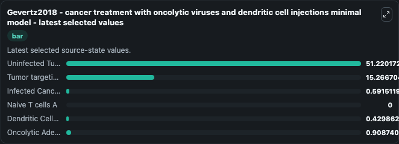

# Gevertz2018 - cancer treatment with oncolytic viruses and dendritic cell injections minimal model

This Biosimulant lab wraps `Gevertz2018 - cancer treatment with oncolytic viruses and dendritic cell injections minimal model` as a runnable oncology model with a companion visualization module.
The model is based on 'Developing a Minimally Structured Mathematical Model of Cancer Treatment with Oncolytic Viruses and Dendritic Cell Injections', PMID:30510594. It can be used to explore treatment-response dynamics and compare scenario outcomes across configurations.

## What You'll See

The lab asks: How does the bundled treatment-response model evolve under its baseline source conditions? It runs for 10.0 time units with a communication step of 1.0. The run uses the model defaults declared by the curated SBML wrapper. The generated visualizations focus on Uninfected Tumor Cell U, Tumor targeting T cells T, Infected Cancer Cell I, Naive T cells A, Dendritic Cells D, and Oncolytic Adenovirus V, combining trajectory, endpoint-comparison, and summary-table views from one completed dark-mode run.

In this captured run, **Uninfected_Tumor_Cell_U** carried the largest peak and **Tumor_targeting_T_cells_T** moved by **15.270** native units across 10.0 simulation windows.

<!-- BIOSIMULANT_VISUALS_START -->
### Output Visualizations



*Summary table for Gevertz2018 - cancer treatment with oncolytic viruses and dendritic cell injections minimal model, reporting the scientific question, observed answer (largest change: **Tumor_targeting_T_cells_T** at **15.270** native units), evidence (peak observable: **Uninfected_Tumor_Cell_U**), dominant module, and caveat.*



*Trajectories of Uninfected Tumor Cell U, Tumor targeting T cells T, Infected Cancer Cell I, Naive T cells A, Dendritic Cells D, and Oncolytic Adenovirus V across the 10.0 simulation. In this run **Tumor targeting T cells T** climbed from 0 to 15.267 and **Uninfected Tumor Cell U** fell from 57.414 to 51.220 — the largest movements among the focused observables.*



*Endpoint ranking of the focused observables. Top 3 by final value: **Uninfected Tumor Cell U** = 51.220, **Tumor targeting T cells T** = 15.267, **Oncolytic Adenovirus V** = 0.9087, with 3 more observables below.*

<!-- BIOSIMULANT_VISUALS_END -->

## Model Context

- Core model: `models/core`
- Visualization model: `models/visualisation`
- Standard: `other`
- Upstream source: `biomodels_ebi:BIOMD0000000817`
- License: `CC0`
- Visual scope: Drug/treatment response and tumour-state change
- Caveat: Values are native SBML quantities; the cleanup does not reinterpret source equations.

## Inputs

| Input | Maps To | Default | Notes |
|---|---|---|---|
| C kill source parameter | `oncology_sbml_gevertz2018_cancer_treatment_with_oncolytic_viru_biomd0000000817_model.c_kill_level` | `0.623397` | C kill source parameter. Maps to bundled SBML parameter `c_kill`. |
| OV dose source parameter | `oncology_sbml_gevertz2018_cancer_treatment_with_oncolytic_viru_biomd0000000817_model.ov_dose` | `2.5` | OV dose source parameter. Maps to bundled SBML parameter `OV_dose`. |
| Uninfected Tumor Cell U | `oncology_sbml_gevertz2018_cancer_treatment_with_oncolytic_viru_biomd0000000817_model.initial_uninfected_tumor_cell_u` | `57.414042` | Initial Uninfected Tumor Cell U. Sets the initial value of bundled SBML symbol `Uninfected_Tumor_Cell_U`. |
| Tumor targeting T cells T | `oncology_sbml_gevertz2018_cancer_treatment_with_oncolytic_viru_biomd0000000817_model.initial_tumor_targeting_t_cells_t` | `0.0` | Initial Tumor targeting T cells T. Sets the initial value of bundled SBML symbol `Tumor_targeting_T_cells_T`. |
| Infected Cancer Cell I | `oncology_sbml_gevertz2018_cancer_treatment_with_oncolytic_viru_biomd0000000817_model.initial_infected_cancer_cell_i` | `0.0` | Initial Infected Cancer Cell I. Sets the initial value of bundled SBML symbol `Infected_Cancer_Cell_I`. |
| Naive T cells A | `oncology_sbml_gevertz2018_cancer_treatment_with_oncolytic_viru_biomd0000000817_model.initial_naive_t_cells_a` | `0.0` | Initial Naive T cells A. Sets the initial value of bundled SBML symbol `Naive_T_cells_A`. |

## Outputs

| Output | Maps To | Role |
|---|---|---|
| `uninfected_tumor_cell_u` | `oncology_sbml_gevertz2018_cancer_treatment_with_oncolytic_viru_biomd0000000817_model.uninfected_tumor_cell_u` | Uninfected Tumor Cell U observable. |
| `tumor_targeting_t_cells_t` | `oncology_sbml_gevertz2018_cancer_treatment_with_oncolytic_viru_biomd0000000817_model.tumor_targeting_t_cells_t` | Tumor targeting T cells T observable. |
| `infected_cancer_cell_i` | `oncology_sbml_gevertz2018_cancer_treatment_with_oncolytic_viru_biomd0000000817_model.infected_cancer_cell_i` | Infected Cancer Cell I observable. |
| `naive_t_cells_a` | `oncology_sbml_gevertz2018_cancer_treatment_with_oncolytic_viru_biomd0000000817_model.naive_t_cells_a` | Naive T cells A observable. |
| `dendritic_cells_d` | `oncology_sbml_gevertz2018_cancer_treatment_with_oncolytic_viru_biomd0000000817_model.dendritic_cells_d` | Dendritic Cells D observable. |
| `oncolytic_adenovirus_v` | `oncology_sbml_gevertz2018_cancer_treatment_with_oncolytic_viru_biomd0000000817_model.oncolytic_adenovirus_v` | Oncolytic Adenovirus V observable. |
| `state` | `oncology_sbml_gevertz2018_cancer_treatment_with_oncolytic_viru_biomd0000000817_model.state` | Full raw SBML observable record for reproducibility and downstream visualisation. |
| `summary` | `oncology_sbml_gevertz2018_cancer_treatment_with_oncolytic_viru_biomd0000000817_model.summary` | Change and peak summary across the simulated SBML observables. |
| `species_labels` | `oncology_sbml_gevertz2018_cancer_treatment_with_oncolytic_viru_biomd0000000817_model.species_labels` | Mapping from selected raw SBML observable symbols to display labels. |

## Runtime

- Duration: `10.0`
- Communication step: `1.0`

## Running Locally

```bash
biosimulant labs serve .
```
