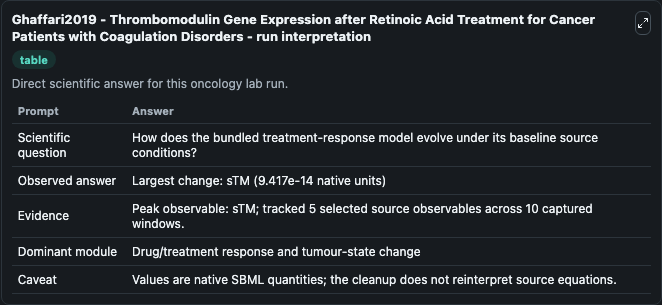
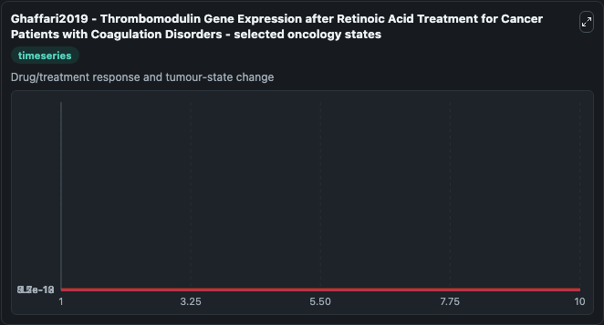
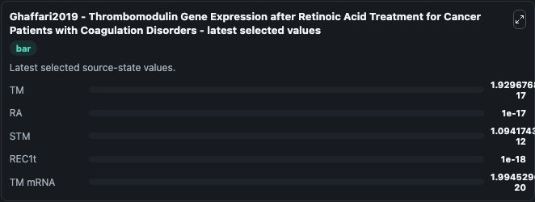

# Ghaffari2019 - Thrombomodulin Gene Expression after Retinoic Acid Treatment for Cancer Patients with Coagulation Disorders

This Biosimulant lab wraps `Ghaffari2019 - Thrombomodulin Gene Expression after Retinoic Acid Treatment for Cancer Patients with Coagulation Disorders` as a runnable oncology model with a companion visualization module.
Publication includes a mathematical model for how retinoic acid affects thrombomodulin gene and mRNA expression as well as a two-compartment pharmacokinetic model for retinoic acid. It can be used to explore treatment-response dynamics and compare scenario outcomes across configurations.

## What You'll See

The lab asks: How does the bundled treatment-response model evolve under its baseline source conditions? It runs for 10.0 time units with a communication step of 1.0. The run uses the model defaults declared by the curated SBML wrapper. The generated visualizations focus on TM, RA, STM, REC1t, and TM mRNA, combining trajectory, endpoint-comparison, and summary-table views from one completed dark-mode run.

In this captured run, **sTM** carried the largest peak and **sTM** moved by **9.42e-14** native units across 10.0 simulation windows.

<!-- BIOSIMULANT_VISUALS_START -->
### Output Visualizations



*Summary table for Ghaffari2019 - Thrombomodulin Gene Expression after Retinoic Acid Treatment for Cancer Patients with Coagulation Disorders, reporting the scientific question, observed answer (largest change: **sTM** at **9.42e-14** native units), evidence (peak observable: **sTM**), dominant module, and caveat.*



*Trajectories of TM, RA, STM, REC1t, and TM mRNA across the 10.0 simulation. In this run **STM** climbed from 1e-12 to 1.09e-12 — the largest movements among the focused observables.*



*Endpoint ranking of the focused observables. Top 3 by final value: **STM** = 1.09e-12, **TM** = 1.93e-17, **RA** = 1e-17, with 2 more observables below.*

<!-- BIOSIMULANT_VISUALS_END -->

## Model Context

- Core model: `models/core`
- Visualization model: `models/visualisation`
- Standard: `other`
- Upstream source: `biomodels_ebi:MODEL1907140001`
- License: `CC0`
- Visual scope: Drug/treatment response and tumour-state change
- Caveat: Values are native SBML quantities; the cleanup does not reinterpret source equations.

## Inputs

| Input | Maps To | Default | Notes |
|---|---|---|---|
| STM | `oncology_sbml_ghaffari2019_thrombomodulin_gene_expression_afte_model1907140001_model.initial_stm` | `1.0` | Initial STM. Sets the initial value of bundled SBML symbol `sTM`. |
| REC1t | `oncology_sbml_ghaffari2019_thrombomodulin_gene_expression_afte_model1907140001_model.initial_rec1t` | `1e-06` | Initial REC1t. Sets the initial value of bundled SBML symbol `REC1t`. |
| TM mRNA | `oncology_sbml_ghaffari2019_thrombomodulin_gene_expression_afte_model1907140001_model.initial_tm_mrna` | `0.0` | Initial TM mRNA. Sets the initial value of bundled SBML symbol `TM_mRNA`. |

## Outputs

| Output | Maps To | Role |
|---|---|---|
| `model_state_1` | `oncology_sbml_ghaffari2019_thrombomodulin_gene_expression_afte_model1907140001_model.model_state_1` | TM observable. |
| `model_state_2` | `oncology_sbml_ghaffari2019_thrombomodulin_gene_expression_afte_model1907140001_model.model_state_2` | RA observable. |
| `stm` | `oncology_sbml_ghaffari2019_thrombomodulin_gene_expression_afte_model1907140001_model.stm` | STM observable. |
| `rec1t` | `oncology_sbml_ghaffari2019_thrombomodulin_gene_expression_afte_model1907140001_model.rec1t` | REC1t observable. |
| `tm_mrna` | `oncology_sbml_ghaffari2019_thrombomodulin_gene_expression_afte_model1907140001_model.tm_mrna` | TM mRNA observable. |
| `state` | `oncology_sbml_ghaffari2019_thrombomodulin_gene_expression_afte_model1907140001_model.state` | Full raw SBML observable record for reproducibility and downstream visualisation. |
| `summary` | `oncology_sbml_ghaffari2019_thrombomodulin_gene_expression_afte_model1907140001_model.summary` | Change and peak summary across the simulated SBML observables. |
| `species_labels` | `oncology_sbml_ghaffari2019_thrombomodulin_gene_expression_afte_model1907140001_model.species_labels` | Mapping from selected raw SBML observable symbols to display labels. |

## Runtime

- Duration: `10.0`
- Communication step: `1.0`

## Running Locally

```bash
biosimulant labs serve .
```
