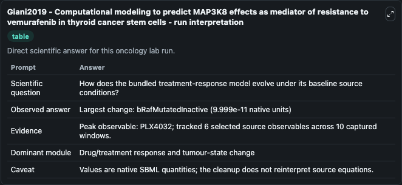
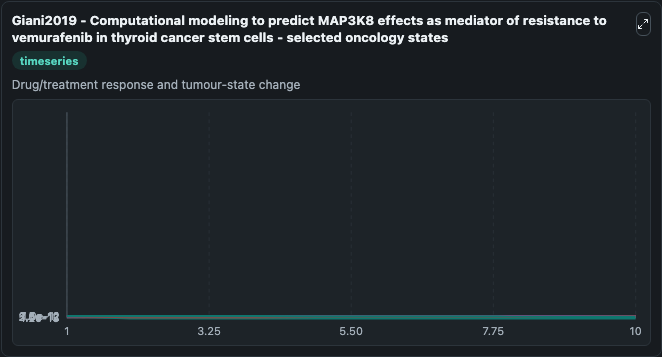
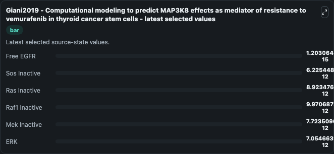

# Giani2019 - Computational modeling to predict MAP3K8 effects as mediator of resistance to vemurafenib in thyroid cancer stem cells

This Biosimulant lab wraps `Giani2019 - Computational modeling to predict MAP3K8 effects as mediator of resistance to vemurafenib in thyroid cancer stem cells` as a runnable oncology model with a companion visualization module.
Computational modeling to predict MAP3K8 effects as mediator of resistance to vemurafenib in thyroid cancer stem cells. It can be used to explore treatment-response dynamics and compare scenario outcomes across configurations.

## What You'll See

The lab asks: How does the bundled treatment-response model evolve under its baseline source conditions? It runs for 10.0 time units with a communication step of 1.0. The run uses the model defaults declared by the curated SBML wrapper. The generated visualizations focus on Free EGFR, Sos Inactive, Ras Inactive, Raf1 Inactive, Mek Inactive, and ERK, combining trajectory, endpoint-comparison, and summary-table views from one completed dark-mode run.

In this captured run, **PLX4032** carried the largest peak and **bRafMutatedInactive** moved by **1e-10** native units across 10.0 simulation windows.

<!-- BIOSIMULANT_VISUALS_START -->
### Output Visualizations



*Summary table for Giani2019 - Computational modeling to predict MAP3K8 effects as mediator of resistance to vemurafenib in thyroid cancer stem cells, reporting the scientific question, observed answer (largest change: **bRafMutatedInactive** at **1e-10** native units), evidence (peak observable: **PLX4032**), dominant module, and caveat.*



*Trajectories of Free EGFR, Sos Inactive, Ras Inactive, Raf1 Inactive, Mek Inactive, and ERK across the 10.0 simulation. In this run **Free EGFR** fell from 1e-11 to 1.2e-15 — the largest movements among the focused observables.*



*Endpoint ranking of the focused observables. Top 3 by final value: **Raf1 Inactive** = 9.97e-12, **Ras Inactive** = 8.92e-12, **Mek Inactive** = 7.72e-12, with 3 more observables below.*

<!-- BIOSIMULANT_VISUALS_END -->

## Model Context

- Core model: `models/core`
- Visualization model: `models/visualisation`
- Standard: `other`
- Upstream source: `biomodels_ebi:BIOMD0000000883`
- License: `CC0`
- Visual scope: Drug/treatment response and tumour-state change
- Caveat: Values are native SBML quantities; the cleanup does not reinterpret source equations.

## Inputs

| Input | Maps To | Default | Notes |
|---|---|---|---|
| Free EGFR | `oncology_sbml_giani2019_computational_modeling_to_predict_map3_biomd0000000883_model.initial_free_egfr` | `10.0` | Initial Free EGFR. Sets the initial value of bundled SBML symbol `species_1`. |
| Sos Inactive | `oncology_sbml_giani2019_computational_modeling_to_predict_map3_biomd0000000883_model.initial_sos_inactive` | `10.0` | Initial Sos Inactive. Sets the initial value of bundled SBML symbol `species_3`. |
| Ras Inactive | `oncology_sbml_giani2019_computational_modeling_to_predict_map3_biomd0000000883_model.initial_ras_inactive` | `10.0` | Initial Ras Inactive. Sets the initial value of bundled SBML symbol `species_5`. |
| Raf1 Inactive | `oncology_sbml_giani2019_computational_modeling_to_predict_map3_biomd0000000883_model.initial_raf1_inactive` | `10.0` | Initial Raf1 Inactive. Sets the initial value of bundled SBML symbol `species_7`. |
| Mek Inactive | `oncology_sbml_giani2019_computational_modeling_to_predict_map3_biomd0000000883_model.initial_mek_inactive` | `10.0` | Initial Mek Inactive. Sets the initial value of bundled SBML symbol `species_9`. |
| ERK | `oncology_sbml_giani2019_computational_modeling_to_predict_map3_biomd0000000883_model.initial_erk` | `10.0` | Initial ERK. Sets the initial value of bundled SBML symbol `species_11`. |

## Outputs

| Output | Maps To | Role |
|---|---|---|
| `free_egfr` | `oncology_sbml_giani2019_computational_modeling_to_predict_map3_biomd0000000883_model.free_egfr` | Free EGFR observable. |
| `sos_inactive` | `oncology_sbml_giani2019_computational_modeling_to_predict_map3_biomd0000000883_model.sos_inactive` | Sos Inactive observable. |
| `ras_inactive` | `oncology_sbml_giani2019_computational_modeling_to_predict_map3_biomd0000000883_model.ras_inactive` | Ras Inactive observable. |
| `raf1_inactive` | `oncology_sbml_giani2019_computational_modeling_to_predict_map3_biomd0000000883_model.raf1_inactive` | Raf1 Inactive observable. |
| `mek_inactive` | `oncology_sbml_giani2019_computational_modeling_to_predict_map3_biomd0000000883_model.mek_inactive` | Mek Inactive observable. |
| `erk` | `oncology_sbml_giani2019_computational_modeling_to_predict_map3_biomd0000000883_model.erk` | ERK observable. |
| `state` | `oncology_sbml_giani2019_computational_modeling_to_predict_map3_biomd0000000883_model.state` | Full raw SBML observable record for reproducibility and downstream visualisation. |
| `summary` | `oncology_sbml_giani2019_computational_modeling_to_predict_map3_biomd0000000883_model.summary` | Change and peak summary across the simulated SBML observables. |
| `species_labels` | `oncology_sbml_giani2019_computational_modeling_to_predict_map3_biomd0000000883_model.species_labels` | Mapping from selected raw SBML observable symbols to display labels. |

## Runtime

- Duration: `10.0`
- Communication step: `1.0`

## Running Locally

```bash
biosimulant labs serve .
```
