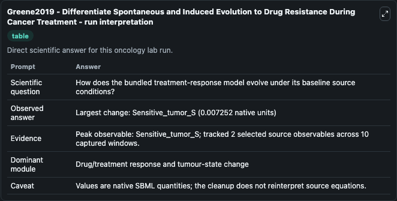
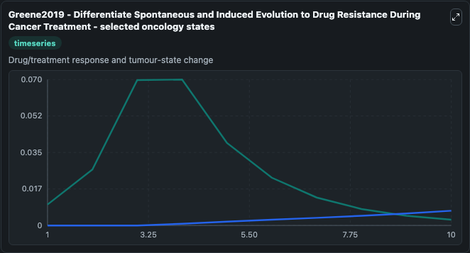
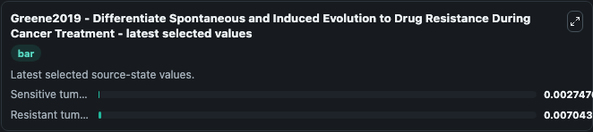

# Greene2019 - Differentiate Spontaneous and Induced Evolution to Drug Resistance During Cancer Treatment

This Biosimulant lab wraps `Greene2019 - Differentiate Spontaneous and Induced Evolution to Drug Resistance During Cancer Treatment` as a runnable oncology model with a companion visualization module.
This model is built by COPASI 4.24(Build 197), based on paper:Mathematical Approach to Differentiate Spontaneous and Induced Evolution to Drug Resistance During Cancer Treatment.Author:James M. It can be used to explore treatment-response dynamics and compare scenario outcomes across configurations.

## What You'll See

The lab asks: How does the bundled treatment-response model evolve under its baseline source conditions? It runs for 10.0 time units with a communication step of 1.0. The run uses the model defaults declared by the curated SBML wrapper. The generated visualizations focus on Sensitive tumor S, and Resistant tumor R, combining trajectory, endpoint-comparison, and summary-table views from one completed dark-mode run.

In this captured run, **Sensitive_tumor_S** carried the largest peak and **Sensitive_tumor_S** moved by **0.00725** native units across 10.0 simulation windows.

<!-- BIOSIMULANT_VISUALS_START -->
### Output Visualizations



*Summary table for Greene2019 - Differentiate Spontaneous and Induced Evolution to Drug Resistance During Cancer Treatment, reporting the scientific question, observed answer (largest change: **Sensitive_tumor_S** at **0.00725** native units), evidence (peak observable: **Sensitive_tumor_S**), dominant module, and caveat.*



*Trajectories of Sensitive tumor S, and Resistant tumor R across the 10.0 simulation. In this run **Resistant tumor R** climbed from 0 to 0.00704 and **Sensitive tumor S** fell from 0.0100 to 0.00275 — the largest movements among the focused observables.*



*Endpoint ranking of the focused observables. Top 2 by final value: **Resistant tumor R** = 0.00704, **Sensitive tumor S** = 0.00275.*

<!-- BIOSIMULANT_VISUALS_END -->

## Model Context

- Core model: `models/core`
- Visualization model: `models/visualisation`
- Standard: `other`
- Upstream source: `biomodels_ebi:BIOMD0000000825`
- License: `CC0`
- Visual scope: Drug/treatment response and tumour-state change
- Caveat: Values are native SBML quantities; the cleanup does not reinterpret source equations.

## Inputs

| Input | Maps To | Default | Notes |
|---|---|---|---|
| Epsilon source parameter | `oncology_sbml_greene2019_differentiate_spontaneous_and_induced_biomd0000000825_model.epsilon_level` | `1e-06` | Epsilon source parameter. Maps to bundled SBML parameter `epsilon`. |
| Sensitive tumor S | `oncology_sbml_greene2019_differentiate_spontaneous_and_induced_biomd0000000825_model.initial_sensitive_tumor_s` | `0.01` | Initial Sensitive tumor S. Sets the initial value of bundled SBML symbol `Sensitive_tumor_S`. |
| Resistant tumor R | `oncology_sbml_greene2019_differentiate_spontaneous_and_induced_biomd0000000825_model.initial_resistant_tumor_r` | `0.0` | Initial Resistant tumor R. Sets the initial value of bundled SBML symbol `Resistant_tumor_R`. |

## Outputs

| Output | Maps To | Role |
|---|---|---|
| `sensitive_tumor_s` | `oncology_sbml_greene2019_differentiate_spontaneous_and_induced_biomd0000000825_model.sensitive_tumor_s` | Sensitive tumor S observable. |
| `resistant_tumor_r` | `oncology_sbml_greene2019_differentiate_spontaneous_and_induced_biomd0000000825_model.resistant_tumor_r` | Resistant tumor R observable. |
| `state` | `oncology_sbml_greene2019_differentiate_spontaneous_and_induced_biomd0000000825_model.state` | Full raw SBML observable record for reproducibility and downstream visualisation. |
| `summary` | `oncology_sbml_greene2019_differentiate_spontaneous_and_induced_biomd0000000825_model.summary` | Change and peak summary across the simulated SBML observables. |
| `species_labels` | `oncology_sbml_greene2019_differentiate_spontaneous_and_induced_biomd0000000825_model.species_labels` | Mapping from selected raw SBML observable symbols to display labels. |

## Runtime

- Duration: `10.0`
- Communication step: `1.0`

## Running Locally

```bash
biosimulant labs serve .
```
