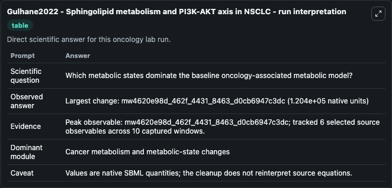
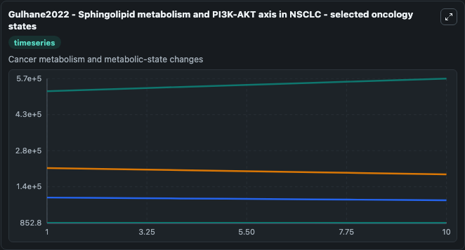
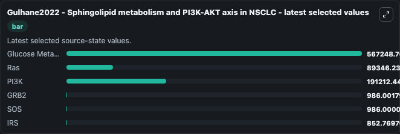

# Gulhane2022 - Sphingolipid metabolism and PI3K-AKT axis in NSCLC

This Biosimulant lab wraps `Gulhane2022 - Sphingolipid metabolism and PI3K-AKT axis in NSCLC` as a runnable oncology model with a companion visualization module.
In this model, we demonstrated that the increased expression of sphingolipids enzyme affects PI3K-AKT signaling axis and its downstream signaling mediators resulting in cancer progression. It can be used to explore treatment-response dynamics and compare scenario outcomes across configurations.

## What You'll See

The lab asks: Which metabolic states dominate the baseline oncology-associated metabolic model? It runs for 10.0 time units with a communication step of 1.0. The run uses the model defaults declared by the curated SBML wrapper. The generated visualizations focus on Glucose Metabolism, Ras, PI3K, GRB2, SOS, and IRS, combining trajectory, endpoint-comparison, and summary-table views from one completed dark-mode run.

In this captured run, **mw4620e98d_462f_4431_8463_d0cb6947c3dc** carried the largest peak and **mw4620e98d_462f_4431_8463_d0cb6947c3dc** moved by **1.2e+05** native units across 10.0 simulation windows.

<!-- BIOSIMULANT_VISUALS_START -->
### Output Visualizations



*Summary table for Gulhane2022 - Sphingolipid metabolism and PI3K-AKT axis in NSCLC, reporting the scientific question, observed answer (largest change: **mw4620e98d_462f_4431_8463_d0cb6947c3dc** at **1.2e+05** native units), evidence (peak observable: **mw4620e98d_462f_4431_8463_d0cb6947c3dc**), dominant module, and caveat.*



*Trajectories of Glucose Metabolism, Ras, PI3K, GRB2, SOS, and IRS across the 10.0 simulation. In this run **Glucose Metabolism** climbed from 5.18e+05 to 5.67e+05 and **PI3K** fell from 2.16e+05 to 1.91e+05 — the largest movements among the focused observables.*



*Endpoint ranking of the focused observables. Top 3 by final value: **Glucose Metabolism** = 5.67e+05, **PI3K** = 1.91e+05, **Ras** = 8.93e+04, with 3 more observables below.*

<!-- BIOSIMULANT_VISUALS_END -->

## Model Context

- Core model: `models/core`
- Visualization model: `models/visualisation`
- Standard: `other`
- Upstream source: `biomodels_ebi:MODEL2402290001`
- License: `CC0`
- Visual scope: Cancer metabolism and metabolic-state changes
- Caveat: Values are native SBML quantities; the cleanup does not reinterpret source equations.

## Inputs

| Input | Maps To | Default | Notes |
|---|---|---|---|
| Glucose Metabolism | `oncology_sbml_gulhane2022_sphingolipid_metabolism_and_pi3k_akt_model2402290001_model.initial_glucose_metabolism` | `518000.0` | Initial Glucose Metabolism. Sets the initial value of bundled SBML symbol `mwcc0d0d1e_f9ca_43ca_a94d_dbf4e0efbc13`. |
| Ras | `oncology_sbml_gulhane2022_sphingolipid_metabolism_and_pi3k_akt_model2402290001_model.initial_ras` | `100000.0` | Initial Ras. Sets the initial value of bundled SBML symbol `mw338974cb_3199_4092_a3fe_e32b9b3fc4d6`. |
| PI3K | `oncology_sbml_gulhane2022_sphingolipid_metabolism_and_pi3k_akt_model2402290001_model.initial_pi3k` | `216000.0` | Initial PI3K. Sets the initial value of bundled SBML symbol `mw1906ffc7_edd7_4567_8b41_84201e788393`. |
| GRB2 | `oncology_sbml_gulhane2022_sphingolipid_metabolism_and_pi3k_akt_model2402290001_model.initial_grb2` | `986.0` | Initial GRB2. Sets the initial value of bundled SBML symbol `mwe5fc6bf1_e5b9_4f84_b107_5828de7af61b`. |
| SOS | `oncology_sbml_gulhane2022_sphingolipid_metabolism_and_pi3k_akt_model2402290001_model.initial_sos` | `986.0` | Initial SOS. Sets the initial value of bundled SBML symbol `mw25445311_570d_491b_835f_c395e5a4003a`. |
| IRS | `oncology_sbml_gulhane2022_sphingolipid_metabolism_and_pi3k_akt_model2402290001_model.initial_irs` | `986.0` | Initial IRS. Sets the initial value of bundled SBML symbol `mw36987a2d_4042_4802_add1_f8d289da6b4a`. |

## Outputs

| Output | Maps To | Role |
|---|---|---|
| `glucose_metabolism` | `oncology_sbml_gulhane2022_sphingolipid_metabolism_and_pi3k_akt_model2402290001_model.glucose_metabolism` | Glucose Metabolism observable. |
| `ras` | `oncology_sbml_gulhane2022_sphingolipid_metabolism_and_pi3k_akt_model2402290001_model.ras` | Ras observable. |
| `pi3k` | `oncology_sbml_gulhane2022_sphingolipid_metabolism_and_pi3k_akt_model2402290001_model.pi3k` | PI3K observable. |
| `grb2` | `oncology_sbml_gulhane2022_sphingolipid_metabolism_and_pi3k_akt_model2402290001_model.grb2` | GRB2 observable. |
| `sos` | `oncology_sbml_gulhane2022_sphingolipid_metabolism_and_pi3k_akt_model2402290001_model.sos` | SOS observable. |
| `irs` | `oncology_sbml_gulhane2022_sphingolipid_metabolism_and_pi3k_akt_model2402290001_model.irs` | IRS observable. |
| `state` | `oncology_sbml_gulhane2022_sphingolipid_metabolism_and_pi3k_akt_model2402290001_model.state` | Full raw SBML observable record for reproducibility and downstream visualisation. |
| `summary` | `oncology_sbml_gulhane2022_sphingolipid_metabolism_and_pi3k_akt_model2402290001_model.summary` | Change and peak summary across the simulated SBML observables. |
| `species_labels` | `oncology_sbml_gulhane2022_sphingolipid_metabolism_and_pi3k_akt_model2402290001_model.species_labels` | Mapping from selected raw SBML observable symbols to display labels. |

## Runtime

- Duration: `10.0`
- Communication step: `1.0`

## Running Locally

```bash
biosimulant labs serve .
```
