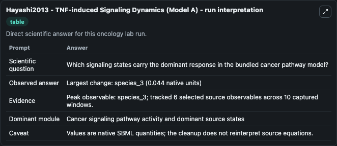
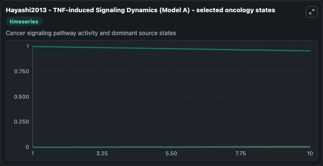
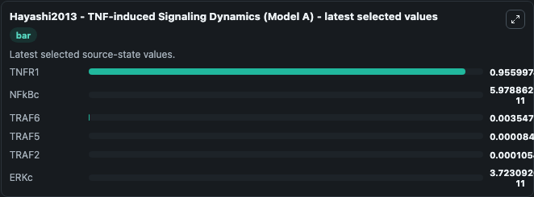

# Hayashi2013 - TNF-induced Signaling Dynamics (Model A)

This Biosimulant lab wraps `Hayashi2013 - TNF-induced Signaling Dynamics (Model A)` as a runnable oncology model with a companion visualization module.
Hayashi2013 - TNF-induced Signaling Dynamics Model (Model A)Tumor necrosis factor (TNF) plays a crucial role in inflammation and is associated with diseases such as rheumatoid arthritis and cancer. It can be used to explore treatment-response dynamics and compare scenario outcomes across configurations.

## What You'll See

The lab asks: Which signaling states carry the dominant response in the bundled cancer pathway model? It runs for 10.0 time units with a communication step of 1.0. The run uses the model defaults declared by the curated SBML wrapper. The generated visualizations focus on TNFR1, NFkBc, TRAF6, TRAF5, TRAF2, and ERKc, combining trajectory, endpoint-comparison, and summary-table views from one completed dark-mode run.

In this captured run, **species_3** carried the largest peak and **species_3** moved by **0.0440** native units across 10.0 simulation windows.

<!-- BIOSIMULANT_VISUALS_START -->
### Output Visualizations



*Summary table for Hayashi2013 - TNF-induced Signaling Dynamics (Model A), reporting the scientific question, observed answer (largest change: **species_3** at **0.0440** native units), evidence (peak observable: **species_3**), dominant module, and caveat.*



*Trajectories of TNFR1, NFkBc, TRAF6, TRAF5, TRAF2, and ERKc across the 10.0 simulation. In this run **TRAF6** climbed from 0 to 0.00355 and **TNFR1** fell from 1.000 to 0.9560 — the largest movements among the focused observables.*



*Endpoint ranking of the focused observables. Top 3 by final value: **TNFR1** = 0.9560, **TRAF6** = 0.00355, **TRAF2** = 0.000105, with 3 more observables below.*

<!-- BIOSIMULANT_VISUALS_END -->

## Model Context

- Core model: `models/core`
- Visualization model: `models/visualisation`
- Standard: `other`
- Upstream source: `biomodels_ebi:MODEL2502170001`
- License: `CC0`
- Visual scope: Cancer signaling pathway activity and dominant source states
- Caveat: Values are native SBML quantities; the cleanup does not reinterpret source equations.

## Inputs

| Input | Maps To | Default | Notes |
|---|---|---|---|
| TNFR1 | `oncology_sbml_hayashi2013_tnf_induced_signaling_dynamics_model_model2502170001_model.initial_tnfr1` | `1.0` | Initial TNFR1. Sets the initial value of bundled SBML symbol `species_3`. |
| NFkBc | `oncology_sbml_hayashi2013_tnf_induced_signaling_dynamics_model_model2502170001_model.initial_nfkbc` | `0.0` | Initial NFkBc. Sets the initial value of bundled SBML symbol `species_2`. |
| TRAF6 | `oncology_sbml_hayashi2013_tnf_induced_signaling_dynamics_model_model2502170001_model.initial_traf6` | `0.0` | Initial TRAF6. Sets the initial value of bundled SBML symbol `species_6`. |
| TRAF5 | `oncology_sbml_hayashi2013_tnf_induced_signaling_dynamics_model_model2502170001_model.initial_traf5` | `0.0` | Initial TRAF5. Sets the initial value of bundled SBML symbol `species_7`. |
| TRAF2 | `oncology_sbml_hayashi2013_tnf_induced_signaling_dynamics_model_model2502170001_model.initial_traf2` | `0.0` | Initial TRAF2. Sets the initial value of bundled SBML symbol `species_9`. |
| ERKc | `oncology_sbml_hayashi2013_tnf_induced_signaling_dynamics_model_model2502170001_model.initial_erkc` | `0.0` | Initial ERKc. Sets the initial value of bundled SBML symbol `species_16`. |

## Outputs

| Output | Maps To | Role |
|---|---|---|
| `tnfr1` | `oncology_sbml_hayashi2013_tnf_induced_signaling_dynamics_model_model2502170001_model.tnfr1` | TNFR1 observable. |
| `nfkbc` | `oncology_sbml_hayashi2013_tnf_induced_signaling_dynamics_model_model2502170001_model.nfkbc` | NFkBc observable. |
| `traf6` | `oncology_sbml_hayashi2013_tnf_induced_signaling_dynamics_model_model2502170001_model.traf6` | TRAF6 observable. |
| `traf5` | `oncology_sbml_hayashi2013_tnf_induced_signaling_dynamics_model_model2502170001_model.traf5` | TRAF5 observable. |
| `traf2` | `oncology_sbml_hayashi2013_tnf_induced_signaling_dynamics_model_model2502170001_model.traf2` | TRAF2 observable. |
| `erkc` | `oncology_sbml_hayashi2013_tnf_induced_signaling_dynamics_model_model2502170001_model.erkc` | ERKc observable. |
| `state` | `oncology_sbml_hayashi2013_tnf_induced_signaling_dynamics_model_model2502170001_model.state` | Full raw SBML observable record for reproducibility and downstream visualisation. |
| `summary` | `oncology_sbml_hayashi2013_tnf_induced_signaling_dynamics_model_model2502170001_model.summary` | Change and peak summary across the simulated SBML observables. |
| `species_labels` | `oncology_sbml_hayashi2013_tnf_induced_signaling_dynamics_model_model2502170001_model.species_labels` | Mapping from selected raw SBML observable symbols to display labels. |

## Runtime

- Duration: `10.0`
- Communication step: `1.0`

## Running Locally

```bash
biosimulant labs serve .
```
