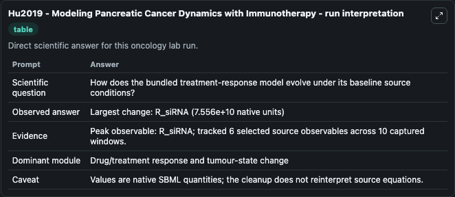
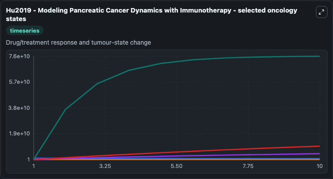
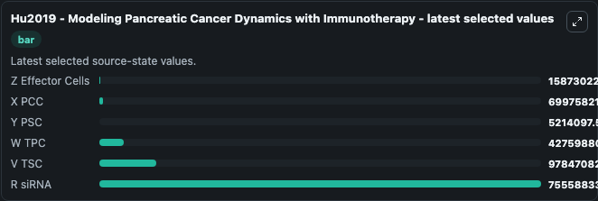

# Hu2019 - Modeling Pancreatic Cancer Dynamics with Immunotherapy

This Biosimulant lab wraps `Hu2019 - Modeling Pancreatic Cancer Dynamics with Immunotherapy` as a runnable oncology model with a companion visualization module.
This is a mathematical model of pancreatic cancer that includes descriptions of pancreatic cancer cells, pancreatic stellate cells, effector cells and tumor-promoting and tumor-suppressing cytokines t. It can be used to explore treatment-response dynamics and compare scenario outcomes across configurations.

## What You'll See

The lab asks: How does the bundled treatment-response model evolve under its baseline source conditions? It runs for 10.0 time units with a communication step of 1.0. The run uses the model defaults declared by the curated SBML wrapper. The generated visualizations focus on Z Effector Cells, X PCC, Y PSC, W TPC, V TSC, and R siRNA, combining trajectory, endpoint-comparison, and summary-table views from one completed dark-mode run.

In this captured run, **R_siRNA** carried the largest peak and **R_siRNA** moved by **7.56e+10** native units across 10.0 simulation windows.

<!-- BIOSIMULANT_VISUALS_START -->
### Output Visualizations



*Summary table for Hu2019 - Modeling Pancreatic Cancer Dynamics with Immunotherapy, reporting the scientific question, observed answer (largest change: **R_siRNA** at **7.56e+10** native units), evidence (peak observable: **R_siRNA**), dominant module, and caveat.*



*Trajectories of Z Effector Cells, X PCC, Y PSC, W TPC, V TSC, and R siRNA across the 10.0 simulation. In this run **R siRNA** climbed from 1.000 to 7.56e+10 and **X PCC** fell from 1e+09 to 7e+08 — the largest movements among the focused observables.*



*Endpoint ranking of the focused observables. Top 3 by final value: **R siRNA** = 7.56e+10, **V TSC** = 9.78e+09, **W TPC** = 4.28e+09, with 3 more observables below.*

<!-- BIOSIMULANT_VISUALS_END -->

## Model Context

- Core model: `models/core`
- Visualization model: `models/visualisation`
- Standard: `other`
- Upstream source: `biomodels_ebi:BIOMD0000000792`
- License: `CC0`
- Visual scope: Drug/treatment response and tumour-state change
- Caveat: Values are native SBML quantities; the cleanup does not reinterpret source equations.

## Inputs

| Input | Maps To | Default | Notes |
|---|---|---|---|
| Z Effector Cells | `oncology_sbml_hu2019_modeling_pancreatic_cancer_dynamics_with_biomd0000000792_model.initial_z_effector_cells` | `190000000.0` | Initial Z Effector Cells. Sets the initial value of bundled SBML symbol `z_Effector_Cells`. |
| X PCC | `oncology_sbml_hu2019_modeling_pancreatic_cancer_dynamics_with_biomd0000000792_model.initial_x_pcc` | `1000000000.0` | Initial X PCC. Sets the initial value of bundled SBML symbol `x_PCC`. |
| Y PSC | `oncology_sbml_hu2019_modeling_pancreatic_cancer_dynamics_with_biomd0000000792_model.initial_y_psc` | `5600000.0` | Initial Y PSC. Sets the initial value of bundled SBML symbol `y_PSC`. |
| W TPC | `oncology_sbml_hu2019_modeling_pancreatic_cancer_dynamics_with_biomd0000000792_model.initial_w_tpc` | `50000.0` | Initial W TPC. Sets the initial value of bundled SBML symbol `w_TPC`. |
| V TSC | `oncology_sbml_hu2019_modeling_pancreatic_cancer_dynamics_with_biomd0000000792_model.initial_v_tsc` | `9.4` | Initial V TSC. Sets the initial value of bundled SBML symbol `v_TSC`. |
| R siRNA | `oncology_sbml_hu2019_modeling_pancreatic_cancer_dynamics_with_biomd0000000792_model.initial_r_sirna` | `1.0` | Initial R siRNA. Sets the initial value of bundled SBML symbol `R_siRNA`. |

## Outputs

| Output | Maps To | Role |
|---|---|---|
| `z_effector_cells` | `oncology_sbml_hu2019_modeling_pancreatic_cancer_dynamics_with_biomd0000000792_model.z_effector_cells` | Z Effector Cells observable. |
| `x_pcc` | `oncology_sbml_hu2019_modeling_pancreatic_cancer_dynamics_with_biomd0000000792_model.x_pcc` | X PCC observable. |
| `y_psc` | `oncology_sbml_hu2019_modeling_pancreatic_cancer_dynamics_with_biomd0000000792_model.y_psc` | Y PSC observable. |
| `w_tpc` | `oncology_sbml_hu2019_modeling_pancreatic_cancer_dynamics_with_biomd0000000792_model.w_tpc` | W TPC observable. |
| `v_tsc` | `oncology_sbml_hu2019_modeling_pancreatic_cancer_dynamics_with_biomd0000000792_model.v_tsc` | V TSC observable. |
| `r_sirna` | `oncology_sbml_hu2019_modeling_pancreatic_cancer_dynamics_with_biomd0000000792_model.r_sirna` | R siRNA observable. |
| `state` | `oncology_sbml_hu2019_modeling_pancreatic_cancer_dynamics_with_biomd0000000792_model.state` | Full raw SBML observable record for reproducibility and downstream visualisation. |
| `summary` | `oncology_sbml_hu2019_modeling_pancreatic_cancer_dynamics_with_biomd0000000792_model.summary` | Change and peak summary across the simulated SBML observables. |
| `species_labels` | `oncology_sbml_hu2019_modeling_pancreatic_cancer_dynamics_with_biomd0000000792_model.species_labels` | Mapping from selected raw SBML observable symbols to display labels. |

## Runtime

- Duration: `10.0`
- Communication step: `1.0`

## Running Locally

```bash
biosimulant labs serve .
```
