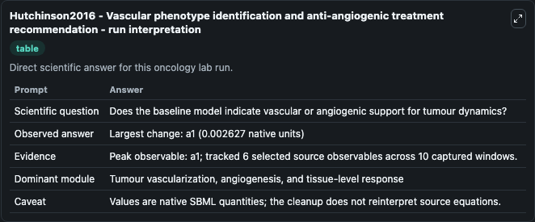
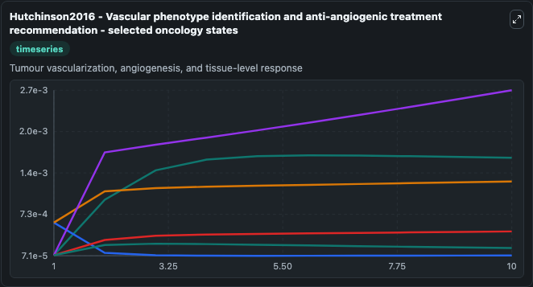
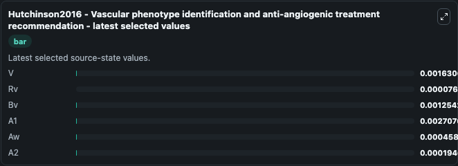

# Hutchinson2016 - Vascular phenotype identification and anti-angiogenic treatment recommendation

This Biosimulant lab wraps `Hutchinson2016 - Vascular phenotype identification and anti-angiogenic treatment recommendation` as a runnable oncology model with a companion visualization module.
This is a spatially averaged multiscale mathematical model of tumor angiogenesis. It can be used to explore treatment-response dynamics and compare scenario outcomes across configurations.

## What You'll See

The lab asks: Does the baseline model indicate vascular or angiogenic support for tumour dynamics? It runs for 10.0 time units with a communication step of 1.0. The run uses the model defaults declared by the curated SBML wrapper. The generated visualizations focus on V, Rv, Bv, A1, Aw, and A2, combining trajectory, endpoint-comparison, and summary-table views from one completed dark-mode run.

In this captured run, **a1** carried the largest peak and **a1** moved by **0.00263** native units across 10.0 simulation windows.

<!-- BIOSIMULANT_VISUALS_START -->
### Output Visualizations



*Summary table for Hutchinson2016 - Vascular phenotype identification and anti-angiogenic treatment recommendation, reporting the scientific question, observed answer (largest change: **a1** at **0.00263** native units), evidence (peak observable: **a1**), dominant module, and caveat.*



*Trajectories of V, Rv, Bv, A1, Aw, and A2 across the 10.0 simulation. In this run **A1** climbed from 8e-05 to 0.00271 and **Rv** fell from 0.0006 to 7.61e-05 — the largest movements among the focused observables.*



*Endpoint ranking of the focused observables. Top 3 by final value: **A1** = 0.00271, **V** = 0.00163, **Bv** = 0.00125, with 3 more observables below.*

<!-- BIOSIMULANT_VISUALS_END -->

## Model Context

- Core model: `models/core`
- Visualization model: `models/visualisation`
- Standard: `other`
- Upstream source: `biomodels_ebi:MODEL1911130007`
- License: `CC0`
- Visual scope: Tumour vascularization, angiogenesis, and tissue-level response
- Caveat: Values are native SBML quantities; the cleanup does not reinterpret source equations.

## Inputs

| Input | Maps To | Default | Notes |
|---|---|---|---|
| Epsilon source parameter | `oncology_sbml_hutchinson2016_vascular_phenotype_identification_model1911130007_model.epsilon_level` | `0.04` | Epsilon source parameter. Maps to bundled SBML parameter `epsilon`. |

## Outputs

| Output | Maps To | Role |
|---|---|---|
| `model_state_1` | `oncology_sbml_hutchinson2016_vascular_phenotype_identification_model1911130007_model.model_state_1` | V observable. |
| `model_state_2` | `oncology_sbml_hutchinson2016_vascular_phenotype_identification_model1911130007_model.model_state_2` | Rv observable. |
| `model_state_3` | `oncology_sbml_hutchinson2016_vascular_phenotype_identification_model1911130007_model.model_state_3` | Bv observable. |
| `model_state_4` | `oncology_sbml_hutchinson2016_vascular_phenotype_identification_model1911130007_model.model_state_4` | A1 observable. |
| `model_state_5` | `oncology_sbml_hutchinson2016_vascular_phenotype_identification_model1911130007_model.model_state_5` | Aw observable. |
| `model_state_6` | `oncology_sbml_hutchinson2016_vascular_phenotype_identification_model1911130007_model.model_state_6` | A2 observable. |
| `state` | `oncology_sbml_hutchinson2016_vascular_phenotype_identification_model1911130007_model.state` | Full raw SBML observable record for reproducibility and downstream visualisation. |
| `summary` | `oncology_sbml_hutchinson2016_vascular_phenotype_identification_model1911130007_model.summary` | Change and peak summary across the simulated SBML observables. |
| `species_labels` | `oncology_sbml_hutchinson2016_vascular_phenotype_identification_model1911130007_model.species_labels` | Mapping from selected raw SBML observable symbols to display labels. |

## Runtime

- Duration: `10.0`
- Communication step: `1.0`

## Running Locally

```bash
biosimulant labs serve .
```
