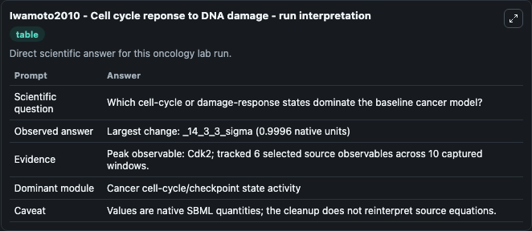
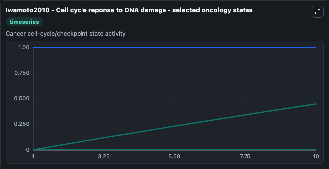
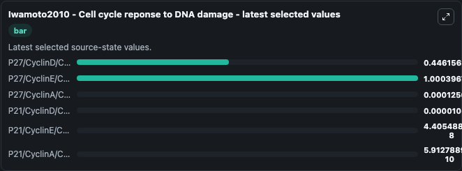

# Iwamoto2010 - Cell cycle reponse to DNA damage

This Biosimulant lab wraps `Iwamoto2010 - Cell cycle reponse to DNA damage` as a runnable oncology model with a companion visualization module.
After DNA damage, cells activate p53, a tumor suppressor gene, and select a cell fate (e.g., DNA repair, cell cycle arrest, or apoptosis). It can be used to explore treatment-response dynamics and compare scenario outcomes across configurations.

## What You'll See

The lab asks: Which cell-cycle or damage-response states dominate the baseline cancer model? It runs for 10.0 time units with a communication step of 1.0. The run uses the model defaults declared by the curated SBML wrapper. The generated visualizations focus on P27/CyclinD/Cdk4, P27/CyclinE/Cdk2, P27/CyclinA/Cdk2, P21/CyclinD/Cdk4, P21/CyclinE/Cdk2, and P21/CyclinA/Cdk2, combining trajectory, endpoint-comparison, and summary-table views from one completed dark-mode run.

In this captured run, **Cdk2** carried the largest peak and **_14_3_3_sigma** moved by **0.9996** native units across 10.0 simulation windows.

<!-- BIOSIMULANT_VISUALS_START -->
### Output Visualizations



*Summary table for Iwamoto2010 - Cell cycle reponse to DNA damage, reporting the scientific question, observed answer (largest change: **_14_3_3_sigma** at **0.9996** native units), evidence (peak observable: **Cdk2**), dominant module, and caveat.*



*Trajectories of P27/CyclinD/Cdk4, P27/CyclinE/Cdk2, P27/CyclinA/Cdk2, P21/CyclinD/Cdk4, P21/CyclinE/Cdk2, and P21/CyclinA/Cdk2 across the 10.0 simulation. In this run **P27/CyclinD/Cdk4** climbed from 0.001 to 0.4462 — the largest movements among the focused observables.*



*Endpoint ranking of the focused observables. Top 3 by final value: **P27/CyclinE/Cdk2** = 1.000, **P27/CyclinD/Cdk4** = 0.4462, **P27/CyclinA/Cdk2** = 0.000126, with 3 more observables below.*

<!-- BIOSIMULANT_VISUALS_END -->

## Model Context

- Core model: `models/core`
- Visualization model: `models/visualisation`
- Standard: `other`
- Upstream source: `biomodels_ebi:BIOMD0000000939`
- License: `CC0`
- Visual scope: Cancer cell-cycle/checkpoint state activity
- Caveat: Values are native SBML quantities; the cleanup does not reinterpret source equations.

## Inputs

| Input | Maps To | Default | Notes |
|---|---|---|---|
| DNA damage signal source parameter | `oncology_sbml_iwamoto2010_cell_cycle_reponse_to_dna_damage_biomd0000000939_model.dna_damage_signal` | `0.0` | DNA damage signal source parameter. Maps to bundled SBML parameter `DNA_damage_signal`. |
| P27/CyclinD/Cdk4 | `oncology_sbml_iwamoto2010_cell_cycle_reponse_to_dna_damage_biomd0000000939_model.initial_p27_cyclind_cdk4` | `0.001` | Initial P27/CyclinD/Cdk4. Sets the initial value of bundled SBML symbol `p27_CyclinD_Cdk4`. |
| P27/CyclinE/Cdk2 | `oncology_sbml_iwamoto2010_cell_cycle_reponse_to_dna_damage_biomd0000000939_model.initial_p27_cycline_cdk2` | `1.0` | Initial P27/CyclinE/Cdk2. Sets the initial value of bundled SBML symbol `p27_CyclinE_Cdk2`. |
| P27/CyclinA/Cdk2 | `oncology_sbml_iwamoto2010_cell_cycle_reponse_to_dna_damage_biomd0000000939_model.initial_p27_cyclina_cdk2` | `0.0001` | Initial P27/CyclinA/Cdk2. Sets the initial value of bundled SBML symbol `p27_CyclinA_Cdk2`. |
| P21/CyclinD/Cdk4 | `oncology_sbml_iwamoto2010_cell_cycle_reponse_to_dna_damage_biomd0000000939_model.initial_p21_cyclind_cdk4` | `0.0` | Initial P21/CyclinD/Cdk4. Sets the initial value of bundled SBML symbol `p21_CyclinD_Cdk4`. |
| P21/CyclinE/Cdk2 | `oncology_sbml_iwamoto2010_cell_cycle_reponse_to_dna_damage_biomd0000000939_model.initial_p21_cycline_cdk2` | `0.0` | Initial P21/CyclinE/Cdk2. Sets the initial value of bundled SBML symbol `p21_CyclinE_Cdk2`. |

## Outputs

| Output | Maps To | Role |
|---|---|---|
| `p27_cyclind_cdk4` | `oncology_sbml_iwamoto2010_cell_cycle_reponse_to_dna_damage_biomd0000000939_model.p27_cyclind_cdk4` | P27/CyclinD/Cdk4 observable. |
| `p27_cycline_cdk2` | `oncology_sbml_iwamoto2010_cell_cycle_reponse_to_dna_damage_biomd0000000939_model.p27_cycline_cdk2` | P27/CyclinE/Cdk2 observable. |
| `p27_cyclina_cdk2` | `oncology_sbml_iwamoto2010_cell_cycle_reponse_to_dna_damage_biomd0000000939_model.p27_cyclina_cdk2` | P27/CyclinA/Cdk2 observable. |
| `p21_cyclind_cdk4` | `oncology_sbml_iwamoto2010_cell_cycle_reponse_to_dna_damage_biomd0000000939_model.p21_cyclind_cdk4` | P21/CyclinD/Cdk4 observable. |
| `p21_cycline_cdk2` | `oncology_sbml_iwamoto2010_cell_cycle_reponse_to_dna_damage_biomd0000000939_model.p21_cycline_cdk2` | P21/CyclinE/Cdk2 observable. |
| `p21_cyclina_cdk2` | `oncology_sbml_iwamoto2010_cell_cycle_reponse_to_dna_damage_biomd0000000939_model.p21_cyclina_cdk2` | P21/CyclinA/Cdk2 observable. |
| `state` | `oncology_sbml_iwamoto2010_cell_cycle_reponse_to_dna_damage_biomd0000000939_model.state` | Full raw SBML observable record for reproducibility and downstream visualisation. |
| `summary` | `oncology_sbml_iwamoto2010_cell_cycle_reponse_to_dna_damage_biomd0000000939_model.summary` | Change and peak summary across the simulated SBML observables. |
| `species_labels` | `oncology_sbml_iwamoto2010_cell_cycle_reponse_to_dna_damage_biomd0000000939_model.species_labels` | Mapping from selected raw SBML observable symbols to display labels. |

## Runtime

- Duration: `10.0`
- Communication step: `1.0`

## Running Locally

```bash
biosimulant labs serve .
```
