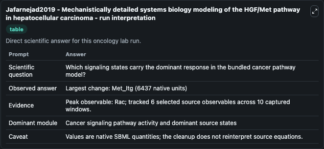
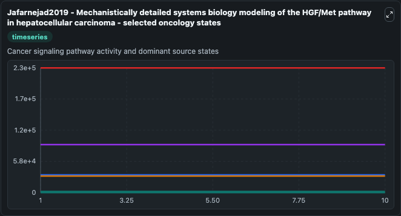
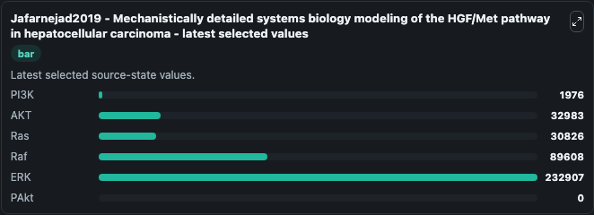

# Jafarnejad2019 - Mechanistically detailed systems biology modeling of the HGF/Met pathway in hepatocellular carcinoma

This Biosimulant lab wraps `Jafarnejad2019 - Mechanistically detailed systems biology modeling of the HGF/Met pathway in hepatocellular carcinoma` as a runnable oncology model with a companion visualization module.
Hepatocyte growth factor (HGF) signaling through its receptor Met has been implicated in hepatocellular carcinoma tumorigenesis and progression. It can be used to explore treatment-response dynamics and compare scenario outcomes across configurations.

## What You'll See

The lab asks: Which signaling states carry the dominant response in the bundled cancer pathway model? It runs for 10.0 time units with a communication step of 1.0. The run uses the model defaults declared by the curated SBML wrapper. The generated visualizations focus on PI3K, AKT, Ras, Raf, ERK, and PAkt, combining trajectory, endpoint-comparison, and summary-table views from one completed dark-mode run.

In this captured run, **Rac** carried the largest peak and **Met_Itg** moved by **6437.0** native units across 10.0 simulation windows.

<!-- BIOSIMULANT_VISUALS_START -->
### Output Visualizations



*Summary table for Jafarnejad2019 - Mechanistically detailed systems biology modeling of the HGF/Met pathway in hepatocellular carcinoma, reporting the scientific question, observed answer (largest change: **Met_Itg** at **6437.0** native units), evidence (peak observable: **Rac**), dominant module, and caveat.*



*Trajectories of PI3K, AKT, Ras, Raf, ERK, and PAkt across the 10.0 simulation. In this run PI3K, AKT, Ras, Raf stayed near their initial values — no observable moved appreciably.*



*Endpoint ranking of the focused observables. Top 3 by final value: **ERK** = 2.33e+05, **Raf** = 8.96e+04, **AKT** = 3.3e+04, with 3 more observables below.*

<!-- BIOSIMULANT_VISUALS_END -->

## Model Context

- Core model: `models/core`
- Visualization model: `models/visualisation`
- Standard: `other`
- Upstream source: `biomodels_ebi:MODEL2003200001`
- License: `CC0`
- Visual scope: Cancer signaling pathway activity and dominant source states
- Caveat: Values are native SBML quantities; the cleanup does not reinterpret source equations.

## Inputs

| Input | Maps To | Default | Notes |
|---|---|---|---|
| KD Rilotumumab source parameter | `oncology_sbml_jafarnejad2019_mechanistically_detailed_systems_model2003200001_model.kd_rilotumumab_level` | `0.22` | KD Rilotumumab source parameter. Maps to bundled SBML parameter `KD_Rilotumumab`. |
| PI3K | `oncology_sbml_jafarnejad2019_mechanistically_detailed_systems_model2003200001_model.initial_pi3k` | `1976.0` | Initial PI3K. Sets the initial value of bundled SBML symbol `PI3K`. |
| AKT | `oncology_sbml_jafarnejad2019_mechanistically_detailed_systems_model2003200001_model.initial_akt` | `32983.0` | Initial AKT. Sets the initial value of bundled SBML symbol `Akt`. |
| Ras | `oncology_sbml_jafarnejad2019_mechanistically_detailed_systems_model2003200001_model.initial_ras` | `30826.0` | Initial Ras. Sets the initial value of bundled SBML symbol `Ras`. |
| Raf | `oncology_sbml_jafarnejad2019_mechanistically_detailed_systems_model2003200001_model.initial_raf` | `89608.0` | Initial Raf. Sets the initial value of bundled SBML symbol `Raf`. |
| ERK | `oncology_sbml_jafarnejad2019_mechanistically_detailed_systems_model2003200001_model.initial_erk` | `232907.0` | Initial ERK. Sets the initial value of bundled SBML symbol `ERK`. |

## Outputs

| Output | Maps To | Role |
|---|---|---|
| `pi3k` | `oncology_sbml_jafarnejad2019_mechanistically_detailed_systems_model2003200001_model.pi3k` | PI3K observable. |
| `akt` | `oncology_sbml_jafarnejad2019_mechanistically_detailed_systems_model2003200001_model.akt` | AKT observable. |
| `ras` | `oncology_sbml_jafarnejad2019_mechanistically_detailed_systems_model2003200001_model.ras` | Ras observable. |
| `raf` | `oncology_sbml_jafarnejad2019_mechanistically_detailed_systems_model2003200001_model.raf` | Raf observable. |
| `erk` | `oncology_sbml_jafarnejad2019_mechanistically_detailed_systems_model2003200001_model.erk` | ERK observable. |
| `pakt` | `oncology_sbml_jafarnejad2019_mechanistically_detailed_systems_model2003200001_model.pakt` | PAkt observable. |
| `state` | `oncology_sbml_jafarnejad2019_mechanistically_detailed_systems_model2003200001_model.state` | Full raw SBML observable record for reproducibility and downstream visualisation. |
| `summary` | `oncology_sbml_jafarnejad2019_mechanistically_detailed_systems_model2003200001_model.summary` | Change and peak summary across the simulated SBML observables. |
| `species_labels` | `oncology_sbml_jafarnejad2019_mechanistically_detailed_systems_model2003200001_model.species_labels` | Mapping from selected raw SBML observable symbols to display labels. |

## Runtime

- Duration: `10.0`
- Communication step: `1.0`

## Running Locally

```bash
biosimulant labs serve .
```
