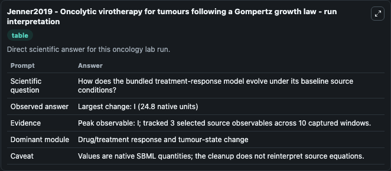
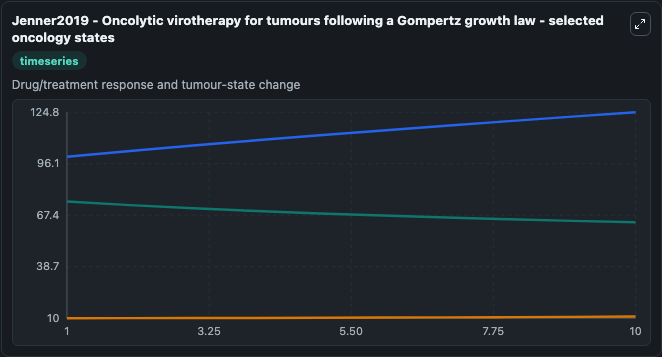
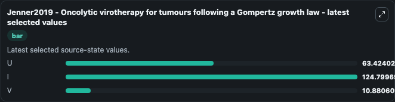

# Jenner2019 - Oncolytic virotherapy for tumours following a Gompertz growth law

This Biosimulant lab wraps `Jenner2019 - Oncolytic virotherapy for tumours following a Gompertz growth law` as a runnable oncology model with a companion visualization module.
This is a mathematical model using a Gompertz growth law to describe the in vivo dynamics of a cancer under treatment with an oncolytic virus. It can be used to explore treatment-response dynamics and compare scenario outcomes across configurations.

## What You'll See

The lab asks: How does the bundled treatment-response model evolve under its baseline source conditions? It runs for 10.0 time units with a communication step of 1.0. The run uses the model defaults declared by the curated SBML wrapper. The generated visualizations focus on U, I, and V, combining trajectory, endpoint-comparison, and summary-table views from one completed dark-mode run.

In this captured run, **I** peaked at **124.8** and **I** moved by **24.800** native units across 10.0 simulation windows.

<!-- BIOSIMULANT_VISUALS_START -->
### Output Visualizations



*Summary table for Jenner2019 - Oncolytic virotherapy for tumours following a Gompertz growth law, reporting the scientific question, observed answer (largest change: **I** at **24.800** native units), evidence (peak observable: **I**), dominant module, and caveat.*



*Trajectories of U, I, and V across the 10.0 simulation. In this run **I** climbed from 100.0 to 124.8 and **U** fell from 75.000 to 63.424 — the largest movements among the focused observables.*



*Endpoint ranking of the focused observables. Top 3 by final value: **I** = 124.8, **U** = 63.424, **V** = 10.881.*

<!-- BIOSIMULANT_VISUALS_END -->

## Model Context

- Core model: `models/core`
- Visualization model: `models/visualisation`
- Standard: `other`
- Upstream source: `biomodels_ebi:BIOMD0000000850`
- License: `CC0`
- Visual scope: Drug/treatment response and tumour-state change
- Caveat: Values are native SBML quantities; the cleanup does not reinterpret source equations.

## Inputs

| Input | Maps To | Default | Notes |
|---|---|---|---|

## Outputs

| Output | Maps To | Role |
|---|---|---|
| `model_state_1` | `oncology_sbml_jenner2019_oncolytic_virotherapy_for_tumours_fol_biomd0000000850_model.model_state_1` | U observable. |
| `model_state_2` | `oncology_sbml_jenner2019_oncolytic_virotherapy_for_tumours_fol_biomd0000000850_model.model_state_2` | I observable. |
| `model_state_3` | `oncology_sbml_jenner2019_oncolytic_virotherapy_for_tumours_fol_biomd0000000850_model.model_state_3` | V observable. |
| `state` | `oncology_sbml_jenner2019_oncolytic_virotherapy_for_tumours_fol_biomd0000000850_model.state` | Full raw SBML observable record for reproducibility and downstream visualisation. |
| `summary` | `oncology_sbml_jenner2019_oncolytic_virotherapy_for_tumours_fol_biomd0000000850_model.summary` | Change and peak summary across the simulated SBML observables. |
| `species_labels` | `oncology_sbml_jenner2019_oncolytic_virotherapy_for_tumours_fol_biomd0000000850_model.species_labels` | Mapping from selected raw SBML observable symbols to display labels. |

## Runtime

- Duration: `10.0`
- Communication step: `1.0`

## Running Locally

```bash
biosimulant labs serve .
```
