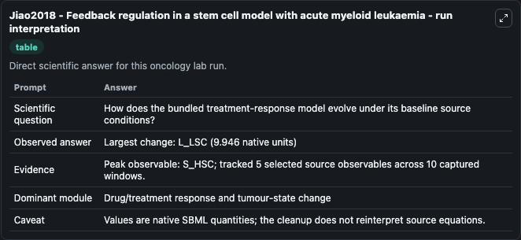
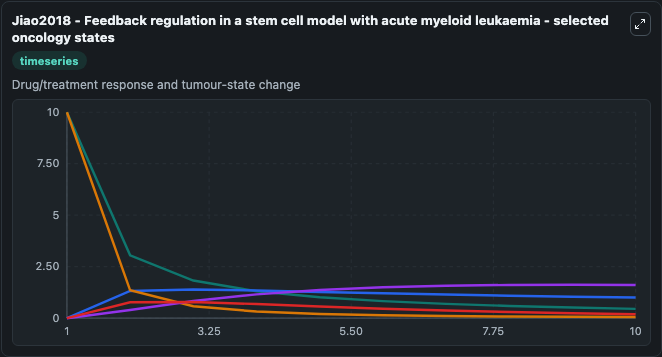
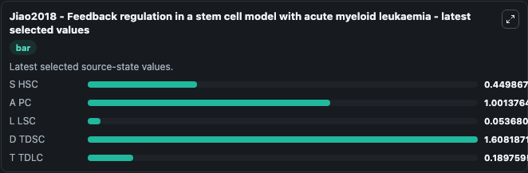

# Jiao2018 - Feedback regulation in a stem cell model with acute myeloid leukaemia

This Biosimulant lab wraps `Jiao2018 - Feedback regulation in a stem cell model with acute myeloid leukaemia` as a runnable oncology model with a companion visualization module.
This is a mathematical model describing the hematopoietic lineages with leukemia lineages, as controlled by end-product negative feedback inhibition. It can be used to explore treatment-response dynamics and compare scenario outcomes across configurations.

## What You'll See

The lab asks: How does the bundled treatment-response model evolve under its baseline source conditions? It runs for 10.0 time units with a communication step of 1.0. The run uses the model defaults declared by the curated SBML wrapper. The generated visualizations focus on S HSC, A PC, L LSC, D TDSC, and T TDLC, combining trajectory, endpoint-comparison, and summary-table views from one completed dark-mode run.

In this captured run, **S_HSC** carried the largest peak and **L_LSC** moved by **9.946** native units across 10.0 simulation windows.

<!-- BIOSIMULANT_VISUALS_START -->
### Output Visualizations



*Summary table for Jiao2018 - Feedback regulation in a stem cell model with acute myeloid leukaemia, reporting the scientific question, observed answer (largest change: **L_LSC** at **9.946** native units), evidence (peak observable: **S_HSC**), dominant module, and caveat.*



*Trajectories of S HSC, A PC, L LSC, D TDSC, and T TDLC across the 10.0 simulation. In this run **D TDSC** climbed from 0 to 1.608 and **L LSC** fell from 10.000 to 0.0537 — the largest movements among the focused observables.*



*Endpoint ranking of the focused observables. Top 3 by final value: **D TDSC** = 1.608, **A PC** = 1.001, **S HSC** = 0.4499, with 2 more observables below.*

<!-- BIOSIMULANT_VISUALS_END -->

## Model Context

- Core model: `models/core`
- Visualization model: `models/visualisation`
- Standard: `other`
- Upstream source: `biomodels_ebi:BIOMD0000000898`
- License: `CC0`
- Visual scope: Drug/treatment response and tumour-state change
- Caveat: Values are native SBML quantities; the cleanup does not reinterpret source equations.

## Inputs

| Input | Maps To | Default | Notes |
|---|---|---|---|
| S HSC | `oncology_sbml_jiao2018_feedback_regulation_in_a_stem_cell_mode_biomd0000000898_model.initial_s_hsc` | `10.0` | Initial S HSC. Sets the initial value of bundled SBML symbol `S_HSC`. |
| A PC | `oncology_sbml_jiao2018_feedback_regulation_in_a_stem_cell_mode_biomd0000000898_model.initial_a_pc` | `0.0` | Initial A PC. Sets the initial value of bundled SBML symbol `A_PC`. |
| L LSC | `oncology_sbml_jiao2018_feedback_regulation_in_a_stem_cell_mode_biomd0000000898_model.initial_l_lsc` | `10.0` | Initial L LSC. Sets the initial value of bundled SBML symbol `L_LSC`. |
| D TDSC | `oncology_sbml_jiao2018_feedback_regulation_in_a_stem_cell_mode_biomd0000000898_model.initial_d_tdsc` | `0.0` | Initial D TDSC. Sets the initial value of bundled SBML symbol `D_TDSC`. |
| T TDLC | `oncology_sbml_jiao2018_feedback_regulation_in_a_stem_cell_mode_biomd0000000898_model.initial_t_tdlc` | `0.0` | Initial T TDLC. Sets the initial value of bundled SBML symbol `T_TDLC`. |

## Outputs

| Output | Maps To | Role |
|---|---|---|
| `s_hsc` | `oncology_sbml_jiao2018_feedback_regulation_in_a_stem_cell_mode_biomd0000000898_model.s_hsc` | S HSC observable. |
| `a_pc` | `oncology_sbml_jiao2018_feedback_regulation_in_a_stem_cell_mode_biomd0000000898_model.a_pc` | A PC observable. |
| `l_lsc` | `oncology_sbml_jiao2018_feedback_regulation_in_a_stem_cell_mode_biomd0000000898_model.l_lsc` | L LSC observable. |
| `d_tdsc` | `oncology_sbml_jiao2018_feedback_regulation_in_a_stem_cell_mode_biomd0000000898_model.d_tdsc` | D TDSC observable. |
| `t_tdlc` | `oncology_sbml_jiao2018_feedback_regulation_in_a_stem_cell_mode_biomd0000000898_model.t_tdlc` | T TDLC observable. |
| `state` | `oncology_sbml_jiao2018_feedback_regulation_in_a_stem_cell_mode_biomd0000000898_model.state` | Full raw SBML observable record for reproducibility and downstream visualisation. |
| `summary` | `oncology_sbml_jiao2018_feedback_regulation_in_a_stem_cell_mode_biomd0000000898_model.summary` | Change and peak summary across the simulated SBML observables. |
| `species_labels` | `oncology_sbml_jiao2018_feedback_regulation_in_a_stem_cell_mode_biomd0000000898_model.species_labels` | Mapping from selected raw SBML observable symbols to display labels. |

## Runtime

- Duration: `10.0`
- Communication step: `1.0`

## Running Locally

```bash
biosimulant labs serve .
```
