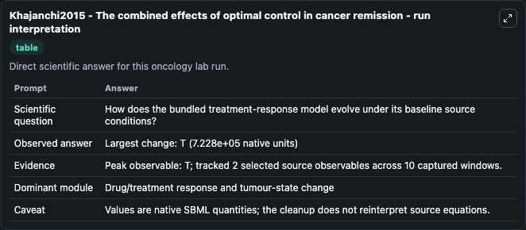
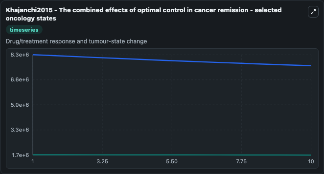
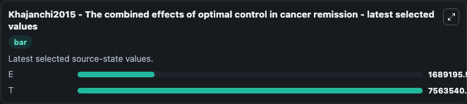

# Khajanchi2015 - The combined effects of optimal control in cancer remission

This Biosimulant lab wraps `Khajanchi2015 - The combined effects of optimal control in cancer remission` as a runnable oncology model with a companion visualization module.
The combined effects of optimal control in cancer remissionSubhasKhajanchiDibakarGhoshAbstractWe investigate a mathematical model depicting the nonlinear dynamics of immunogenic tumors as envisioned b. It can be used to explore treatment-response dynamics and compare scenario outcomes across configurations.

## What You'll See

The lab asks: How does the bundled treatment-response model evolve under its baseline source conditions? It runs for 10.0 time units with a communication step of 1.0. The run uses the model defaults declared by the curated SBML wrapper. The generated visualizations focus on E, and T, combining trajectory, endpoint-comparison, and summary-table views from one completed dark-mode run.

In this captured run, **T** peaked at **8.29e+06** and **T** moved by **7.23e+05** native units across 10.0 simulation windows.

<!-- BIOSIMULANT_VISUALS_START -->
### Output Visualizations



*Summary table for Khajanchi2015 - The combined effects of optimal control in cancer remission, reporting the scientific question, observed answer (largest change: **T** at **7.23e+05** native units), evidence (peak observable: **T**), dominant module, and caveat.*



*Trajectories of E, and T across the 10.0 simulation. In this run **T** fell from 8.29e+06 to 7.56e+06 — the largest movements among the focused observables.*



*Endpoint ranking of the focused observables. Top 2 by final value: **T** = 7.56e+06, **E** = 1.69e+06.*

<!-- BIOSIMULANT_VISUALS_END -->

## Model Context

- Core model: `models/core`
- Visualization model: `models/visualisation`
- Standard: `other`
- Upstream source: `biomodels_ebi:BIOMD0000000897`
- License: `CC0`
- Visual scope: Drug/treatment response and tumour-state change
- Caveat: Values are native SBML quantities; the cleanup does not reinterpret source equations.

## Inputs

| Input | Maps To | Default | Notes |
|---|---|---|---|

## Outputs

| Output | Maps To | Role |
|---|---|---|
| `model_state_1` | `oncology_sbml_khajanchi2015_the_combined_effects_of_optimal_co_biomd0000000897_model.model_state_1` | E observable. |
| `model_state_2` | `oncology_sbml_khajanchi2015_the_combined_effects_of_optimal_co_biomd0000000897_model.model_state_2` | T observable. |
| `state` | `oncology_sbml_khajanchi2015_the_combined_effects_of_optimal_co_biomd0000000897_model.state` | Full raw SBML observable record for reproducibility and downstream visualisation. |
| `summary` | `oncology_sbml_khajanchi2015_the_combined_effects_of_optimal_co_biomd0000000897_model.summary` | Change and peak summary across the simulated SBML observables. |
| `species_labels` | `oncology_sbml_khajanchi2015_the_combined_effects_of_optimal_co_biomd0000000897_model.species_labels` | Mapping from selected raw SBML observable symbols to display labels. |

## Runtime

- Duration: `10.0`
- Communication step: `1.0`

## Running Locally

```bash
biosimulant labs serve .
```
