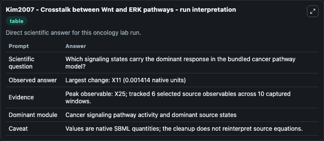
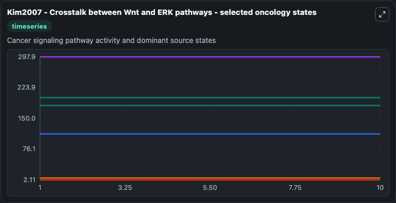
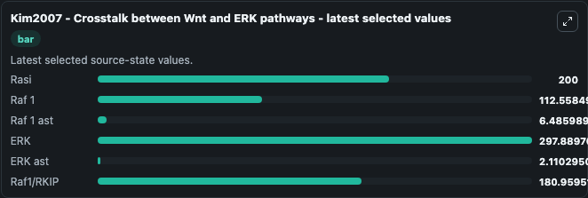

# Kim2007 - Crosstalk between Wnt and ERK pathways

This Biosimulant lab wraps `Kim2007 - Crosstalk between Wnt and ERK pathways` as a runnable oncology model with a companion visualization module.
Kim2007 - Crosstalk between Wnt and ERK pathways Experimental studies have shown that both Wnt and the MAPK pathways are involved in the pathogenesis of various kinds of cancers (eg. It can be used to explore treatment-response dynamics and compare scenario outcomes across configurations.

## What You'll See

The lab asks: Which signaling states carry the dominant response in the bundled cancer pathway model? It runs for 10.0 time units with a communication step of 1.0. The run uses the model defaults declared by the curated SBML wrapper. The generated visualizations focus on Rasi, Raf 1, Raf 1 ast, ERK, ERK ast, and Raf1/RKIP, combining trajectory, endpoint-comparison, and summary-table views from one completed dark-mode run.

In this captured run, **X25** carried the largest peak and **X11** moved by **0.00141** native units across 10.0 simulation windows.

<!-- BIOSIMULANT_VISUALS_START -->
### Output Visualizations



*Summary table for Kim2007 - Crosstalk between Wnt and ERK pathways, reporting the scientific question, observed answer (largest change: **X11** at **0.00141** native units), evidence (peak observable: **X25**), dominant module, and caveat.*



*Trajectories of Rasi, Raf 1, Raf 1 ast, ERK, ERK ast, and Raf1/RKIP across the 10.0 simulation. In this run **Raf1/RKIP** climbed from 181.0 to 181.0 and **Raf 1 ast** fell from 6.486 to 6.486 — the largest movements among the focused observables.*



*Endpoint ranking of the focused observables. Top 3 by final value: **ERK** = 297.9, **Rasi** = 200.0, **Raf1/RKIP** = 181.0, with 3 more observables below.*

<!-- BIOSIMULANT_VISUALS_END -->

## Model Context

- Core model: `models/core`
- Visualization model: `models/visualisation`
- Standard: `other`
- Upstream source: `biomodels_ebi:BIOMD0000000149`
- License: `CC0`
- Visual scope: Cancer signaling pathway activity and dominant source states
- Caveat: Values are native SBML quantities; the cleanup does not reinterpret source equations.

## Inputs

| Input | Maps To | Default | Notes |
|---|---|---|---|
| Rasi | `oncology_sbml_kim2007_crosstalk_between_wnt_and_erk_pathways_biomd0000000149_model.initial_rasi` | `200.0` | Initial Rasi. Sets the initial value of bundled SBML symbol `X16`. |
| Raf 1 | `oncology_sbml_kim2007_crosstalk_between_wnt_and_erk_pathways_biomd0000000149_model.initial_raf_1` | `112.5585` | Initial Raf 1. Sets the initial value of bundled SBML symbol `X18`. |
| Raf 1 ast | `oncology_sbml_kim2007_crosstalk_between_wnt_and_erk_pathways_biomd0000000149_model.initial_raf_1_ast` | `6.486` | Initial Raf 1 ast. Sets the initial value of bundled SBML symbol `X19`. |
| ERK | `oncology_sbml_kim2007_crosstalk_between_wnt_and_erk_pathways_biomd0000000149_model.initial_erk` | `297.8897` | Initial ERK. Sets the initial value of bundled SBML symbol `X22`. |
| ERK ast | `oncology_sbml_kim2007_crosstalk_between_wnt_and_erk_pathways_biomd0000000149_model.initial_erk_ast` | `2.1103` | Initial ERK ast. Sets the initial value of bundled SBML symbol `X23`. |
| Raf1/RKIP | `oncology_sbml_kim2007_crosstalk_between_wnt_and_erk_pathways_biomd0000000149_model.initial_raf1_rkip` | `180.9595` | Initial Raf1/RKIP. Sets the initial value of bundled SBML symbol `X24`. |

## Outputs

| Output | Maps To | Role |
|---|---|---|
| `rasi` | `oncology_sbml_kim2007_crosstalk_between_wnt_and_erk_pathways_biomd0000000149_model.rasi` | Rasi observable. |
| `raf_1` | `oncology_sbml_kim2007_crosstalk_between_wnt_and_erk_pathways_biomd0000000149_model.raf_1` | Raf 1 observable. |
| `raf_1_ast` | `oncology_sbml_kim2007_crosstalk_between_wnt_and_erk_pathways_biomd0000000149_model.raf_1_ast` | Raf 1 ast observable. |
| `erk` | `oncology_sbml_kim2007_crosstalk_between_wnt_and_erk_pathways_biomd0000000149_model.erk` | ERK observable. |
| `erk_ast` | `oncology_sbml_kim2007_crosstalk_between_wnt_and_erk_pathways_biomd0000000149_model.erk_ast` | ERK ast observable. |
| `raf1_rkip` | `oncology_sbml_kim2007_crosstalk_between_wnt_and_erk_pathways_biomd0000000149_model.raf1_rkip` | Raf1/RKIP observable. |
| `state` | `oncology_sbml_kim2007_crosstalk_between_wnt_and_erk_pathways_biomd0000000149_model.state` | Full raw SBML observable record for reproducibility and downstream visualisation. |
| `summary` | `oncology_sbml_kim2007_crosstalk_between_wnt_and_erk_pathways_biomd0000000149_model.summary` | Change and peak summary across the simulated SBML observables. |
| `species_labels` | `oncology_sbml_kim2007_crosstalk_between_wnt_and_erk_pathways_biomd0000000149_model.species_labels` | Mapping from selected raw SBML observable symbols to display labels. |

## Runtime

- Duration: `10.0`
- Communication step: `1.0`

## Running Locally

```bash
biosimulant labs serve .
```
