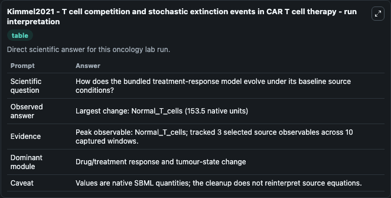
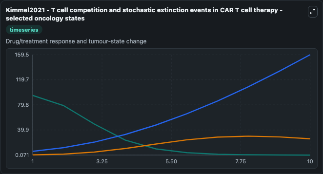
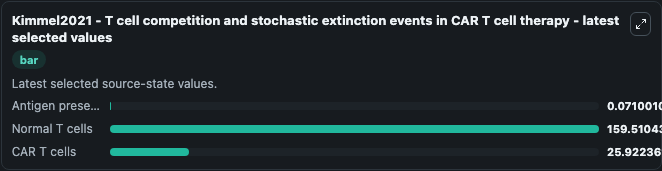

# Kimmel2021 - T cell competition and stochastic extinction events in CAR T cell therapy

This Biosimulant lab wraps `Kimmel2021 - T cell competition and stochastic extinction events in CAR T cell therapy` as a runnable oncology model with a companion visualization module.
This mathematical model of T cell-tumour interactions considering the roles of T cell competition and stochastic extinction events in CAR T cell therapy is described by the publication:Kimmel GJ, Lock. It can be used to explore treatment-response dynamics and compare scenario outcomes across configurations.

## What You'll See

The lab asks: How does the bundled treatment-response model evolve under its baseline source conditions? It runs for 10.0 time units with a communication step of 1.0. The run uses the model defaults declared by the curated SBML wrapper. The generated visualizations focus on Antigen presenting tumour cells, Normal T cells, and CAR T cells, combining trajectory, endpoint-comparison, and summary-table views from one completed dark-mode run.

In this captured run, **Normal_T_cells** carried the largest peak and **Normal_T_cells** moved by **153.5** native units across 10.0 simulation windows.

<!-- BIOSIMULANT_VISUALS_START -->
### Output Visualizations



*Summary table for Kimmel2021 - T cell competition and stochastic extinction events in CAR T cell therapy, reporting the scientific question, observed answer (largest change: **Normal_T_cells** at **153.5** native units), evidence (peak observable: **Normal_T_cells**), dominant module, and caveat.*



*Trajectories of Antigen presenting tumour cells, Normal T cells, and CAR T cells across the 10.0 simulation. In this run **Normal T cells** climbed from 6.000 to 159.5 and **Antigen presenting tumour cells** fell from 94.860 to 0.0710 — the largest movements among the focused observables.*



*Endpoint ranking of the focused observables. Top 3 by final value: **Normal T cells** = 159.5, **CAR T cells** = 25.922, **Antigen presenting tumour cells** = 0.0710.*

<!-- BIOSIMULANT_VISUALS_END -->

## Model Context

- Core model: `models/core`
- Visualization model: `models/visualisation`
- Standard: `other`
- Upstream source: `biomodels_ebi:BIOMD0000001041`
- License: `CC0`
- Visual scope: Drug/treatment response and tumour-state change
- Caveat: Values are native SBML quantities; the cleanup does not reinterpret source equations.

## Inputs

| Input | Maps To | Default | Notes |
|---|---|---|---|
| Antigen presenting tumour cells | `oncology_sbml_kimmel2021_t_cell_competition_and_stochastic_ext_biomd0000001041_model.initial_antigen_presenting_tumour_cells` | `94.86` | Initial Antigen presenting tumour cells. Sets the initial value of bundled SBML symbol `Antigen_presenting_tumour_cells`. |
| Normal T cells | `oncology_sbml_kimmel2021_t_cell_competition_and_stochastic_ext_biomd0000001041_model.initial_normal_t_cells` | `6.0` | Initial Normal T cells. Sets the initial value of bundled SBML symbol `Normal_T_cells`. |
| CAR T cells | `oncology_sbml_kimmel2021_t_cell_competition_and_stochastic_ext_biomd0000001041_model.initial_car_t_cells` | `0.36` | Initial CAR T cells. Sets the initial value of bundled SBML symbol `CAR_T_cells`. |

## Outputs

| Output | Maps To | Role |
|---|---|---|
| `antigen_presenting_tumour_cells` | `oncology_sbml_kimmel2021_t_cell_competition_and_stochastic_ext_biomd0000001041_model.antigen_presenting_tumour_cells` | Antigen presenting tumour cells observable. |
| `normal_t_cells` | `oncology_sbml_kimmel2021_t_cell_competition_and_stochastic_ext_biomd0000001041_model.normal_t_cells` | Normal T cells observable. |
| `car_t_cells` | `oncology_sbml_kimmel2021_t_cell_competition_and_stochastic_ext_biomd0000001041_model.car_t_cells` | CAR T cells observable. |
| `state` | `oncology_sbml_kimmel2021_t_cell_competition_and_stochastic_ext_biomd0000001041_model.state` | Full raw SBML observable record for reproducibility and downstream visualisation. |
| `summary` | `oncology_sbml_kimmel2021_t_cell_competition_and_stochastic_ext_biomd0000001041_model.summary` | Change and peak summary across the simulated SBML observables. |
| `species_labels` | `oncology_sbml_kimmel2021_t_cell_competition_and_stochastic_ext_biomd0000001041_model.species_labels` | Mapping from selected raw SBML observable symbols to display labels. |

## Runtime

- Duration: `10.0`
- Communication step: `1.0`

## Running Locally

```bash
biosimulant labs serve .
```
