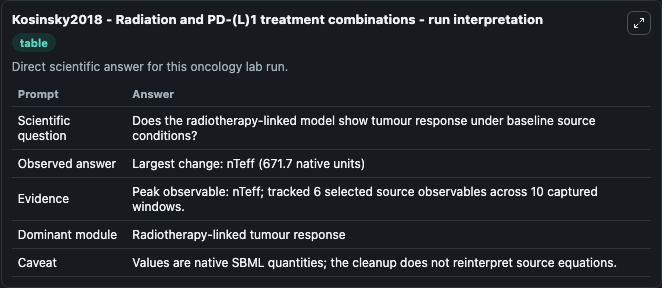
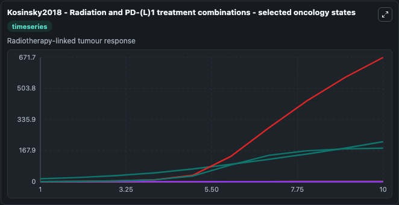
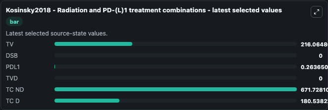

# Kosinsky2018 - Radiation and PD-(L)1 treatment combinations

This Biosimulant lab wraps `Kosinsky2018 - Radiation and PD-(L)1 treatment combinations` as a runnable oncology model with a companion visualization module.
This is a quantitative systems pharmacology (QSP) model that describes key elements of the cancer immunity cycle and the tumor microenvironment, tumor growth, as well as dose-exposure-target modulatio. It can be used to explore treatment-response dynamics and compare scenario outcomes across configurations.

## What You'll See

The lab asks: Does the radiotherapy-linked model show tumour response under baseline source conditions? It runs for 10.0 time units with a communication step of 1.0. The run uses the model defaults declared by the curated SBML wrapper. The generated visualizations focus on TV, DSB, PDL1, TVD, TC ND, and TC D, combining trajectory, endpoint-comparison, and summary-table views from one completed dark-mode run.

In this captured run, **nTeff** carried the largest peak and **nTeff** moved by **671.7** native units across 10.0 simulation windows.

<!-- BIOSIMULANT_VISUALS_START -->
### Output Visualizations



*Summary table for Kosinsky2018 - Radiation and PD-(L)1 treatment combinations, reporting the scientific question, observed answer (largest change: **nTeff** at **671.7** native units), evidence (peak observable: **nTeff**), dominant module, and caveat.*



*Trajectories of TV, DSB, PDL1, TVD, TC ND, and TC D across the 10.0 simulation. In this run **TC ND** climbed from 0 to 671.7 — the largest movements among the focused observables.*



*Endpoint ranking of the focused observables. Top 3 by final value: **TC ND** = 671.7, **TV** = 216.1, **TC D** = 180.5, with 3 more observables below.*

<!-- BIOSIMULANT_VISUALS_END -->

## Model Context

- Core model: `models/core`
- Visualization model: `models/visualisation`
- Standard: `other`
- Upstream source: `biomodels_ebi:BIOMD0000000863`
- License: `CC0`
- Visual scope: Radiotherapy-linked tumour response
- Caveat: Values are native SBML quantities; the cleanup does not reinterpret source equations.

## Inputs

| Input | Maps To | Default | Notes |
|---|---|---|---|
| Radiation Dose source parameter | `oncology_sbml_kosinsky2018_radiation_and_pd_l_1_treatment_comb_biomd0000000863_model.radiation_dose` | `0.0` | Radiation Dose source parameter. Maps to bundled SBML parameter `radiation_Dose`. |
| DSB | `oncology_sbml_kosinsky2018_radiation_and_pd_l_1_treatment_comb_biomd0000000863_model.initial_dsb` | `0.0` | Initial DSB. Sets the initial value of bundled SBML symbol `U`. |
| PDL1 | `oncology_sbml_kosinsky2018_radiation_and_pd_l_1_treatment_comb_biomd0000000863_model.initial_pdl1` | `0.0` | Initial PDL1. Sets the initial value of bundled SBML symbol `PDL1`. |
| TVD | `oncology_sbml_kosinsky2018_radiation_and_pd_l_1_treatment_comb_biomd0000000863_model.initial_tvd` | `0.0` | Initial TVD. Sets the initial value of bundled SBML symbol `TVd`. |
| TC ND | `oncology_sbml_kosinsky2018_radiation_and_pd_l_1_treatment_comb_biomd0000000863_model.initial_tc_nd` | `0.0` | Initial TC ND. Sets the initial value of bundled SBML symbol `nTeff`. |
| TC D | `oncology_sbml_kosinsky2018_radiation_and_pd_l_1_treatment_comb_biomd0000000863_model.initial_tc_d` | `0.0` | Initial TC D. Sets the initial value of bundled SBML symbol `dTeff`. |

## Outputs

| Output | Maps To | Role |
|---|---|---|
| `model_state_1` | `oncology_sbml_kosinsky2018_radiation_and_pd_l_1_treatment_comb_biomd0000000863_model.model_state_1` | TV observable. |
| `dsb` | `oncology_sbml_kosinsky2018_radiation_and_pd_l_1_treatment_comb_biomd0000000863_model.dsb` | DSB observable. |
| `pdl1` | `oncology_sbml_kosinsky2018_radiation_and_pd_l_1_treatment_comb_biomd0000000863_model.pdl1` | PDL1 observable. |
| `tvd` | `oncology_sbml_kosinsky2018_radiation_and_pd_l_1_treatment_comb_biomd0000000863_model.tvd` | TVD observable. |
| `tc_nd` | `oncology_sbml_kosinsky2018_radiation_and_pd_l_1_treatment_comb_biomd0000000863_model.tc_nd` | TC ND observable. |
| `tc_d` | `oncology_sbml_kosinsky2018_radiation_and_pd_l_1_treatment_comb_biomd0000000863_model.tc_d` | TC D observable. |
| `state` | `oncology_sbml_kosinsky2018_radiation_and_pd_l_1_treatment_comb_biomd0000000863_model.state` | Full raw SBML observable record for reproducibility and downstream visualisation. |
| `summary` | `oncology_sbml_kosinsky2018_radiation_and_pd_l_1_treatment_comb_biomd0000000863_model.summary` | Change and peak summary across the simulated SBML observables. |
| `species_labels` | `oncology_sbml_kosinsky2018_radiation_and_pd_l_1_treatment_comb_biomd0000000863_model.species_labels` | Mapping from selected raw SBML observable symbols to display labels. |

## Runtime

- Duration: `10.0`
- Communication step: `1.0`

## Running Locally

```bash
biosimulant labs serve .
```
