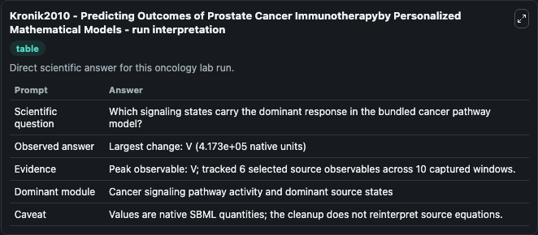
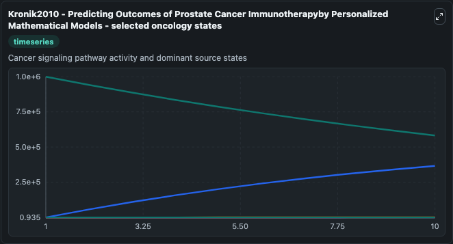
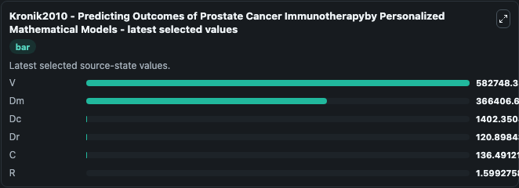

# Kronik2010 - Predicting Outcomes of Prostate Cancer Immunotherapyby Personalized Mathematical Models

This Biosimulant lab wraps `Kronik2010 - Predicting Outcomes of Prostate Cancer Immunotherapyby Personalized Mathematical Models` as a runnable oncology model with a companion visualization module.
Predicting Outcomes of Prostate Cancer Immunotherapyby Personalized Mathematical ModelsNatalie Kronik1¤, Yuri Kogan1, Moran Elishmereni1, Karin Halevi-Tobias1, Stanimir Vuk-Pavlovic ́2.,Zvia Agur1*.1I. It can be used to explore treatment-response dynamics and compare scenario outcomes across configurations.

## What You'll See

The lab asks: Which signaling states carry the dominant response in the bundled cancer pathway model? It runs for 10.0 time units with a communication step of 1.0. The run uses the model defaults declared by the curated SBML wrapper. The generated visualizations focus on V, Dm, Dc, Dr, C, and R, combining trajectory, endpoint-comparison, and summary-table views from one completed dark-mode run.

In this captured run, **V** peaked at **1e+06** and **V** moved by **4.17e+05** native units across 10.0 simulation windows.

<!-- BIOSIMULANT_VISUALS_START -->
### Output Visualizations



*Summary table for Kronik2010 - Predicting Outcomes of Prostate Cancer Immunotherapyby Personalized Mathematical Models, reporting the scientific question, observed answer (largest change: **V** at **4.17e+05** native units), evidence (peak observable: **V**), dominant module, and caveat.*



*Trajectories of V, Dm, Dc, Dr, C, and R across the 10.0 simulation. In this run **Dm** climbed from 1.000 to 3.66e+05 and **V** fell from 1e+06 to 5.83e+05 — the largest movements among the focused observables.*



*Endpoint ranking of the focused observables. Top 3 by final value: **V** = 5.83e+05, **Dm** = 3.66e+05, **Dc** = 1402.4, with 3 more observables below.*

<!-- BIOSIMULANT_VISUALS_END -->

## Model Context

- Core model: `models/core`
- Visualization model: `models/visualisation`
- Standard: `other`
- Upstream source: `biomodels_ebi:MODEL2001130003`
- License: `CC0`
- Visual scope: Cancer signaling pathway activity and dominant source states
- Caveat: Values are native SBML quantities; the cleanup does not reinterpret source equations.

## Inputs

| Input | Maps To | Default | Notes |
|---|---|---|---|

## Outputs

| Output | Maps To | Role |
|---|---|---|
| `model_state_1` | `oncology_sbml_kronik2010_predicting_outcomes_of_prostate_cance_model2001130003_model.model_state_1` | V observable. |
| `model_state_2` | `oncology_sbml_kronik2010_predicting_outcomes_of_prostate_cance_model2001130003_model.model_state_2` | Dm observable. |
| `model_state_3` | `oncology_sbml_kronik2010_predicting_outcomes_of_prostate_cance_model2001130003_model.model_state_3` | Dc observable. |
| `model_state_4` | `oncology_sbml_kronik2010_predicting_outcomes_of_prostate_cance_model2001130003_model.model_state_4` | Dr observable. |
| `model_state_5` | `oncology_sbml_kronik2010_predicting_outcomes_of_prostate_cance_model2001130003_model.model_state_5` | C observable. |
| `model_state_6` | `oncology_sbml_kronik2010_predicting_outcomes_of_prostate_cance_model2001130003_model.model_state_6` | R observable. |
| `state` | `oncology_sbml_kronik2010_predicting_outcomes_of_prostate_cance_model2001130003_model.state` | Full raw SBML observable record for reproducibility and downstream visualisation. |
| `summary` | `oncology_sbml_kronik2010_predicting_outcomes_of_prostate_cance_model2001130003_model.summary` | Change and peak summary across the simulated SBML observables. |
| `species_labels` | `oncology_sbml_kronik2010_predicting_outcomes_of_prostate_cance_model2001130003_model.species_labels` | Mapping from selected raw SBML observable symbols to display labels. |

## Runtime

- Duration: `10.0`
- Communication step: `1.0`

## Running Locally

```bash
biosimulant labs serve .
```
