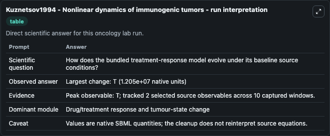
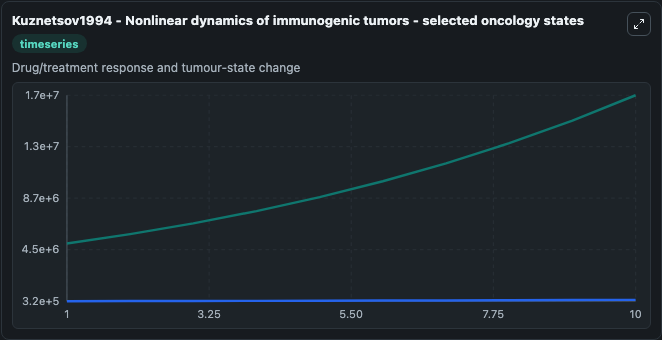
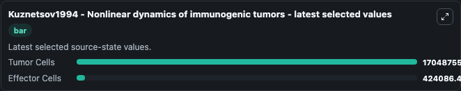

# Kuznetsov1994 - Nonlinear dynamics of immunogenic tumors

This Biosimulant lab wraps `Kuznetsov1994 - Nonlinear dynamics of immunogenic tumors` as a runnable oncology model with a companion visualization module.
This mathematical model describes the response of cytotoxic T lymphocytes to the growth of an immunogenic tumor, with the inclusion on a number of in vivo phenomena, such as the immunostimulation of t. It can be used to explore treatment-response dynamics and compare scenario outcomes across configurations.

## What You'll See

The lab asks: How does the bundled treatment-response model evolve under its baseline source conditions? It runs for 10.0 time units with a communication step of 1.0. The run uses the model defaults declared by the curated SBML wrapper. The generated visualizations focus on Tumor Cells, and Effector Cells, combining trajectory, endpoint-comparison, and summary-table views from one completed dark-mode run.

In this captured run, **T** carried the largest peak and **T** moved by **1.2e+07** native units across 10.0 simulation windows.

<!-- BIOSIMULANT_VISUALS_START -->
### Output Visualizations



*Summary table for Kuznetsov1994 - Nonlinear dynamics of immunogenic tumors, reporting the scientific question, observed answer (largest change: **T** at **1.2e+07** native units), evidence (peak observable: **T**), dominant module, and caveat.*



*Trajectories of Tumor Cells, and Effector Cells across the 10.0 simulation. In this run **Tumor Cells** climbed from 5e+06 to 1.7e+07 — the largest movements among the focused observables.*



*Endpoint ranking of the focused observables. Top 2 by final value: **Tumor Cells** = 1.7e+07, **Effector Cells** = 4.24e+05.*

<!-- BIOSIMULANT_VISUALS_END -->

## Model Context

- Core model: `models/core`
- Visualization model: `models/visualisation`
- Standard: `other`
- Upstream source: `biomodels_ebi:BIOMD0000000762`
- License: `CC0`
- Visual scope: Drug/treatment response and tumour-state change
- Caveat: Values are native SBML quantities; the cleanup does not reinterpret source equations.

## Inputs

| Input | Maps To | Default | Notes |
|---|---|---|---|
| Tumor Cells | `oncology_sbml_kuznetsov1994_nonlinear_dynamics_of_immunogenic_biomd0000000762_model.initial_tumor_cells` | `5000000.0` | Initial Tumor Cells. Sets the initial value of bundled SBML symbol `T`. |
| Effector Cells | `oncology_sbml_kuznetsov1994_nonlinear_dynamics_of_immunogenic_biomd0000000762_model.initial_effector_cells` | `320000.0` | Initial Effector Cells. Sets the initial value of bundled SBML symbol `E`. |

## Outputs

| Output | Maps To | Role |
|---|---|---|
| `tumor_cells` | `oncology_sbml_kuznetsov1994_nonlinear_dynamics_of_immunogenic_biomd0000000762_model.tumor_cells` | Tumor Cells observable. |
| `effector_cells` | `oncology_sbml_kuznetsov1994_nonlinear_dynamics_of_immunogenic_biomd0000000762_model.effector_cells` | Effector Cells observable. |
| `state` | `oncology_sbml_kuznetsov1994_nonlinear_dynamics_of_immunogenic_biomd0000000762_model.state` | Full raw SBML observable record for reproducibility and downstream visualisation. |
| `summary` | `oncology_sbml_kuznetsov1994_nonlinear_dynamics_of_immunogenic_biomd0000000762_model.summary` | Change and peak summary across the simulated SBML observables. |
| `species_labels` | `oncology_sbml_kuznetsov1994_nonlinear_dynamics_of_immunogenic_biomd0000000762_model.species_labels` | Mapping from selected raw SBML observable symbols to display labels. |

## Runtime

- Duration: `10.0`
- Communication step: `1.0`

## Running Locally

```bash
biosimulant labs serve .
```
