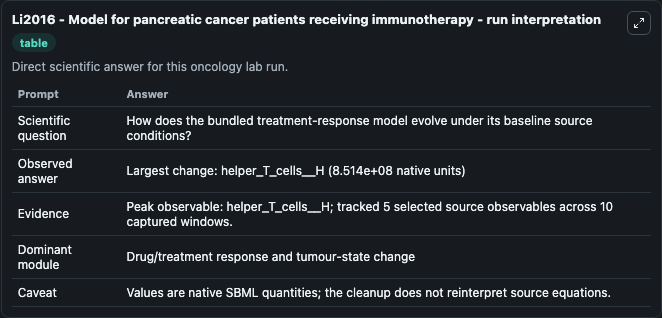
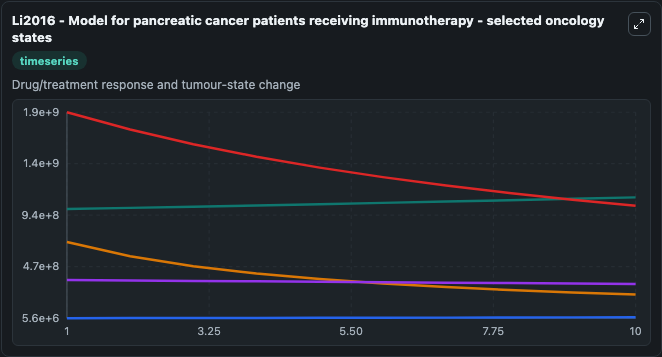
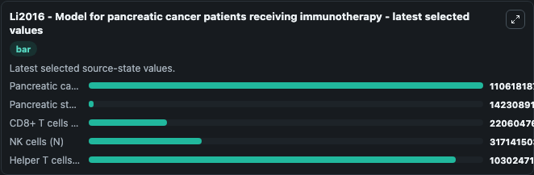

# Li2016 - Model for pancreatic cancer patients receiving immunotherapy

This Biosimulant lab wraps `Li2016 - Model for pancreatic cancer patients receiving immunotherapy` as a runnable oncology model with a companion visualization module.
immunotherapy offers a better prognosis for pancreatic cancer patients. It can be used to explore treatment-response dynamics and compare scenario outcomes across configurations.

## What You'll See

The lab asks: How does the bundled treatment-response model evolve under its baseline source conditions? It runs for 10.0 time units with a communication step of 1.0. The run uses the model defaults declared by the curated SBML wrapper. The generated visualizations focus on Pancreatic cancer cells (C), Pancreatic stellate cells (P), CD8+ T cells (T), NK cells (N), and Helper T cells (H), combining trajectory, endpoint-comparison, and summary-table views from one completed dark-mode run.

In this captured run, **helper_T_cells__H** carried the largest peak and **helper_T_cells__H** moved by **8.51e+08** native units across 10.0 simulation windows.

<!-- BIOSIMULANT_VISUALS_START -->
### Output Visualizations



*Summary table for Li2016 - Model for pancreatic cancer patients receiving immunotherapy, reporting the scientific question, observed answer (largest change: **helper_T_cells__H** at **8.51e+08** native units), evidence (peak observable: **helper_T_cells__H**), dominant module, and caveat.*



*Trajectories of Pancreatic cancer cells (C), Pancreatic stellate cells (P), CD8+ T cells (T), NK cells (N), and Helper T cells (H) across the 10.0 simulation. In this run **Pancreatic cancer cells (C)** climbed from 1e+09 to 1.11e+09 and **Helper T cells (H)** fell from 1.88e+09 to 1.03e+09 — the largest movements among the focused observables.*



*Endpoint ranking of the focused observables. Top 3 by final value: **Pancreatic cancer cells (C)** = 1.11e+09, **Helper T cells (H)** = 1.03e+09, **NK cells (N)** = 3.17e+08, with 2 more observables below.*

<!-- BIOSIMULANT_VISUALS_END -->

## Model Context

- Core model: `models/core`
- Visualization model: `models/visualisation`
- Standard: `other`
- Upstream source: `biomodels_ebi:BIOMD0000000929`
- License: `CC0`
- Visual scope: Drug/treatment response and tumour-state change
- Caveat: Values are native SBML quantities; the cleanup does not reinterpret source equations.

## Inputs

| Input | Maps To | Default | Notes |
|---|---|---|---|
| Pancreatic cancer cells (C) | `oncology_sbml_li2016_model_for_pancreatic_cancer_patients_rece_biomd0000000929_model.initial_pancreatic_cancer_cells_c` | `1000000000.0` | Initial Pancreatic cancer cells (C). Sets the initial value of bundled SBML symbol `Pancreatic_cancer_cells__C`. |
| Pancreatic stellate cells (P) | `oncology_sbml_li2016_model_for_pancreatic_cancer_patients_rece_biomd0000000929_model.initial_pancreatic_stellate_cells_p` | `5600000.0` | Initial Pancreatic stellate cells (P). Sets the initial value of bundled SBML symbol `Pancreatic_stellate_cells__P`. |
| CD8+ T cells (T) | `oncology_sbml_li2016_model_for_pancreatic_cancer_patients_rece_biomd0000000929_model.initial_cd8_positive_t_cells_t` | `700000000.0` | Initial CD8+ T cells (T). Sets the initial value of bundled SBML symbol `CD8__T_cells__T`. |
| NK cells (N) | `oncology_sbml_li2016_model_for_pancreatic_cancer_patients_rece_biomd0000000929_model.initial_nk_cells_n` | `352800000.0` | Initial NK cells (N). Sets the initial value of bundled SBML symbol `NK_cells__N`. |
| Helper T cells (H) | `oncology_sbml_li2016_model_for_pancreatic_cancer_patients_rece_biomd0000000929_model.initial_helper_t_cells_h` | `1881600000.0` | Initial Helper T cells (H). Sets the initial value of bundled SBML symbol `helper_T_cells__H`. |

## Outputs

| Output | Maps To | Role |
|---|---|---|
| `pancreatic_cancer_cells_c` | `oncology_sbml_li2016_model_for_pancreatic_cancer_patients_rece_biomd0000000929_model.pancreatic_cancer_cells_c` | Pancreatic cancer cells (C) observable. |
| `pancreatic_stellate_cells_p` | `oncology_sbml_li2016_model_for_pancreatic_cancer_patients_rece_biomd0000000929_model.pancreatic_stellate_cells_p` | Pancreatic stellate cells (P) observable. |
| `cd8_positive_t_cells_t` | `oncology_sbml_li2016_model_for_pancreatic_cancer_patients_rece_biomd0000000929_model.cd8_positive_t_cells_t` | CD8+ T cells (T) observable. |
| `nk_cells_n` | `oncology_sbml_li2016_model_for_pancreatic_cancer_patients_rece_biomd0000000929_model.nk_cells_n` | NK cells (N) observable. |
| `helper_t_cells_h` | `oncology_sbml_li2016_model_for_pancreatic_cancer_patients_rece_biomd0000000929_model.helper_t_cells_h` | Helper T cells (H) observable. |
| `state` | `oncology_sbml_li2016_model_for_pancreatic_cancer_patients_rece_biomd0000000929_model.state` | Full raw SBML observable record for reproducibility and downstream visualisation. |
| `summary` | `oncology_sbml_li2016_model_for_pancreatic_cancer_patients_rece_biomd0000000929_model.summary` | Change and peak summary across the simulated SBML observables. |
| `species_labels` | `oncology_sbml_li2016_model_for_pancreatic_cancer_patients_rece_biomd0000000929_model.species_labels` | Mapping from selected raw SBML observable symbols to display labels. |

## Runtime

- Duration: `10.0`
- Communication step: `1.0`

## Running Locally

```bash
biosimulant labs serve .
```
