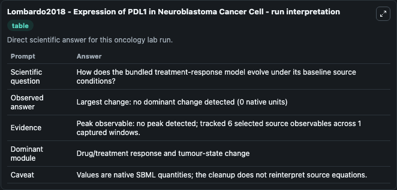
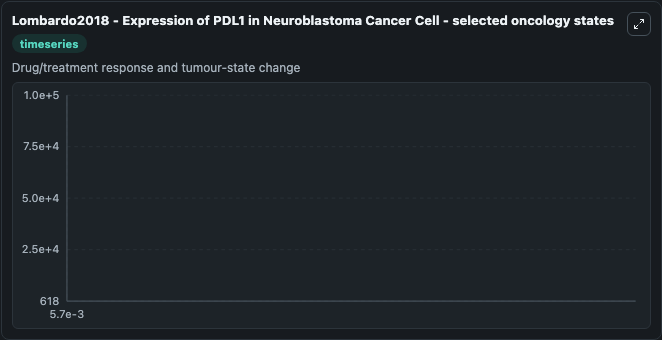
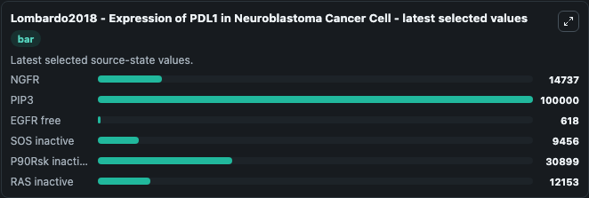

# Lombardo2018 - Expression of PDL1 in Neuroblastoma Cancer Cell

This Biosimulant lab wraps `Lombardo2018 - Expression of PDL1 in Neuroblastoma Cancer Cell` as a runnable oncology model with a companion visualization module.
The model reproduces the time profiles of PDL1 in a Neuroblastoma Cancer Cell, considering the activating mutation of ALK: ALKF1174L. It can be used to explore treatment-response dynamics and compare scenario outcomes across configurations.

## What You'll See

The lab asks: How does the bundled treatment-response model evolve under its baseline source conditions? It runs for 0.00575 time units with a communication step of 1.0. The run uses the model defaults declared by the curated SBML wrapper. The generated visualizations focus on NGFR, PIP3, EGFR free, SOS inactive, P90Rsk inactive, and RAS inactive, combining trajectory, endpoint-comparison, and summary-table views from one completed dark-mode run.

In this captured run, **no** carried the largest peak and **no dominant change detected** moved by **0** native units across 0.00575 simulation windows.

<!-- BIOSIMULANT_VISUALS_START -->
### Output Visualizations



*Summary table for Lombardo2018 - Expression of PDL1 in Neuroblastoma Cancer Cell, reporting the scientific question, observed answer (largest change: **no dominant change detected** at **0** native units), evidence (peak observable: **no**), dominant module, and caveat.*



*Trajectories of NGFR, PIP3, EGFR free, SOS inactive, P90Rsk inactive, and RAS inactive across the 0.00575 simulation. In this run NGFR, PIP3, EGFR free, SOS inactive stayed near their initial values — no observable moved appreciably.*



*Largest-excursion ranking of the focused observables — the absolute movement magnitude during the run. Top 3: **PIP3** = 1e+05, **P90Rsk inactive** = 3.09e+04, **NGFR** = 1.47e+04, with 3 more observables below.*

<!-- BIOSIMULANT_VISUALS_END -->

## Model Context

- Core model: `models/core`
- Visualization model: `models/visualisation`
- Standard: `other`
- Upstream source: `biomodels_ebi:MODEL1812070002`
- License: `CC0`
- Visual scope: Drug/treatment response and tumour-state change
- Caveat: Values are native SBML quantities; the cleanup does not reinterpret source equations.

## Inputs

| Input | Maps To | Default | Notes |
|---|---|---|---|
| KmEGF source parameter | `oncology_sbml_lombardo2018_expression_of_pdl1_in_neuroblastoma_model1812070002_model.km_egf_source_parameter` | `6086070.0` | KmEGF source parameter. Maps to bundled SBML parameter `KmEGF`. |
| KcatEGF source parameter | `oncology_sbml_lombardo2018_expression_of_pdl1_in_neuroblastoma_model1812070002_model.kcat_egf_source_parameter` | `694.731` | KcatEGF source parameter. Maps to bundled SBML parameter `KcatEGF`. |
| NGFR | `oncology_sbml_lombardo2018_expression_of_pdl1_in_neuroblastoma_model1812070002_model.initial_ngfr` | `14737.0` | Initial NGFR. Sets the initial value of bundled SBML symbol `NGFR`. |
| PIP3 | `oncology_sbml_lombardo2018_expression_of_pdl1_in_neuroblastoma_model1812070002_model.initial_pip3` | `100000.0` | Initial PIP3. Sets the initial value of bundled SBML symbol `PIP3`. |
| EGFR free | `oncology_sbml_lombardo2018_expression_of_pdl1_in_neuroblastoma_model1812070002_model.initial_egfr_free` | `618.0` | Initial EGFR free. Sets the initial value of bundled SBML symbol `EGFR_f`. |
| SOS inactive | `oncology_sbml_lombardo2018_expression_of_pdl1_in_neuroblastoma_model1812070002_model.initial_sos_inactive` | `9456.0` | Initial SOS inactive. Sets the initial value of bundled SBML symbol `SOS_inactive`. |

## Outputs

| Output | Maps To | Role |
|---|---|---|
| `ngfr` | `oncology_sbml_lombardo2018_expression_of_pdl1_in_neuroblastoma_model1812070002_model.ngfr` | NGFR observable. |
| `pip3` | `oncology_sbml_lombardo2018_expression_of_pdl1_in_neuroblastoma_model1812070002_model.pip3` | PIP3 observable. |
| `egfr_free` | `oncology_sbml_lombardo2018_expression_of_pdl1_in_neuroblastoma_model1812070002_model.egfr_free` | EGFR free observable. |
| `sos_inactive` | `oncology_sbml_lombardo2018_expression_of_pdl1_in_neuroblastoma_model1812070002_model.sos_inactive` | SOS inactive observable. |
| `p90_rsk_inactive` | `oncology_sbml_lombardo2018_expression_of_pdl1_in_neuroblastoma_model1812070002_model.p90_rsk_inactive` | P90Rsk inactive observable. |
| `ras_inactive` | `oncology_sbml_lombardo2018_expression_of_pdl1_in_neuroblastoma_model1812070002_model.ras_inactive` | RAS inactive observable. |
| `state` | `oncology_sbml_lombardo2018_expression_of_pdl1_in_neuroblastoma_model1812070002_model.state` | Full raw SBML observable record for reproducibility and downstream visualisation. |
| `summary` | `oncology_sbml_lombardo2018_expression_of_pdl1_in_neuroblastoma_model1812070002_model.summary` | Change and peak summary across the simulated SBML observables. |
| `species_labels` | `oncology_sbml_lombardo2018_expression_of_pdl1_in_neuroblastoma_model1812070002_model.species_labels` | Mapping from selected raw SBML observable symbols to display labels. |

## Runtime

- Duration: `0.00575`
- Communication step: `1.0`

## Running Locally

```bash
biosimulant labs serve .
```
