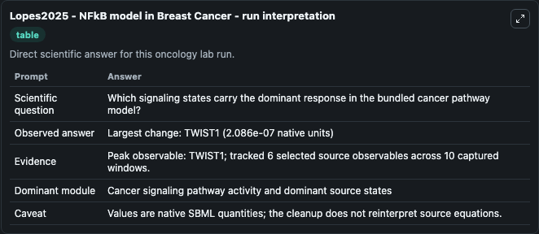
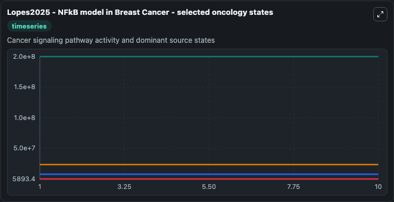
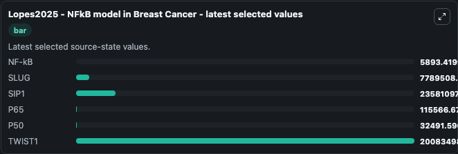

# Lopes2025 - NFkB model in Breast Cancer

This Biosimulant lab wraps `Lopes2025 - NFkB model in Breast Cancer` as a runnable oncology model with a companion visualization module.
Model for the activation of SLUG, SIP1, TWIST1, and NF-κB (subunits p50 and p65). It can be used to explore treatment-response dynamics and compare scenario outcomes across configurations.

## What You'll See

The lab asks: Which signaling states carry the dominant response in the bundled cancer pathway model? It runs for 10.0 time units with a communication step of 1.0. The run uses the model defaults declared by the curated SBML wrapper. The generated visualizations focus on NF-kB, SLUG, SIP1, P65, P50, and TWIST1, combining trajectory, endpoint-comparison, and summary-table views from one completed dark-mode run.

In this captured run, **TWIST1** peaked at **2.01e+08** and **TWIST1** moved by **2.09e-07** native units across 10.0 simulation windows.

<!-- BIOSIMULANT_VISUALS_START -->
### Output Visualizations



*Summary table for Lopes2025 - NFkB model in Breast Cancer, reporting the scientific question, observed answer (largest change: **TWIST1** at **2.09e-07** native units), evidence (peak observable: **TWIST1**), dominant module, and caveat.*



*Trajectories of NF-kB, SLUG, SIP1, P65, P50, and TWIST1 across the 10.0 simulation. In this run **NF-kB** climbed from 5893.4 to 5893.4 and **TWIST1** fell from 2.01e+08 to 2.01e+08 — the largest movements among the focused observables.*



*Endpoint ranking of the focused observables. Top 3 by final value: **TWIST1** = 2.01e+08, **SIP1** = 2.36e+07, **SLUG** = 7.79e+06, with 3 more observables below.*

<!-- BIOSIMULANT_VISUALS_END -->

## Model Context

- Core model: `models/core`
- Visualization model: `models/visualisation`
- Standard: `other`
- Upstream source: `biomodels_ebi:MODEL2508260001`
- License: `CC0`
- Visual scope: Cancer signaling pathway activity and dominant source states
- Caveat: Values are native SBML quantities; the cleanup does not reinterpret source equations.

## Inputs

| Input | Maps To | Default | Notes |
|---|---|---|---|
| NF-kB | `oncology_sbml_lopes2025_nfkb_model_in_breast_cancer_model2508260001_model.initial_nf_kb` | `5893.41991828698` | Initial NF-kB. Sets the initial value of bundled SBML symbol `NFkB`. |
| SLUG | `oncology_sbml_lopes2025_nfkb_model_in_breast_cancer_model2508260001_model.initial_slug` | `7789508.97608121` | Initial SLUG. Sets the initial value of bundled SBML symbol `SLUG`. |
| SIP1 | `oncology_sbml_lopes2025_nfkb_model_in_breast_cancer_model2508260001_model.initial_sip1` | `23581097.7152633` | Initial SIP1. Sets the initial value of bundled SBML symbol `SIP1`. |
| TWIST1 | `oncology_sbml_lopes2025_nfkb_model_in_breast_cancer_model2508260001_model.initial_twist1` | `200834985.025365` | Initial TWIST1. Sets the initial value of bundled SBML symbol `TWIST1`. |

## Outputs

| Output | Maps To | Role |
|---|---|---|
| `nf_kb` | `oncology_sbml_lopes2025_nfkb_model_in_breast_cancer_model2508260001_model.nf_kb` | NF-kB observable. |
| `slug` | `oncology_sbml_lopes2025_nfkb_model_in_breast_cancer_model2508260001_model.slug` | SLUG observable. |
| `sip1` | `oncology_sbml_lopes2025_nfkb_model_in_breast_cancer_model2508260001_model.sip1` | SIP1 observable. |
| `p65` | `oncology_sbml_lopes2025_nfkb_model_in_breast_cancer_model2508260001_model.p65` | P65 observable. |
| `p50` | `oncology_sbml_lopes2025_nfkb_model_in_breast_cancer_model2508260001_model.p50` | P50 observable. |
| `twist1` | `oncology_sbml_lopes2025_nfkb_model_in_breast_cancer_model2508260001_model.twist1` | TWIST1 observable. |
| `state` | `oncology_sbml_lopes2025_nfkb_model_in_breast_cancer_model2508260001_model.state` | Full raw SBML observable record for reproducibility and downstream visualisation. |
| `summary` | `oncology_sbml_lopes2025_nfkb_model_in_breast_cancer_model2508260001_model.summary` | Change and peak summary across the simulated SBML observables. |
| `species_labels` | `oncology_sbml_lopes2025_nfkb_model_in_breast_cancer_model2508260001_model.species_labels` | Mapping from selected raw SBML observable symbols to display labels. |

## Runtime

- Duration: `10.0`
- Communication step: `1.0`

## Running Locally

```bash
biosimulant labs serve .
```
