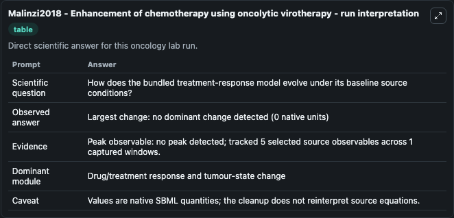
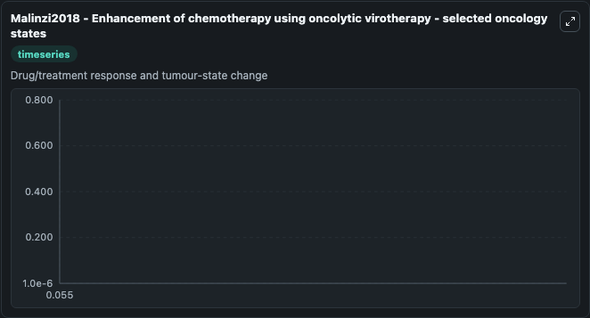
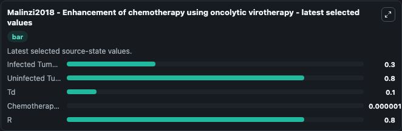

# Malinzi2018 - Enhancement of chemotherapy using oncolytic virotherapy

This Biosimulant lab wraps `Malinzi2018 - Enhancement of chemotherapy using oncolytic virotherapy` as a runnable oncology model with a companion visualization module.
IA spatio-temporal mathematical model, in the form of a moving boundary problem, to explain cancer dormancy is developed. It can be used to explore treatment-response dynamics and compare scenario outcomes across configurations.

## What You'll See

The lab asks: How does the bundled treatment-response model evolve under its baseline source conditions? It runs for 0.055 time units with a communication step of 1.0. The run uses the model defaults declared by the curated SBML wrapper. The generated visualizations focus on Infected Tumor Cells, Uninfected Tumor Cells, Td, Chemotherapy Level, and R, combining trajectory, endpoint-comparison, and summary-table views from one completed dark-mode run.

In this captured run, **no** carried the largest peak and **no dominant change detected** moved by **0** native units across 0.055 simulation windows.

<!-- BIOSIMULANT_VISUALS_START -->
### Output Visualizations



*Summary table for Malinzi2018 - Enhancement of chemotherapy using oncolytic virotherapy, reporting the scientific question, observed answer (largest change: **no dominant change detected** at **0** native units), evidence (peak observable: **no**), dominant module, and caveat.*



*Trajectories of Infected Tumor Cells, Uninfected Tumor Cells, Td, Chemotherapy Level, and R across the 0.055 simulation. In this run Infected Tumor Cells, Uninfected Tumor Cells, Td, Chemotherapy Level stayed near their initial values — no observable moved appreciably.*



*Largest-excursion ranking of the focused observables — the absolute movement magnitude during the run. Top 3: **Uninfected Tumor Cells** = 0.8000, **R** = 0.8000, **Infected Tumor Cells** = 0.3000, with 2 more observables below.*

<!-- BIOSIMULANT_VISUALS_END -->

## Model Context

- Core model: `models/core`
- Visualization model: `models/visualisation`
- Standard: `other`
- Upstream source: `biomodels_ebi:MODEL2003050002`
- License: `CC0`
- Visual scope: Drug/treatment response and tumour-state change
- Caveat: Values are native SBML quantities; the cleanup does not reinterpret source equations.

## Inputs

| Input | Maps To | Default | Notes |
|---|---|---|---|
| Uninfected Tumor Cells | `oncology_sbml_malinzi2018_enhancement_of_chemotherapy_using_on_model2003050002_model.initial_uninfected_tumor_cells` | `0.8` | Initial Uninfected Tumor Cells. Sets the initial value of bundled SBML symbol `T`. |
| Infected Tumor Cells | `oncology_sbml_malinzi2018_enhancement_of_chemotherapy_using_on_model2003050002_model.initial_infected_tumor_cells` | `0.3` | Initial Infected Tumor Cells. Sets the initial value of bundled SBML symbol `I`. |
| Chemotherapy Level | `oncology_sbml_malinzi2018_enhancement_of_chemotherapy_using_on_model2003050002_model.initial_chemotherapy_level` | `1e-06` | Initial Chemotherapy Level. Sets the initial value of bundled SBML symbol `C`. |

## Outputs

| Output | Maps To | Role |
|---|---|---|
| `uninfected_tumor_cells` | `oncology_sbml_malinzi2018_enhancement_of_chemotherapy_using_on_model2003050002_model.uninfected_tumor_cells` | Uninfected Tumor Cells observable. |
| `infected_tumor_cells` | `oncology_sbml_malinzi2018_enhancement_of_chemotherapy_using_on_model2003050002_model.infected_tumor_cells` | Infected Tumor Cells observable. |
| `chemotherapy_level` | `oncology_sbml_malinzi2018_enhancement_of_chemotherapy_using_on_model2003050002_model.chemotherapy_level` | Chemotherapy Level observable. |
| `state` | `oncology_sbml_malinzi2018_enhancement_of_chemotherapy_using_on_model2003050002_model.state` | Full raw SBML observable record for reproducibility and downstream visualisation. |
| `summary` | `oncology_sbml_malinzi2018_enhancement_of_chemotherapy_using_on_model2003050002_model.summary` | Change and peak summary across the simulated SBML observables. |
| `species_labels` | `oncology_sbml_malinzi2018_enhancement_of_chemotherapy_using_on_model2003050002_model.species_labels` | Mapping from selected raw SBML observable symbols to display labels. |

## Runtime

- Duration: `0.055`
- Communication step: `1.0`

## Running Locally

```bash
biosimulant labs serve .
```
