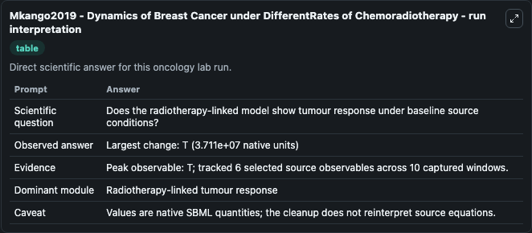
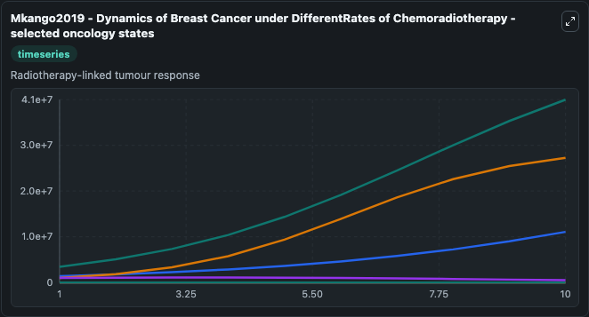
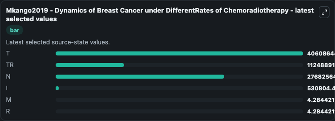

# Mkango2019 - Dynamics of Breast Cancer under DifferentRates of Chemoradiotherapy

This Biosimulant lab wraps `Mkango2019 - Dynamics of Breast Cancer under DifferentRates of Chemoradiotherapy` as a runnable oncology model with a companion visualization module.
Dynamics of Breast Cancer under Different Rates of Chemoradiotherapy.Mkango SB1, Shaban N1, Mureithi E1, Ngoma T2.Author information1 Department of Mathematics, University of Dar es Salaam, P.O. It can be used to explore treatment-response dynamics and compare scenario outcomes across configurations.

## What You'll See

The lab asks: Does the radiotherapy-linked model show tumour response under baseline source conditions? It runs for 10.0 time units with a communication step of 1.0. The run uses the model defaults declared by the curated SBML wrapper. The generated visualizations focus on T, TR, N, I, M, and R, combining trajectory, endpoint-comparison, and summary-table views from one completed dark-mode run.

In this captured run, **T** peaked at **4.06e+07** and **T** moved by **3.71e+07** native units across 10.0 simulation windows.

<!-- BIOSIMULANT_VISUALS_START -->
### Output Visualizations



*Summary table for Mkango2019 - Dynamics of Breast Cancer under DifferentRates of Chemoradiotherapy, reporting the scientific question, observed answer (largest change: **T** at **3.71e+07** native units), evidence (peak observable: **T**), dominant module, and caveat.*



*Trajectories of T, TR, N, I, M, and R across the 10.0 simulation. In this run **T** climbed from 3.5e+06 to 4.06e+07 and **I** fell from 1e+06 to 5.31e+05 — the largest movements among the focused observables.*



*Endpoint ranking of the focused observables. Top 3 by final value: **T** = 4.06e+07, **N** = 2.77e+07, **TR** = 1.12e+07, with 3 more observables below.*

<!-- BIOSIMULANT_VISUALS_END -->

## Model Context

- Core model: `models/core`
- Visualization model: `models/visualisation`
- Standard: `other`
- Upstream source: `biomodels_ebi:MODEL1912120005`
- License: `CC0`
- Visual scope: Radiotherapy-linked tumour response
- Caveat: Values are native SBML quantities; the cleanup does not reinterpret source equations.

## Inputs

| Input | Maps To | Default | Notes |
|---|---|---|---|

## Outputs

| Output | Maps To | Role |
|---|---|---|
| `model_state_1` | `oncology_sbml_mkango2019_dynamics_of_breast_cancer_under_diffe_model1912120005_model.model_state_1` | T observable. |
| `model_state_2` | `oncology_sbml_mkango2019_dynamics_of_breast_cancer_under_diffe_model1912120005_model.model_state_2` | TR observable. |
| `model_state_3` | `oncology_sbml_mkango2019_dynamics_of_breast_cancer_under_diffe_model1912120005_model.model_state_3` | N observable. |
| `model_state_4` | `oncology_sbml_mkango2019_dynamics_of_breast_cancer_under_diffe_model1912120005_model.model_state_4` | I observable. |
| `model_state_5` | `oncology_sbml_mkango2019_dynamics_of_breast_cancer_under_diffe_model1912120005_model.model_state_5` | M observable. |
| `model_state_6` | `oncology_sbml_mkango2019_dynamics_of_breast_cancer_under_diffe_model1912120005_model.model_state_6` | R observable. |
| `state` | `oncology_sbml_mkango2019_dynamics_of_breast_cancer_under_diffe_model1912120005_model.state` | Full raw SBML observable record for reproducibility and downstream visualisation. |
| `summary` | `oncology_sbml_mkango2019_dynamics_of_breast_cancer_under_diffe_model1912120005_model.summary` | Change and peak summary across the simulated SBML observables. |
| `species_labels` | `oncology_sbml_mkango2019_dynamics_of_breast_cancer_under_diffe_model1912120005_model.species_labels` | Mapping from selected raw SBML observable symbols to display labels. |

## Runtime

- Duration: `10.0`
- Communication step: `1.0`

## Running Locally

```bash
biosimulant labs serve .
```
