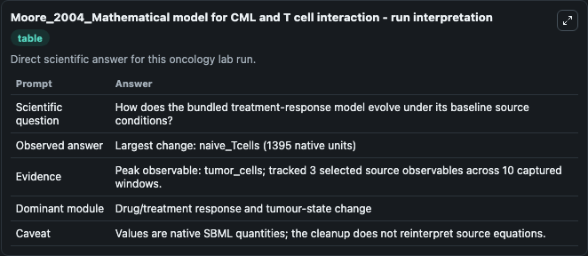
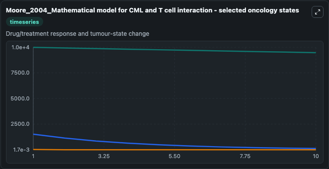
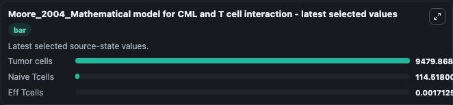

# Moore_2004_Mathematical model for CML and T cell interaction

This Biosimulant lab wraps `Moore_2004_Mathematical model for CML and T cell interaction` as a runnable oncology model with a companion visualization module.
Its a mathematical model depicting CML (chronic myelogenous leukemia) interaction with T cells and impact of T cell activations on CML progression over time. It can be used to explore treatment-response dynamics and compare scenario outcomes across configurations.

## What You'll See

The lab asks: How does the bundled treatment-response model evolve under its baseline source conditions? It runs for 10.0 time units with a communication step of 1.0. The run uses the model defaults declared by the curated SBML wrapper. The generated visualizations focus on Tumor cells, Naive Tcells, and Eff Tcells, combining trajectory, endpoint-comparison, and summary-table views from one completed dark-mode run.

In this captured run, **tumor_cells** carried the largest peak and **naive_Tcells** moved by **1395.0** native units across 10.0 simulation windows.

<!-- BIOSIMULANT_VISUALS_START -->
### Output Visualizations



*Summary table for Moore_2004_Mathematical model for CML and T cell interaction, reporting the scientific question, observed answer (largest change: **naive_Tcells** at **1395.0** native units), evidence (peak observable: **tumor_cells**), dominant module, and caveat.*



*Trajectories of Tumor cells, Naive Tcells, and Eff Tcells across the 10.0 simulation. In this run **Naive Tcells** fell from 1510.0 to 114.5 — the largest movements among the focused observables.*



*Endpoint ranking of the focused observables. Top 3 by final value: **Tumor cells** = 9479.9, **Naive Tcells** = 114.5, **Eff Tcells** = 0.00171.*

<!-- BIOSIMULANT_VISUALS_END -->

## Model Context

- Core model: `models/core`
- Visualization model: `models/visualisation`
- Standard: `other`
- Upstream source: `biomodels_ebi:BIOMD0000000733`
- License: `CC0`
- Visual scope: Drug/treatment response and tumour-state change
- Caveat: Values are native SBML quantities; the cleanup does not reinterpret source equations.

## Inputs

| Input | Maps To | Default | Notes |
|---|---|---|---|
| Tumor cells | `oncology_sbml_moore_2004_mathematical_model_for_cml_and_t_cell_biomd0000000733_model.initial_tumor_cells` | `10000.0` | Initial Tumor cells. Sets the initial value of bundled SBML symbol `tumor_cells`. |
| Naive Tcells | `oncology_sbml_moore_2004_mathematical_model_for_cml_and_t_cell_biomd0000000733_model.initial_naive_tcells` | `1510.0` | Initial Naive Tcells. Sets the initial value of bundled SBML symbol `naive_Tcells`. |
| Eff Tcells | `oncology_sbml_moore_2004_mathematical_model_for_cml_and_t_cell_biomd0000000733_model.initial_eff_tcells` | `20.0` | Initial Eff Tcells. Sets the initial value of bundled SBML symbol `eff_Tcells`. |

## Outputs

| Output | Maps To | Role |
|---|---|---|
| `tumor_cells` | `oncology_sbml_moore_2004_mathematical_model_for_cml_and_t_cell_biomd0000000733_model.tumor_cells` | Tumor cells observable. |
| `naive_tcells` | `oncology_sbml_moore_2004_mathematical_model_for_cml_and_t_cell_biomd0000000733_model.naive_tcells` | Naive Tcells observable. |
| `eff_tcells` | `oncology_sbml_moore_2004_mathematical_model_for_cml_and_t_cell_biomd0000000733_model.eff_tcells` | Eff Tcells observable. |
| `state` | `oncology_sbml_moore_2004_mathematical_model_for_cml_and_t_cell_biomd0000000733_model.state` | Full raw SBML observable record for reproducibility and downstream visualisation. |
| `summary` | `oncology_sbml_moore_2004_mathematical_model_for_cml_and_t_cell_biomd0000000733_model.summary` | Change and peak summary across the simulated SBML observables. |
| `species_labels` | `oncology_sbml_moore_2004_mathematical_model_for_cml_and_t_cell_biomd0000000733_model.species_labels` | Mapping from selected raw SBML observable symbols to display labels. |

## Runtime

- Duration: `10.0`
- Communication step: `1.0`

## Running Locally

```bash
biosimulant labs serve .
```
