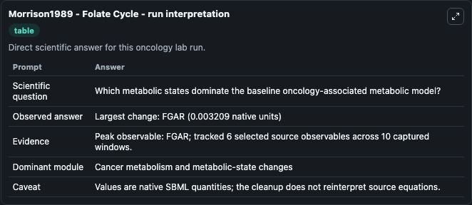
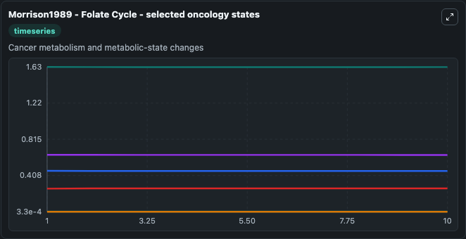
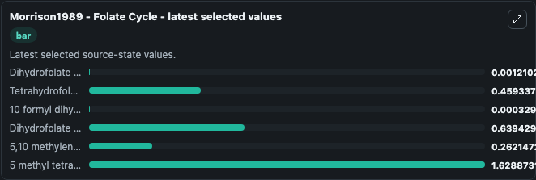

# Morrison1989 - Folate Cycle

This Biosimulant lab wraps `Morrison1989 - Folate Cycle` as a runnable oncology model with a companion visualization module.
Morrison1989 - Folate Cycle The model describes the folate cyclekinetics in breast cancer cells. It can be used to explore treatment-response dynamics and compare scenario outcomes across configurations.

## What You'll See

The lab asks: Which metabolic states dominate the baseline oncology-associated metabolic model? It runs for 10.0 time units with a communication step of 1.0. The run uses the model defaults declared by the curated SBML wrapper. The generated visualizations focus on Dihydrofolate free, Tetrahydrofolate, 10 formyl dihydrofolate, Dihydrofolate reductase free, 5,10 methylene tetrahydrofolate, and 5 methyl tetrahydrofolate, combining trajectory, endpoint-comparison, and summary-table views from one completed dark-mode run.

In this captured run, **FGAR** carried the largest peak and **FGAR** moved by **0.00321** native units across 10.0 simulation windows.

<!-- BIOSIMULANT_VISUALS_START -->
### Output Visualizations



*Summary table for Morrison1989 - Folate Cycle, reporting the scientific question, observed answer (largest change: **FGAR** at **0.00321** native units), evidence (peak observable: **FGAR**), dominant module, and caveat.*



*Trajectories of Dihydrofolate free, Tetrahydrofolate, 10 formyl dihydrofolate, Dihydrofolate reductase free, 5,10 methylene tetrahydrofolate, and 5 methyl tetrahydrofolate across the 10.0 simulation. In this run **5,10 methylene tetrahydrofolate** climbed from 0.2600 to 0.2621 and **5 methyl tetrahydrofolate** fell from 1.630 to 1.629 — the largest movements among the focused observables.*



*Endpoint ranking of the focused observables. Top 3 by final value: **5 methyl tetrahydrofolate** = 1.629, **Dihydrofolate reductase free** = 0.6394, **Tetrahydrofolate** = 0.4593, with 3 more observables below.*

<!-- BIOSIMULANT_VISUALS_END -->

## Model Context

- Core model: `models/core`
- Visualization model: `models/visualisation`
- Standard: `other`
- Upstream source: `biomodels_ebi:BIOMD0000000018`
- License: `CC0`
- Visual scope: Cancer metabolism and metabolic-state changes
- Caveat: Values are native SBML quantities; the cleanup does not reinterpret source equations.

## Inputs

| Input | Maps To | Default | Notes |
|---|---|---|---|
| Dihydrofolate free | `oncology_sbml_morrison1989_folate_cycle_biomd0000000018_model.initial_dihydrofolate_free` | `0.0012` | Initial Dihydrofolate free. Sets the initial value of bundled SBML symbol `FH2f`. |
| Tetrahydrofolate | `oncology_sbml_morrison1989_folate_cycle_biomd0000000018_model.initial_tetrahydrofolate` | `0.46` | Initial Tetrahydrofolate. Sets the initial value of bundled SBML symbol `FH4`. |
| Dihydrofolate reductase free | `oncology_sbml_morrison1989_folate_cycle_biomd0000000018_model.initial_dihydrofolate_reductase_free` | `0.64` | Initial Dihydrofolate reductase free. Sets the initial value of bundled SBML symbol `DHFRf`. |

## Outputs

| Output | Maps To | Role |
|---|---|---|
| `dihydrofolate_free` | `oncology_sbml_morrison1989_folate_cycle_biomd0000000018_model.dihydrofolate_free` | Dihydrofolate free observable. |
| `tetrahydrofolate` | `oncology_sbml_morrison1989_folate_cycle_biomd0000000018_model.tetrahydrofolate` | Tetrahydrofolate observable. |
| `model_state_3` | `oncology_sbml_morrison1989_folate_cycle_biomd0000000018_model.model_state_3` | 10 formyl dihydrofolate observable. |
| `dihydrofolate_reductase_free` | `oncology_sbml_morrison1989_folate_cycle_biomd0000000018_model.dihydrofolate_reductase_free` | Dihydrofolate reductase free observable. |
| `model_state_5` | `oncology_sbml_morrison1989_folate_cycle_biomd0000000018_model.model_state_5` | 5,10 methylene tetrahydrofolate observable. |
| `model_state_6` | `oncology_sbml_morrison1989_folate_cycle_biomd0000000018_model.model_state_6` | 5 methyl tetrahydrofolate observable. |
| `state` | `oncology_sbml_morrison1989_folate_cycle_biomd0000000018_model.state` | Full raw SBML observable record for reproducibility and downstream visualisation. |
| `summary` | `oncology_sbml_morrison1989_folate_cycle_biomd0000000018_model.summary` | Change and peak summary across the simulated SBML observables. |
| `species_labels` | `oncology_sbml_morrison1989_folate_cycle_biomd0000000018_model.species_labels` | Mapping from selected raw SBML observable symbols to display labels. |

## Runtime

- Duration: `10.0`
- Communication step: `1.0`

## Running Locally

```bash
biosimulant labs serve .
```
