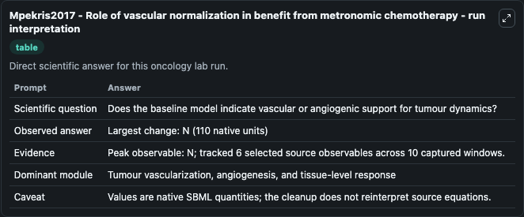
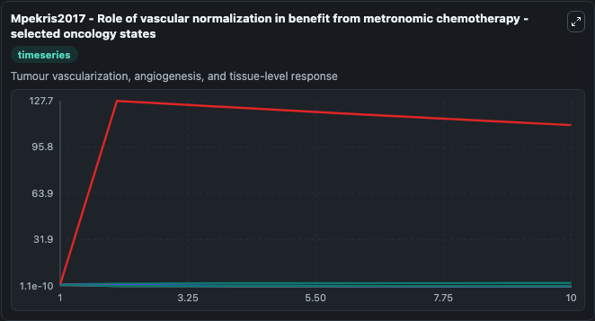
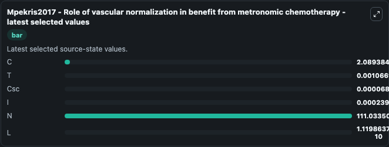

# Mpekris2017 - Role of vascular normalization in benefit from metronomic chemotherapy

This Biosimulant lab wraps `Mpekris2017 - Role of vascular normalization in benefit from metronomic chemotherapy` as a runnable oncology model with a companion visualization module.
Role of vascular normalization in benefit from metronomic chemotherapy.Mpekris F1, Baish JW2, Stylianopoulos T3, Jain RK4.Author informationAbstractMetronomic dosing of chemotherapy-defined as frequen. It can be used to explore treatment-response dynamics and compare scenario outcomes across configurations.

## What You'll See

The lab asks: Does the baseline model indicate vascular or angiogenic support for tumour dynamics? It runs for 10.0 time units with a communication step of 1.0. The run uses the model defaults declared by the curated SBML wrapper. The generated visualizations focus on C, T, Csc, I, N, and L, combining trajectory, endpoint-comparison, and summary-table views from one completed dark-mode run.

In this captured run, **N** peaked at **127.7** and **N** moved by **110.0** native units across 10.0 simulation windows.

<!-- BIOSIMULANT_VISUALS_START -->
### Output Visualizations



*Summary table for Mpekris2017 - Role of vascular normalization in benefit from metronomic chemotherapy, reporting the scientific question, observed answer (largest change: **N** at **110.0** native units), evidence (peak observable: **N**), dominant module, and caveat.*



*Trajectories of C, T, Csc, I, N, and L across the 10.0 simulation. In this run **N** climbed from 1.000 to 111.0 and **L** fell from 1.000 to 1.12e-10 — the largest movements among the focused observables.*



*Endpoint ranking of the focused observables. Top 3 by final value: **N** = 111.0, **C** = 2.089, **T** = 0.00107, with 3 more observables below.*

<!-- BIOSIMULANT_VISUALS_END -->

## Model Context

- Core model: `models/core`
- Visualization model: `models/visualisation`
- Standard: `other`
- Upstream source: `biomodels_ebi:MODEL2001200002`
- License: `CC0`
- Visual scope: Tumour vascularization, angiogenesis, and tissue-level response
- Caveat: Values are native SBML quantities; the cleanup does not reinterpret source equations.

## Inputs

| Input | Maps To | Default | Notes |
|---|---|---|---|
| Csc | `oncology_sbml_mpekris2017_role_of_vascular_normalization_in_be_model2001200002_model.initial_csc` | `1.0` | Initial Csc. Sets the initial value of bundled SBML symbol `Csc`. |

## Outputs

| Output | Maps To | Role |
|---|---|---|
| `model_state_1` | `oncology_sbml_mpekris2017_role_of_vascular_normalization_in_be_model2001200002_model.model_state_1` | C observable. |
| `model_state_2` | `oncology_sbml_mpekris2017_role_of_vascular_normalization_in_be_model2001200002_model.model_state_2` | T observable. |
| `csc` | `oncology_sbml_mpekris2017_role_of_vascular_normalization_in_be_model2001200002_model.csc` | Csc observable. |
| `model_state_4` | `oncology_sbml_mpekris2017_role_of_vascular_normalization_in_be_model2001200002_model.model_state_4` | I observable. |
| `model_state_5` | `oncology_sbml_mpekris2017_role_of_vascular_normalization_in_be_model2001200002_model.model_state_5` | N observable. |
| `model_state_6` | `oncology_sbml_mpekris2017_role_of_vascular_normalization_in_be_model2001200002_model.model_state_6` | L observable. |
| `state` | `oncology_sbml_mpekris2017_role_of_vascular_normalization_in_be_model2001200002_model.state` | Full raw SBML observable record for reproducibility and downstream visualisation. |
| `summary` | `oncology_sbml_mpekris2017_role_of_vascular_normalization_in_be_model2001200002_model.summary` | Change and peak summary across the simulated SBML observables. |
| `species_labels` | `oncology_sbml_mpekris2017_role_of_vascular_normalization_in_be_model2001200002_model.species_labels` | Mapping from selected raw SBML observable symbols to display labels. |

## Runtime

- Duration: `10.0`
- Communication step: `1.0`

## Running Locally

```bash
biosimulant labs serve .
```
