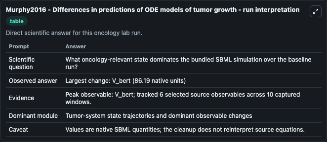
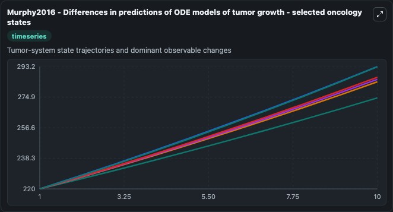
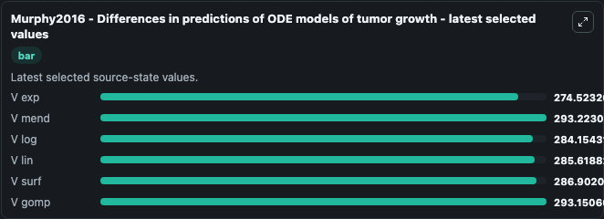

# Murphy2016 - Differences in predictions of ODE models of tumor growth

This Biosimulant lab wraps `Murphy2016 - Differences in predictions of ODE models of tumor growth` as a runnable oncology model with a companion visualization module.
Murphy2016 - Differences in predictions ofODE models of tumor growth Comparison of 7 ODE models for tumoursize. It can be used to explore treatment-response dynamics and compare scenario outcomes across configurations.

## What You'll See

The lab asks: What oncology-relevant state dominates the bundled SBML simulation over the baseline run? It runs for 10.0 time units with a communication step of 1.0. The run uses the model defaults declared by the curated SBML wrapper. The generated visualizations focus on V exp, V mend, V log, V lin, V surf, and V gomp, combining trajectory, endpoint-comparison, and summary-table views from one completed dark-mode run.

In this captured run, **V_bert** carried the largest peak and **V_bert** moved by **86.190** native units across 10.0 simulation windows.

<!-- BIOSIMULANT_VISUALS_START -->
### Output Visualizations



*Summary table for Murphy2016 - Differences in predictions of ODE models of tumor growth, reporting the scientific question, observed answer (largest change: **V_bert** at **86.190** native units), evidence (peak observable: **V_bert**), dominant module, and caveat.*



*Trajectories of V exp, V mend, V log, V lin, V surf, and V gomp across the 10.0 simulation. In this run **V mend** climbed from 220.0 to 293.2 — the largest movements among the focused observables.*



*Endpoint ranking of the focused observables. Top 3 by final value: **V mend** = 293.2, **V gomp** = 293.2, **V surf** = 286.9, with 3 more observables below.*

<!-- BIOSIMULANT_VISUALS_END -->

## Model Context

- Core model: `models/core`
- Visualization model: `models/visualisation`
- Standard: `other`
- Upstream source: `biomodels_ebi:BIOMD0000000671`
- License: `CC0`
- Visual scope: Tumor-system state trajectories and dominant observable changes
- Caveat: Values are native SBML quantities; the cleanup does not reinterpret source equations.

## Inputs

| Input | Maps To | Default | Notes |
|---|---|---|---|

## Outputs

| Output | Maps To | Role |
|---|---|---|
| `v_exp` | `oncology_sbml_murphy2016_differences_in_predictions_of_ode_mod_biomd0000000671_model.v_exp` | V exp observable. |
| `v_mend` | `oncology_sbml_murphy2016_differences_in_predictions_of_ode_mod_biomd0000000671_model.v_mend` | V mend observable. |
| `v_log` | `oncology_sbml_murphy2016_differences_in_predictions_of_ode_mod_biomd0000000671_model.v_log` | V log observable. |
| `v_lin` | `oncology_sbml_murphy2016_differences_in_predictions_of_ode_mod_biomd0000000671_model.v_lin` | V lin observable. |
| `v_surf` | `oncology_sbml_murphy2016_differences_in_predictions_of_ode_mod_biomd0000000671_model.v_surf` | V surf observable. |
| `v_gomp` | `oncology_sbml_murphy2016_differences_in_predictions_of_ode_mod_biomd0000000671_model.v_gomp` | V gomp observable. |
| `state` | `oncology_sbml_murphy2016_differences_in_predictions_of_ode_mod_biomd0000000671_model.state` | Full raw SBML observable record for reproducibility and downstream visualisation. |
| `summary` | `oncology_sbml_murphy2016_differences_in_predictions_of_ode_mod_biomd0000000671_model.summary` | Change and peak summary across the simulated SBML observables. |
| `species_labels` | `oncology_sbml_murphy2016_differences_in_predictions_of_ode_mod_biomd0000000671_model.species_labels` | Mapping from selected raw SBML observable symbols to display labels. |

## Runtime

- Duration: `10.0`
- Communication step: `1.0`

## Running Locally

```bash
biosimulant labs serve .
```
